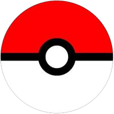

# 151 FILE — All-In-One Codebase

> 本文件汇集了 **151 File**（宝可梦纯原生前端 Web 站点）的全部源码。
> 包含 8 个主页面、5 个全局样式表、11 个前端 JS 核心模块、矢量资源与参考样板。

---

## 目录 (Table of Contents)

**汇总统计**: 共打包 **28** 个文件 | **7,289** 行代码 | **225,551** 字节

---

### 1. HTML 页面结构 (HTML Pages)

- [1.1 `index.html` (Home / 青纸首页)](#11-indexhtml-home-青纸首页)
- [1.2 `pokedex.html` (Dex / 双视图全 1025 图鉴)](#12-pokedexhtml-dex-双视图全-1025-图鉴)
- [1.3 `pokemon.html` (Detail / 详情与开球展台)](#13-pokemonhtml-detail-详情与开球展台)
- [1.4 `regions.html` (Regions / 10 官方地区地图)](#14-regionshtml-regions-10-官方地区地图)
- [1.5 `types.html` (Types / 18 属性矩阵克制表)](#15-typeshtml-types-18-属性矩阵克制表)
- [1.6 `team.html` (Belt / 6 槽腰带编成)](#16-teamhtml-belt-6-槽腰带编成)
- [1.7 `lineup.html` (Lineup / 战力与属性缺口分析)](#17-lineuphtml-lineup-战力与属性缺口分析)
- [1.8 `about.html` (File / 架构说明与数据源)](#18-abouthtml-file-架构说明与数据源)

### 2. CSS 样式模块 (CSS Stylesheets)

- [2.1 `css/tokens.css` (设计 Token & 变量)](#21-csstokenscss-设计-token-&-变量)
- [2.2 `css/base.css` (全局排版与基础样式)](#22-cssbasecss-全局排版与基础样式)
- [2.3 `css/buttons.css` (按钮与交互控件规范)](#23-cssbuttonscss-按钮与交互控件规范)
- [2.4 `css/pokeball.css` (开闭精灵球组件动画)](#24-csspokeballcss-开闭精灵球组件动画)
- [2.5 `css/pages.css` (各页面专用布局与响应式样式)](#25-csspagescss-各页面专用布局与响应式样式)

### 3. JavaScript 核心模块 (JavaScript Modules)

- [3.1 `js/api.js` (PokeAPI 异步请求与缓存)](#31-jsapijs-pokeapi-异步请求与缓存)
- [3.2 `js/regions-data.js` (10 地区编号区间字典)](#32-jsregions-datajs-10-地区编号区间字典)
- [3.3 `js/types-chart.js` (18×18 属性克制常数矩阵)](#33-jstypes-chartjs-18×18-属性克制常数矩阵)
- [3.4 `js/pokeball.js` (精灵球开合音效与转场控制)](#34-jspokeballjs-精灵球开合音效与转场控制)
- [3.5 `js/pokedex.js` (名录+胶片双视图/全1025只图鉴渲染)](#35-jspokedexjs-名录胶片双视图全1025只图鉴渲染)
- [3.6 `js/pokemon.js` (详情页标本台/3D模型/Shiny切换)](#36-jspokemonjs-详情页标本台3d模型shiny切换)
- [3.7 `js/regions.js` (地区列表逻辑)](#37-jsregionsjs-地区列表逻辑)
- [3.8 `js/types.js` (属性色票与矩阵交互)](#38-jstypesjs-属性色票与矩阵交互)
- [3.9 `js/team.js` (腰带存储与拖拽排序)](#39-jsteamjs-腰带存储与拖拽排序)
- [3.10 `js/lineup.js` (弱点缺口计算与两只对比)](#310-jslineupjs-弱点缺口计算与两只对比)
- [3.11 `js/store.js` (本地存储与安全缓存管理)](#311-jsstorejs-本地存储与安全缓存管理)

### 4. 矢量资源与配置 (Assets & Config)

- [4.1 `assets/favicon.svg` (精灵球矢量图标)](#41-assetsfaviconsvg-精灵球矢量图标)
- [4.2 `.gitignore` (版本控制忽略文件)](#42-gitignore-版本控制忽略文件)

### 5. 附录参考模板 (Appendix & Demos)

- [5.1 `demo-interactive.html` (交互组件演示样板)](#51-demo-interactivehtml-交互组件演示样板)
- [5.2 `ui-template.html` (原始设计参考模板)](#52-ui-templatehtml-原始设计参考模板)

---

## 1. HTML 页面结构 (HTML Pages)

### 1.1 `index.html` (Home / 青纸首页)

- **文件路径**: `index.html`  
- **代码行数**: 177 行  
- **文件大小**: 8,235 字节  

```html
<!DOCTYPE html>
<html lang="en">
<head>
  <meta charset="UTF-8">
  <meta name="viewport" content="width=device-width, initial-scale=1">
  <title>151 FILE — Kanto Archive</title>
  <link rel="icon" href="assets/favicon.svg" type="image/svg+xml">
  <link rel="preconnect" href="https://fonts.googleapis.com">
  <link rel="preconnect" href="https://fonts.gstatic.com" crossorigin>
  <link rel="stylesheet" href="https://fonts.googleapis.com/css2?family=Atkinson+Hyperlegible:wght@400;700&family=Oxanium:wght@500;700&display=swap">
  
  <!-- CSS 模块架构 (按照项目规划 §3 分离) -->
  <link rel="stylesheet" href="css/tokens.css">
  <link rel="stylesheet" href="css/base.css">
  <link rel="stylesheet" href="css/buttons.css">
  <link rel="stylesheet" href="css/pokeball.css">
  <link rel="stylesheet" href="css/pages.css">
</head>
<body>
  <!-- 共享顶栏：32px 精灵球 + 站名 + 六链导航（最大宽度 72rem 对齐正文） -->
  <header class="site-bar">
    <div class="site-bar-inner">
      <a class="site-bar-brand" href="index.html" aria-label="151 File home">
        
        <span class="brand">151 FILE</span>
      </a>
      <nav>
        <a href="pokedex.html">Dex</a>
        <a href="regions.html">Regions</a>
        <a href="types.html">Types</a>
        <a href="team.html">Belt</a>
        <a href="lineup.html">Lineup</a>
        <a href="about.html">File</a>
      </nav>
    </div>
  </header>

  <!-- 页面主体容器 -->
  <main class="wrap">
    <!-- Hero 区块：左文本与动作，右侧大型精灵球 CTA -->
    <section class="hero">
      <div>
        <div class="meta-eyebrow">
          <span>KANTO SPECIMENS</span>
          <span>/</span>
          <span>#001–#151</span>
        </div>
        <h1>Kanto file. 151 first.</h1>
        <p>National Dex numbers. Open the Kanto 151 by default. Other regions live in Regions — not a second product.</p>
        <div class="actions">
          <a class="btn btn-primary btn-lg" href="pokedex.html?region=kanto">Open the dex</a>
          <a class="link-action" href="regions.html">Open regions</a>
        </div>
      </div>

      <!-- 大型精灵球：进站 wobble 最多 3 下，点击进 Dex -->
      <button class="hero-ball-btn" id="hero-ball" type="button" aria-label="Open the dex">
        
      </button>
    </section>

    <!-- 标本档案条：初阶御三家 + 皮卡丘 + 拉普拉斯（整砖可点） -->
    <section class="specimens-section" aria-label="Pinned specimens">
      <div class="specimens-header">
        <span class="title">Pinned Specimens / 代表标本</span>
        <span class="hint">Tap Pokémon for Cry · Click tile to open file</span>
      </div>

      <div class="specimens">
        <!-- #025 Pikachu (加宽首发) -->
        <a class="file-tile" href="pokemon.html?id=25" data-id="25" data-name="Pikachu">
          <div class="file-tile-top">
            <span class="id-badge">#025</span>
            <div class="type-badges">
              <span class="type-pill" style="background:#F8D030; color:#12324A;">ELEC</span>
            </div>
          </div>
          <div class="img-stage" title="Click Pokémon to play Cry & interact">
            <div class="stage-pedestal"></div>
            <div class="stage-shadow"></div>
            <div class="cry-ring"></div>
            
          </div>
          <div class="file-tile-info">
            <div class="file-tile-name">Pikachu</div>
            <div class="file-tile-meta">Mouse Pokémon · 0.4m · 6.0kg</div>
          </div>
        </a>

        <!-- #001 Bulbasaur (草系御三家) -->
        <a class="file-tile" href="pokemon.html?id=1" data-id="1" data-name="Bulbasaur">
          <div class="file-tile-top">
            <span class="id-badge">#001</span>
            <div class="type-badges">
              <span class="type-pill" style="background:#78C850; color:#12324A;">GRASS</span>
              <span class="type-pill" style="background:#A040A0; color:#fff;">POIS</span>
            </div>
          </div>
          <div class="img-stage" title="Click Pokémon to play Cry & interact">
            <div class="stage-pedestal"></div>
            <div class="stage-shadow"></div>
            <div class="cry-ring"></div>
            
          </div>
          <div class="file-tile-info">
            <div class="file-tile-name">Bulbasaur</div>
            <div class="file-tile-meta">Seed Pokémon · 0.7m · 6.9kg</div>
          </div>
        </a>

        <!-- #004 Charmander (火系御三家) -->
        <a class="file-tile" href="pokemon.html?id=4" data-id="4" data-name="Charmander">
          <div class="file-tile-top">
            <span class="id-badge">#004</span>
            <div class="type-badges">
              <span class="type-pill" style="background:#F08030; color:#fff;">FIRE</span>
            </div>
          </div>
          <div class="img-stage" title="Click Pokémon to play Cry & interact">
            <div class="stage-pedestal"></div>
            <div class="stage-shadow"></div>
            <div class="cry-ring"></div>
            
          </div>
          <div class="file-tile-info">
            <div class="file-tile-name">Charmander</div>
            <div class="file-tile-meta">Lizard Pokémon · 0.6m · 8.5kg</div>
          </div>
        </a>

        <!-- #007 Squirtle (水系御三家) -->
        <a class="file-tile" href="pokemon.html?id=7" data-id="7" data-name="Squirtle">
          <div class="file-tile-top">
            <span class="id-badge">#007</span>
            <div class="type-badges">
              <span class="type-pill" style="background:#6890F0; color:#fff;">WATER</span>
            </div>
          </div>
          <div class="img-stage" title="Click Pokémon to play Cry & interact">
            <div class="stage-pedestal"></div>
            <div class="stage-shadow"></div>
            <div class="cry-ring"></div>
            
          </div>
          <div class="file-tile-info">
            <div class="file-tile-name">Squirtle</div>
            <div class="file-tile-meta">Tiny Turtle · 0.5m · 9.0kg</div>
          </div>
        </a>

        <!-- #131 Lapras (乘龙/拉普拉斯) -->
        <a class="file-tile" href="pokemon.html?id=131" data-id="131" data-name="Lapras">
          <div class="file-tile-top">
            <span class="id-badge">#131</span>
            <div class="type-badges">
              <span class="type-pill" style="background:#6890F0; color:#fff;">WATER</span>
              <span class="type-pill" style="background:#98D8D8; color:#12324A;">ICE</span>
            </div>
          </div>
          <div class="img-stage" title="Click Pokémon to play Cry & interact">
            <div class="stage-pedestal"></div>
            <div class="stage-shadow"></div>
            <div class="cry-ring"></div>
            
          </div>
          <div class="file-tile-info">
            <div class="file-tile-name">Lapras</div>
            <div class="file-tile-meta">Transport · 2.5m · 220.0kg</div>
          </div>
        </a>
      </div>
    </section>
  </main>

  <script src="js/pokeball.js"></script>
</body>
</html>

```

---

### 1.2 `pokedex.html` (Dex / 双视图全 1025 图鉴)

- **文件路径**: `pokedex.html`  
- **代码行数**: 115 行  
- **文件大小**: 5,558 字节  

```html
<!DOCTYPE html>
<html lang="en">
<head>
  <meta charset="UTF-8">
  <meta name="viewport" content="width=device-width, initial-scale=1">
  <title>Dex — 151 File</title>
  <link rel="icon" href="assets/favicon.svg" type="image/svg+xml">
  <link rel="preconnect" href="https://fonts.googleapis.com">
  <link rel="preconnect" href="https://fonts.gstatic.com" crossorigin>
  <link rel="stylesheet" href="https://fonts.googleapis.com/css2?family=Atkinson+Hyperlegible:wght@400;700&family=Oxanium:wght@500;700&display=swap">

  <!-- 样式模块 -->
  <link rel="stylesheet" href="css/tokens.css">
  <link rel="stylesheet" href="css/base.css">
  <link rel="stylesheet" href="css/buttons.css">
  <link rel="stylesheet" href="css/pokeball.css">
  <link rel="stylesheet" href="css/pages.css">
</head>
<body>
  <!-- 共享顶栏：32px 精灵球 + 站名 + 六链导航 -->
  <header class="site-bar">
    <div class="site-bar-inner">
      <a class="site-bar-brand" href="index.html" aria-label="151 File home">
        
        <span class="brand">151 FILE</span>
      </a>
      <nav>
        <a href="pokedex.html" aria-current="page">Dex</a>
        <a href="regions.html">Regions</a>
        <a href="types.html">Types</a>
        <a href="team.html">Belt</a>
        <a href="lineup.html">Lineup</a>
        <a href="about.html">File</a>
      </nav>
    </div>
  </header>

  <!-- 页面主体容器 -->
  <main class="wrap">
    <!-- 工具筛选条：地区切换、两种展示模式切换 (Ledger/Grid)、实时搜索框、常用属性芯片、随机抽取 -->
    <div class="tools">
      <select id="region-select" class="region-select" aria-label="Select Region">
        <option value="all">All Regions (#001–#1025)</option>
        <option value="kanto">Kanto (#001–#151)</option>
        <option value="johto">Johto (#152–#251)</option>
        <option value="hoenn">Hoenn (#252–#386)</option>
        <option value="sinnoh">Sinnoh (#387–#493)</option>
        <option value="unova">Unova (#494–#649)</option>
        <option value="kalos">Kalos (#650–#721)</option>
        <option value="alola">Alola (#722–#809)</option>
        <option value="galar">Galar (#810–#898)</option>
        <option value="hisui">Hisui (#899–#905)</option>
        <option value="paldea">Paldea (#906–#1025)</option>
      </select>

      <div class="view-toggle" role="group" aria-label="Display mode">
        <button type="button" class="view-btn is-active" id="btn-view-ledger" data-view="ledger" title="Ledger & Stage (台座名录)">
          📑 Ledger
        </button>
        <button type="button" class="view-btn" id="btn-view-grid" data-view="grid" title="Visual Cards Grid (全景网格)">
          ▦ Grid
        </button>
      </div>

      <input id="q" type="search" placeholder="name or number (press / to focus)" autocomplete="off">
      <button class="chip" data-type="" data-on type="button">All types</button>
      <button class="chip" data-type="normal" type="button">normal</button>
      <button class="chip" data-type="fire" type="button">fire</button>
      <button class="chip" data-type="water" type="button">water</button>
      <button class="chip" data-type="electric" type="button">electric</button>
      <button class="chip" data-type="grass" type="button">grass</button>
      <button class="chip" data-type="ice" type="button">ice</button>
      <button class="chip" data-type="fighting" type="button">fighting</button>
      <button class="chip" data-type="poison" type="button">poison</button>
      <button class="chip" data-type="ground" type="button">ground</button>
      <button class="chip" data-type="flying" type="button">flying</button>
      <button class="chip" data-type="psychic" type="button">psychic</button>
      <button class="chip" data-type="bug" type="button">bug</button>
      <button class="chip" data-type="rock" type="button">rock</button>
      <button class="chip" data-type="ghost" type="button">ghost</button>
      <button class="chip" data-type="dragon" type="button">dragon</button>
      <button class="chip" data-type="dark" type="button">dark</button>
      <button class="chip" data-type="steel" type="button">steel</button>
      <button class="chip" data-type="fairy" type="button">fairy</button>
      <button class="chip" id="resist-chip" type="button" hidden></button>
      <button class="chip" id="draw" type="button">Draw one</button>
      <span class="count-badge" id="count-badge"></span>
    </div>

    <!-- 模式 1：Dex 四区同屏布局 (Spine + Ledger + Stage + Film) -->
    <div class="dex" id="dex-ledger-view">
      <!-- 左脊：50 号一段分册导航 -->
      <div class="spines" id="spines"></div>

      <!-- 中名录：该分册过滤清单，记录 #编号 + 英文名 -->
      <ul class="ledger" id="ledger"></ul>

      <!-- 右台座：3D 模型立绘、属性色票、加入腰带与详情入口 -->
      <div class="stage" id="stage"></div>

      <!-- 底胶片尺：整份过滤列表滚动条，支持吸格对齐 -->
      <div class="film" id="film"></div>
    </div>

    <!-- 模式 2：全景 3D 卡片网格布局 (Visual Cards Grid) -->
    <div class="dex-grid" id="dex-grid-view" hidden></div>
  </main>

  <script src="js/store.js"></script>
  <script src="js/regions-data.js"></script>
  <script src="js/types-chart.js"></script>
  <script src="js/api.js"></script>
  <script src="js/pokedex.js"></script>
</body>
</html>

```

---

### 1.3 `pokemon.html` (Detail / 详情与开球展台)

- **文件路径**: `pokemon.html`  
- **代码行数**: 49 行  
- **文件大小**: 1,750 字节  

```html
<!DOCTYPE html>
<html lang="en">
<head>
  <meta charset="UTF-8">
  <meta name="viewport" content="width=device-width, initial-scale=1">
  <title>File — 151 File</title>
  <link rel="icon" href="assets/favicon.svg" type="image/svg+xml">
  <link rel="preconnect" href="https://fonts.googleapis.com">
  <link rel="preconnect" href="https://fonts.gstatic.com" crossorigin>
  <link rel="stylesheet" href="https://fonts.googleapis.com/css2?family=Atkinson+Hyperlegible:wght@400;700&family=Oxanium:wght@500;700&display=swap">

  <!-- 样式模块 -->
  <link rel="stylesheet" href="css/tokens.css">
  <link rel="stylesheet" href="css/base.css">
  <link rel="stylesheet" href="css/buttons.css">
  <link rel="stylesheet" href="css/pokeball.css">
  <link rel="stylesheet" href="css/pages.css">
</head>
<body>
  <!-- 共享顶栏：32px 精灵球 + 站名 + 六链导航 -->
  <header class="site-bar">
    <div class="site-bar-inner">
      <a class="site-bar-brand" href="index.html" aria-label="151 File home">
        
        <span class="brand">151 FILE</span>
      </a>
      <nav>
        <a href="pokedex.html">Dex</a>
        <a href="regions.html">Regions</a>
        <a href="types.html">Types</a>
        <a href="team.html">Belt</a>
        <a href="lineup.html">Lineup</a>
        <a href="about.html">File</a>
      </nav>
    </div>
  </header>

  <!-- 页面主体容器 -->
  <main class="wrap wide">
    <div id="file"></div>
  </main>

  <script src="js/store.js"></script>
  <script src="js/regions-data.js"></script>
  <script src="js/types-chart.js"></script>
  <script src="js/api.js"></script>
  <script src="js/pokemon.js"></script>
</body>
</html>

```

---

### 1.4 `regions.html` (Regions / 10 官方地区地图)

- **文件路径**: `regions.html`  
- **代码行数**: 68 行  
- **文件大小**: 2,659 字节  

```html
<!DOCTYPE html>
<html lang="en">
<head>
  <meta charset="UTF-8">
  <meta name="viewport" content="width=device-width, initial-scale=1">
  <title>Regions — 151 File</title>
  <link rel="icon" href="assets/favicon.svg" type="image/svg+xml">
  <link rel="preconnect" href="https://fonts.googleapis.com">
  <link rel="preconnect" href="https://fonts.gstatic.com" crossorigin>
  <link rel="stylesheet" href="https://fonts.googleapis.com/css2?family=Atkinson+Hyperlegible:wght@400;700&family=Oxanium:wght@500;700&display=swap">

  <!-- 共享样式模块 -->
  <link rel="stylesheet" href="css/tokens.css">
  <link rel="stylesheet" href="css/base.css">
  <link rel="stylesheet" href="css/buttons.css">
  <link rel="stylesheet" href="css/pokeball.css">
  <link rel="stylesheet" href="css/pages.css">
</head>
<body>
  <!-- 共享顶栏：32px 精灵球 + 站名 + 六链导航 -->
  <header class="site-bar">
    <div class="site-bar-inner">
      <a class="site-bar-brand" href="index.html" aria-label="151 File home">
        
        <span class="brand">151 FILE</span>
      </a>
      <nav>
        <a href="pokedex.html">Dex</a>
        <a href="regions.html" aria-current="page">Regions</a>
        <a href="types.html">Types</a>
        <a href="team.html">Belt</a>
        <a href="lineup.html">Lineup</a>
        <a href="about.html">File</a>
      </nav>
    </div>
  </header>

  <!-- 页面主体容器 -->
  <main class="wrap">
    <h1 class="page-title">Regions</h1>
    <p class="regions-lead">National Dex numbers. Official regional maps covering Kanto #001 through Paldea #1025. Forms are not separate files in v1. Click a region to open that slice of the dex.</p>

    <!-- 10 官方地区地图画廊 (Atlas) -->
    <div class="atlas" id="atlas"></div>
  </main>

  <script src="js/regions-data.js"></script>
  <script>
    document.addEventListener("DOMContentLoaded", () => {
      const atlasEl = document.getElementById("atlas");
      if (!atlasEl || !window.REGIONS) return;

      atlasEl.innerHTML = window.REGIONS.map(r => `
        <a class="region-card" href="pokedex.html?region=${r.slug}">
          <div class="map-thumb">
            
          </div>
          <div class="region-info">
            <p class="name">${r.name}</p>
            <p class="ids">#${String(r.start).padStart(3, "0")}–${r.end}</p>
            <p class="n">${r.count} files</p>
          </div>
        </a>
      `).join("");
    });
  </script>
</body>
</html>

```

---

### 1.5 `types.html` (Types / 18 属性矩阵克制表)

- **文件路径**: `types.html`  
- **代码行数**: 62 行  
- **文件大小**: 2,399 字节  

```html
<!DOCTYPE html>
<html lang="en">
<head>
  <meta charset="UTF-8">
  <meta name="viewport" content="width=device-width, initial-scale=1">
  <title>Types — 151 File</title>
  <link rel="icon" href="assets/favicon.svg" type="image/svg+xml">
  <link rel="preconnect" href="https://fonts.googleapis.com">
  <link rel="preconnect" href="https://fonts.gstatic.com" crossorigin>
  <link rel="stylesheet" href="https://fonts.googleapis.com/css2?family=Atkinson+Hyperlegible:wght@400;700&family=Oxanium:wght@500;700&display=swap">

  <!-- 共享样式模块 -->
  <link rel="stylesheet" href="css/tokens.css">
  <link rel="stylesheet" href="css/base.css">
  <link rel="stylesheet" href="css/buttons.css">
  <link rel="stylesheet" href="css/pokeball.css">
  <link rel="stylesheet" href="css/pages.css">
</head>
<body>
  <!-- 共享顶栏：32px 精灵球 + 站名 + 六链导航 -->
  <header class="site-bar">
    <div class="site-bar-inner">
      <a class="site-bar-brand" href="index.html" aria-label="151 File home">
        
        <span class="brand">151 FILE</span>
      </a>
      <nav>
        <a href="pokedex.html">Dex</a>
        <a href="regions.html">Regions</a>
        <a href="types.html" aria-current="page">Types</a>
        <a href="team.html">Belt</a>
        <a href="lineup.html">Lineup</a>
        <a href="about.html">File</a>
      </nav>
    </div>
  </header>

  <!-- 页面主体容器 -->
  <main class="wrap">
    <h1 class="page-title">Types</h1>
    <p class="lead">Attack down the left, defense across the top. Dual defense is multiplied on Lineup, not here. Click a type or a cell to open the dex filtered by the defending type.</p>

    <!-- 18 属性色票墙 -->
    <div class="wall" id="wall"></div>

    <!-- 18×18 属性对战矩阵板 -->
    <div class="board">
      <table class="types-table" id="chart"></table>
    </div>

    <!-- 图例说明 -->
    <div class="types-legend">
      <span><i class="dot" style="background:#3D7DCA"></i> 2× Super effective</span>
      <span><i class="dot" style="background:#1E3A55"></i> ½ Not very effective</span>
      <span><i class="dot" style="background:#071422; border:1px solid #1E3A55"></i> 0 Immune</span>
    </div>
  </main>

  <script src="js/types-chart.js"></script>
  <script src="js/types.js"></script>
</body>
</html>

```

---

### 1.6 `team.html` (Belt / 6 槽腰带编成)

- **文件路径**: `team.html`  
- **代码行数**: 58 行  
- **文件大小**: 2,283 字节  

```html
<!DOCTYPE html>
<html lang="en">
<head>
  <meta charset="UTF-8">
  <meta name="viewport" content="width=device-width, initial-scale=1">
  <title>Belt — 151 File</title>
  <link rel="icon" href="assets/favicon.svg" type="image/svg+xml">
  <link rel="preconnect" href="https://fonts.googleapis.com">
  <link rel="preconnect" href="https://fonts.gstatic.com" crossorigin>
  <link rel="stylesheet" href="https://fonts.googleapis.com/css2?family=Atkinson+Hyperlegible:wght@400;700&family=Oxanium:wght@500;700&display=swap">

  <!-- 共享样式模块 -->
  <link rel="stylesheet" href="css/tokens.css">
  <link rel="stylesheet" href="css/base.css">
  <link rel="stylesheet" href="css/buttons.css">
  <link rel="stylesheet" href="css/pokeball.css">
  <link rel="stylesheet" href="css/pages.css">
</head>
<body>
  <!-- 共享顶栏：32px 精灵球 + 站名 + 六链导航 -->
  <header class="site-bar">
    <div class="site-bar-inner">
      <a class="site-bar-brand" href="index.html" aria-label="151 File home">
        
        <span class="brand">151 FILE</span>
      </a>
      <nav>
        <a href="pokedex.html">Dex</a>
        <a href="regions.html">Regions</a>
        <a href="types.html">Types</a>
        <a href="team.html" aria-current="page">Belt</a>
        <a href="lineup.html">Lineup</a>
        <a href="about.html">File</a>
      </nav>
    </div>
  </header>

  <!-- 页面主体容器 -->
  <main class="wrap">
    <h1 class="page-title">Belt</h1>
    <p class="lead">Six slots. Stored as <code>file151.belt</code> in this browser. Drag a filled slot onto another, or use the ◀ ▶ buttons, to reorder. Empty slot opens the dex.</p>

    <!-- 快捷操作区 -->
    <div class="actions" style="display:flex; gap:0.75rem; flex-wrap:wrap; margin-bottom:1.25rem;">
      <a class="btn btn-primary" href="lineup.html">Check lineup</a>
      <button class="btn btn-paper" id="clear" type="button">Clear belt</button>
    </div>

    <!-- 6 槽位网格 -->
    <div class="slots" id="slots"></div>
  </main>

  <script src="js/store.js"></script>
  <script src="js/regions-data.js"></script>
  <script src="js/api.js"></script>
  <script src="js/team.js"></script>
</body>
</html>

```

---

### 1.7 `lineup.html` (Lineup / 战力与属性缺口分析)

- **文件路径**: `lineup.html`  
- **代码行数**: 82 行  
- **文件大小**: 3,252 字节  

```html
<!DOCTYPE html>
<html lang="en">
<head>
  <meta charset="UTF-8">
  <meta name="viewport" content="width=device-width, initial-scale=1">
  <title>Lineup — 151 File</title>
  <link rel="icon" href="assets/favicon.svg" type="image/svg+xml">
  <link rel="preconnect" href="https://fonts.googleapis.com">
  <link rel="preconnect" href="https://fonts.gstatic.com" crossorigin>
  <link rel="stylesheet" href="https://fonts.googleapis.com/css2?family=Atkinson+Hyperlegible:wght@400;700&family=Oxanium:wght@500;700&display=swap">

  <!-- 共享样式模块 -->
  <link rel="stylesheet" href="css/tokens.css">
  <link rel="stylesheet" href="css/base.css">
  <link rel="stylesheet" href="css/buttons.css">
  <link rel="stylesheet" href="css/pokeball.css">
  <link rel="stylesheet" href="css/pages.css">
</head>
<body>
  <!-- 共享顶栏：32px 精灵球 + 站名 + 六链导航 -->
  <header class="site-bar">
    <div class="site-bar-inner">
      <a class="site-bar-brand" href="index.html" aria-label="151 File home">
        
        <span class="brand">151 FILE</span>
      </a>
      <nav>
        <a href="pokedex.html">Dex</a>
        <a href="regions.html">Regions</a>
        <a href="types.html">Types</a>
        <a href="team.html">Belt</a>
        <a href="lineup.html" aria-current="page">Lineup</a>
        <a href="about.html">File</a>
      </nav>
    </div>
  </header>

  <!-- 页面主体容器 -->
  <main class="wrap">
    <h1 class="page-title">Lineup</h1>
    <p class="lead">Typed as the species types, not moves. Coverage chips open Dex by attack type. Holes open Dex by <code>resist</code>.</p>

    <!-- 腰带 6 槽缩略栏 -->
    <h2 class="lineup-subheading">Belt</h2>
    <div class="lineup-belt" id="belt"></div>
    <p class="lineup-empty" id="belt-empty" hidden>Belt is empty. <a class="link-action" href="pokedex.html">Open the dex</a> and add up to 6.</p>

    <!-- 打击面覆盖 (Coverage) -->
    <h2 class="lineup-subheading">Coverage</h2>
    <div class="wall" id="coverage"></div>

    <!-- 防御盲点 (Holes) -->
    <h2 class="lineup-subheading">Holes</h2>
    <div class="wall" id="holes"></div>

    <!-- 属性抵抗 (Resists) -->
    <h2 class="lineup-subheading">Resists</h2>
    <div class="wall" id="resists"></div>
    <p class="lineup-dupes" id="dupes"></p>

    <!-- 左右并排比对 (Side by side) -->
    <h2 class="lineup-subheading">Side by side</h2>
    <div class="lineup-pair">
      <div class="lineup-pane" id="left"></div>
      <div class="lineup-mid">
        <button class="btn btn-paper" id="swap" type="button">Swap sides</button>
        <button class="btn btn-paper" id="cl" type="button">Clear left</button>
        <button class="btn btn-paper" id="cr" type="button">Clear right</button>
        <button class="btn btn-paper" id="copy" type="button">Copy link</button>
      </div>
      <div class="lineup-pane" id="right"></div>
    </div>
  </main>

  <!-- 脚本依赖 -->
  <script src="js/store.js"></script>
  <script src="js/regions-data.js"></script>
  <script src="js/types-chart.js"></script>
  <script src="js/api.js"></script>
  <script src="js/lineup.js"></script>
</body>
</html>

```

---

### 1.8 `about.html` (File / 架构说明与数据源)

- **文件路径**: `about.html`  
- **代码行数**: 98 行  
- **文件大小**: 4,202 字节  

```html
<!DOCTYPE html>
<html lang="en">
<head>
  <meta charset="UTF-8">
  <meta name="viewport" content="width=device-width, initial-scale=1">
  <title>File — 151 File</title>
  <link rel="icon" href="assets/favicon.svg" type="image/svg+xml">
  <link rel="preconnect" href="https://fonts.googleapis.com">
  <link rel="preconnect" href="https://fonts.gstatic.com" crossorigin>
  <link rel="stylesheet" href="https://fonts.googleapis.com/css2?family=Atkinson+Hyperlegible:wght@400;700&family=Oxanium:wght@500;700&display=swap">
  
  <!-- CSS 模块架构 -->
  <link rel="stylesheet" href="css/tokens.css">
  <link rel="stylesheet" href="css/base.css">
  <link rel="stylesheet" href="css/buttons.css">
  <link rel="stylesheet" href="css/pokeball.css">
  <link rel="stylesheet" href="css/pages.css">
</head>
<body>
  <!-- 共享顶栏：32px 精灵球 + 站名 + 六链导航 -->
  <header class="site-bar">
    <div class="site-bar-inner">
      <a class="site-bar-brand" href="index.html" aria-label="151 File home">
        
        <span class="brand">151 FILE</span>
      </a>
      <nav>
        <a href="pokedex.html">Dex</a>
        <a href="regions.html">Regions</a>
        <a href="types.html">Types</a>
        <a href="team.html">Belt</a>
        <a href="lineup.html">Lineup</a>
        <a href="about.html" aria-current="page">File</a>
      </nav>
    </div>
  </header>

  <!-- 页面主体容器：约束在舒适阅读行宽 (wrap-doc) -->
  <main class="wrap wrap-doc">
    <h1 class="page-title">File</h1>
    <p class="page-desc">Unofficial Kanto-first dex. Not affiliated with Nintendo, Game Freak, or The Pokémon Company.</p>

    <!-- 数据源与规则说明 -->
    <section class="file-block" aria-labelledby="sources-heading">
      <h2 id="sources-heading">Sources</h2>
      <ul>
        <li>Stats and names: <a href="https://pokeapi.co/" target="_blank" rel="noopener">PokeAPI</a></li>
        <li>Art: <a href="https://github.com/PokeAPI/sprites" target="_blank" rel="noopener">PokeAPI/sprites</a></li>
        <li>Search uses English names or National Dex numbers.</li>
        <li>Belt lives in this browser as <span class="soft">file151.belt</span>. Nothing is uploaded.</li>
        <li>Lineup reads species types only, not moves.</li>
        <li>Regions slice National Dex ids. Forms are not separate files in v1.</li>
      </ul>
    </section>

    <!-- 精灵球音效开关 -->
    <section class="file-block" aria-labelledby="sound-heading">
      <h2 id="sound-heading">Sound</h2>
      <p class="soft" style="margin-bottom: 1rem;">Off by default. Writes <code>file151.sound</code>. When on, a cry plays once as a file opens or when you press Draw one. Tapping a Pokémon always plays its cry.</p>
      <button class="btn btn-paper" id="sound" type="button">Sound off</button>
    </section>

    <!-- 快捷键指南 -->
    <section class="file-block" aria-labelledby="keys-heading">
      <h2 id="keys-heading">Keys</h2>
      <table class="keys-table">
        <tbody>
          <tr><td><kbd>/</kbd></td><td>Focus search on Dex / Lineup</td></tr>
          <tr><td><kbd>Esc</kbd></td><td>Close file or clear search</td></tr>
          <tr><td><kbd>←</kbd> <kbd>→</kbd></td><td>Prev / next number on Detail; Film on Dex</td></tr>
          <tr><td><kbd>↑</kbd> <kbd>↓</kbd></td><td>Move in Ledger</td></tr>
          <tr><td><kbd>a</kbd>–<kbd>z</kbd></td><td>Jump Ledger name in the open spine</td></tr>
        </tbody>
      </table>
    </section>
  </main>

  <script src="js/store.js"></script>
  <script src="js/pokeball.js"></script>
  <script>
    // file151.sound 开关控制逻辑
    const soundBtn = document.getElementById("sound");

    function renderSoundState() {
      const isSoundOn = window.store.soundOn();
      soundBtn.textContent = isSoundOn ? "Sound on" : "Sound off";
      soundBtn.setAttribute("aria-pressed", isSoundOn ? "true" : "false");
    }

    soundBtn.addEventListener("click", () => {
      window.store.setSound(!window.store.soundOn());
      renderSoundState();
    });

    renderSoundState();
  </script>
</body>
</html>

```

---

---

## 2. CSS 样式模块 (CSS Stylesheets)

### 2.1 `css/tokens.css` (设计 Token & 变量)

- **文件路径**: `css/tokens.css`  
- **代码行数**: 48 行  
- **文件大小**: 1,926 字节  

```css
/* ==========================================================================
   151 FILE — Design Tokens (Night Archive / 夜档规范)
   ========================================================================== */

:root {
  /* Color Palette — 夜档深色系统 */
  --sky:          #071422; /* 页底，占大面积 */
  --sky-deep:     #0B1C2E; /* 页顶到页底过渡 */
  --paper:        #102338; /* 顶栏底、档案标本砖底 */
  --ink:          #E4F1F8; /* 主字（高对比亮色） */
  --ink-soft:     #8EB8D2; /* 次字（软墨蓝） */
  --navy:         #7EB6D9; /* 链接色、次高亮 */
  --line:         #1E3A55; /* 结构描边、硬投影色 */
  --ok:           #7BC89A; /* 成功状态单行说明 */
  --focus:        #FFCB05; /* 键盘焦点环 */
  --navy-key:     #D7EEF8; /* 主键底（浅青底，深底上压得住） */
  --navy-key-ink: #071422; /* 主键字（深色墨） */
  --mark:         #FFCB05; /* 官方黄：编号底块、当前导航下划线 */
  --ball:         #EE1515; /* 精灵球红：球上半、移除小圆点 */
  --blue:         #3D7DCA; /* 尺格描边、交互微悬停边 */

  /* Spacing Scale (4px 步进 rem token) */
  --s-1:  0.25rem;  /* 4px */
  --s-2:  0.5rem;   /* 8px */
  --s-3:  0.75rem;  /* 12px */
  --s-4:  1rem;     /* 16px */
  --s-5:  1.25rem;  /* 20px */
  --s-6:  1.5rem;   /* 24px */
  --s-7:  1.75rem;  /* 28px */
  --s-8:  2rem;     /* 32px */
  --s-10: 2.5rem;   /* 40px */
  --s-12: 3rem;     /* 48px */
  --s-14: 3.5rem;   /* 56px */

  /* Typography Stacks */
  --font-ui:  "Atkinson Hyperlegible", -apple-system, BlinkMacSystemFont, "Segoe UI", Roboto, sans-serif;
  --font-num: "Oxanium", monospace, sans-serif;

  /* Corner Radii */
  --r-file: 4px;
  --r-key:  4px 4px 14px 4px;
  --r-ball: 50%;
  --r-chip: 4px;

  /* Shadows (硬投影) */
  --shadow-file: 0 10px 0 var(--line);
  --shadow-key:  0 4px 0 var(--line);
}

```

---

### 2.2 `css/base.css` (全局排版与基础样式)

- **文件路径**: `css/base.css`  
- **代码行数**: 159 行  
- **文件大小**: 3,716 字节  

```css
/* ==========================================================================
   151 FILE — Base Layout & Global Styles (Night Archive)
   ========================================================================== */

*, *::before, *::after {
  box-sizing: border-box;
}

html, body {
  margin: 0;
  padding: 0;
  min-height: 100%;
  min-height: 100dvh;
}

body {
  font: 400 1.0625rem/1.45 var(--font-ui);
  color: var(--ink);
  background: linear-gradient(180deg, var(--sky-deep) 0%, var(--sky) 100%);
  background-attachment: fixed;
  -webkit-font-smoothing: antialiased;
  -moz-osx-font-smoothing: grayscale;
}

/* Headings & Text */
h1, h2, h3, h4, p {
  margin-top: 0;
}

a {
  color: var(--navy);
  text-decoration: none;
  transition: color 80ms ease;
}

a:hover {
  color: var(--ink);
}

:focus-visible {
  outline: 3px solid var(--focus);
  outline-offset: 3px;
}

/* Layout Container (带桌面左侧装订边，右侧通栏填满视口，消除右侧空旷) */
.wrap {
  width: 100%;
  margin: 0;
  padding: var(--s-6) max(var(--s-8), env(safe-area-inset-right)) 5rem max(var(--s-12), env(safe-area-inset-left));
}

/* ==========================================================================
   Shared Navigation Bar (32px 精灵球 + 站名 + 六链)
   ========================================================================== */
.site-bar {
  position: sticky;
  top: 0;
  z-index: 50;
  width: 100%;
  background: var(--paper);
  border-bottom: 2px solid var(--line);
  transition: background-color 180ms ease, backdrop-filter 180ms ease, border-color 180ms ease;
}

/* 当内容滚动穿过顶栏时的轻霜效果 */
.site-bar.is-over-content {
  background: color-mix(in srgb, var(--paper) 72%, transparent);
  backdrop-filter: blur(20px) saturate(160%);
  -webkit-backdrop-filter: blur(20px) saturate(160%);
  border-bottom: 1px solid color-mix(in srgb, var(--line) 40%, transparent);
}

/* 顶栏内容容器：通栏 100% 宽度，导航菜单贴至右侧边缘 */
.site-bar-inner {
  display: flex;
  align-items: center;
  gap: 1.5rem;
  height: calc(var(--s-14) + env(safe-area-inset-top));
  width: 100%;
  margin: 0;
  padding: env(safe-area-inset-top) max(var(--s-8), env(safe-area-inset-right)) 0 max(var(--s-12), env(safe-area-inset-left));
}

.site-bar-brand {
  display: inline-flex;
  align-items: center;
  gap: 0.75rem;
  text-decoration: none;
}

.nav-ball-img {
  width: 32px;
  height: 32px;
  object-fit: contain;
  display: block;
  border-radius: 50%;
  transition: transform 100ms ease-out;
}

.site-bar-brand:active .nav-ball-img {
  transform: scale(0.92);
}

.site-bar .brand {
  font-family: var(--font-ui);
  font-weight: 700;
  font-size: 1.125rem;
  letter-spacing: -0.018em;
  color: var(--navy);
  text-decoration: none;
}

.site-bar nav {
  margin-left: auto;
  display: flex;
  gap: 1.25rem;
  font-size: 0.9375rem;
}

.site-bar nav a {
  position: relative;
  text-decoration: none;
  color: var(--ink);
  padding: 0.375rem 0.125rem;
  transition: color 80ms ease;
}

.site-bar nav a:hover {
  color: var(--navy);
}

.site-bar nav a[aria-current="page"] {
  box-shadow: 0 3px 0 var(--mark);
}

/* Accessibility Preferences */
@media (prefers-reduced-transparency: reduce) {
  .site-bar, .site-bar.is-over-content {
    background: var(--paper);
    backdrop-filter: none;
    -webkit-backdrop-filter: none;
  }
}

@media (max-width: 48rem) {
  .wrap {
    padding-left: max(var(--s-4), env(safe-area-inset-left));
    padding-right: max(var(--s-4), env(safe-area-inset-right));
  }
  .site-bar-inner {
    padding-left: max(var(--s-4), 1rem);
    padding-right: max(var(--s-4), 1rem);
  }
  .site-bar nav {
    gap: 0.75rem;
    font-size: 0.875rem;
  }
}


```

---

### 2.3 `css/buttons.css` (按钮与交互控件规范)

- **文件路径**: `css/buttons.css`  
- **代码行数**: 118 行  
- **文件大小**: 2,446 字节  

```css
/* ==========================================================================
   151 FILE — Buttons & Controls (Night Archive)
   ========================================================================== */

/* 基础装置按钮规范：只切右下角 (4px 4px 14px 4px) */
.btn {
  display: inline-flex;
  align-items: center;
  justify-content: center;
  gap: 0.5rem;
  height: 2.75rem;
  padding: 0 var(--s-5);
  border: 0;
  border-radius: var(--r-key);
  font-family: var(--font-num);
  font-weight: 700;
  font-size: 0.875rem;
  line-height: 1;
  letter-spacing: 0.02em;
  text-decoration: none;
  cursor: pointer;
  user-select: none;
  -webkit-tap-highlight-color: transparent;
  transition: transform 100ms ease-out, background-color 80ms ease, border-color 80ms ease, box-shadow 100ms ease;
}

.btn:active {
  transform: scale(0.97) translateY(2px);
  box-shadow: none;
}

.btn:focus-visible {
  outline: 3px solid var(--focus);
  outline-offset: 3px;
}

/* 主操作按钮：浅青底深字，深底上压得住 */
.btn-primary {
  background: var(--navy-key);
  color: var(--navy-key-ink);
  box-shadow: 0 4px 0 var(--line);
}

.btn-primary:hover {
  background: #B9DDF0;
}

.btn-primary:active {
  transform: scale(0.97) translateY(2px);
  box-shadow: none;
}

.btn-primary:disabled {
  background: var(--line);
  color: var(--ink-soft);
  cursor: not-allowed;
  box-shadow: none;
  transform: none;
}

/* 次操作按钮：深色档案纸底 + 2px 边框 */
.btn-paper {
  background: var(--paper);
  color: var(--navy);
  border: 2px solid var(--navy);
  box-shadow: 0 4px 0 var(--line);
}

.btn-paper:hover {
  border-color: var(--blue);
  color: var(--blue);
}

.btn-paper:active {
  transform: scale(0.97) translateY(2px);
  box-shadow: none;
}

/* 稀有强调按钮：黄底深字 */
.btn-mark {
  background: var(--mark);
  color: var(--navy-key-ink);
  box-shadow: 0 4px 0 var(--line);
}

.btn-mark:hover {
  background: #FFE066;
}

/* 尺寸变体 */
.btn-lg {
  height: 3.25rem;
  padding: 0 1.375rem;
  font-size: 1rem;
}

.btn-sm {
  height: 2rem;
  padding: 0 var(--s-3);
  font-size: 0.75rem;
}

/* 文字动作链接 */
.link-action {
  font-family: var(--font-ui);
  font-weight: 700;
  font-size: 1rem;
  color: var(--navy);
  text-decoration: underline;
  text-underline-offset: 4px;
  display: inline-flex;
  align-items: center;
  transition: color 80ms ease;
}

.link-action:hover {
  color: var(--ink);
}

```

---

### 2.4 `css/pokeball.css` (开闭精灵球组件动画)

- **文件路径**: `css/pokeball.css`  
- **代码行数**: 237 行  
- **文件大小**: 4,729 字节  

```css
/* ==========================================================================
   151 FILE — Pokeball Component & Motion (Night Archive)
   ========================================================================== */

/* 精灵球：上红下白、黑中线、中心钮。全站正圆唯独给球 */
.ball {
  --size: 32px;
  width: var(--size);
  height: var(--size);
  border-radius: 50%;
  position: relative;
  display: block;
  border: 0;
  padding: 0;
  background: #F7FBFE;
  box-shadow: inset 0 0 0 3px #1a1a1a;
  cursor: pointer;
  overflow: hidden;
  user-select: none;
  -webkit-tap-highlight-color: transparent;
  transition: transform 100ms ease-out, filter 150ms ease;
}

.ball:active {
  transform: scale(0.97);
}

/* 上半球红 */
.ball .t {
  position: absolute;
  inset: 0 0 50% 0;
  background: var(--ball);
  border-radius: 999px 999px 0 0;
}

/* 黑腰带中线 */
.ball .band {
  position: absolute;
  left: 0;
  right: 0;
  top: calc(50% - 2px);
  height: 4px;
  background: #1a1a1a;
}

/* 中心开合按钮 */
.ball .btn {
  position: absolute;
  width: 28%;
  height: 28%;
  border-radius: 50%;
  left: 36%;
  top: 36%;
  background: #f4f4f4;
  box-shadow: 0 0 0 3px #1a1a1a;
}

/* 大号球（首页入口 / 220–280px） */
.ball.lg {
  --size: clamp(13rem, 30vw, 17.5rem);
  box-shadow: inset 0 0 0 8px #1a1a1a, 0 16px 32px rgba(0, 0, 0, 0.4);
}

.ball.lg .band {
  top: calc(50% - 6px);
  height: 12px;
}

.ball.lg .btn {
  box-shadow: 0 0 0 6px #1a1a1a;
}

/* 首页图片精灵球按钮 */
.hero-ball-btn {
  background: transparent;
  border: 0;
  padding: 0;
  cursor: pointer;
  display: inline-block;
  user-select: none;
  -webkit-tap-highlight-color: transparent;
  transition: transform 100ms ease-out;
}

.hero-ball-btn:active {
  transform: scale(0.97);
}

.hero-ball-img {
  width: clamp(12rem, 24vw, 16.5rem);
  height: clamp(12rem, 24vw, 16.5rem);
  object-fit: contain;
  display: block;
  border-radius: 50%;
  filter: drop-shadow(0 16px 32px rgba(0, 0, 0, 0.5));
  transition: transform 100ms ease-out;
}

/* 首页进站摇球：±8deg，最多 3 下，800ms 内平滑停住 */
@keyframes wobble {
  0%, 100% {
    transform: rotate(0);
  }
  25% {
    transform: rotate(-8deg);
  }
  75% {
    transform: rotate(8deg);
  }
}

.ball.is-wobble,
.hero-ball-btn.is-wobble {
  animation: wobble 0.26s ease-in-out 3;
}

@media (prefers-reduced-motion: reduce) {
  .ball.is-wobble,
  .hero-ball-btn.is-wobble {
    animation: none;
  }
}

/* 腰带空槽虚线球 */
.ball-slot-empty {
  width: var(--size, 7.5rem);
  height: var(--size, 7.5rem);
  border-radius: 50%;
  border: 2px dashed var(--line);
  display: flex;
  align-items: center;
  justify-content: center;
  color: var(--ink-soft);
  background: transparent;
}

/* ==========================================================================
   Detail Page Stage Ball (开合球动画)
   ========================================================================== */
.stage-ball {
  width: min(22rem, 85vw);
  aspect-ratio: 1;
  border-radius: 50%;
  position: relative;
  overflow: hidden;
  margin: 0 auto;
  border: 6px solid #1a1a1a;
  background: #102338;
  cursor: pointer;
  box-shadow: 0 16px 36px rgba(0, 0, 0, 0.45);
}

.stage-ball img {
  width: 76%;
  height: 76%;
  object-fit: contain;
  position: absolute;
  left: 12%;
  top: 12%;
  z-index: 1;
  filter: drop-shadow(0 10px 20px rgba(0, 0, 0, 0.5));
  transition: transform 0.25s ease, filter 0.25s ease;
}

.stage-ball:hover img {
  transform: scale(1.05);
}

.stage-ball .lid-t,
.stage-ball .lid-b {
  position: absolute;
  left: 0;
  right: 0;
  z-index: 2;
  transition: transform 500ms cubic-bezier(0.22, 0.7, 0.3, 1);
}

.stage-ball .lid-t {
  top: 0;
  height: 50%;
  background: var(--ball);
}

.stage-ball .lid-b {
  bottom: 0;
  height: 50%;
  background: #F7FBFE;
}

.stage-ball .lid-band {
  position: absolute;
  top: calc(50% - 7px);
  left: 0;
  right: 0;
  height: 14px;
  background: #1a1a1a;
  z-index: 3;
  transition: opacity 300ms ease;
}

.stage-ball .lid-btn {
  position: absolute;
  width: 48px;
  height: 48px;
  border-radius: 50%;
  left: 50%;
  top: 50%;
  transform: translate(-50%, -50%);
  background: #f2f2f2;
  border: 6px solid #1a1a1a;
  box-shadow: 0 0 0 2px rgba(0,0,0,0.2);
  z-index: 4;
  transition: opacity 300ms ease;
}

.stage-ball.is-open .lid-t {
  transform: translateY(-58%);
}

.stage-ball.is-open .lid-b {
  transform: translateY(58%);
}

.stage-ball.is-open .lid-band,
.stage-ball.is-open .lid-btn {
  opacity: 0;
  pointer-events: none;
}

@media (prefers-reduced-motion: reduce) {
  .stage-ball .lid-t,
  .stage-ball .lid-b {
    transition: opacity 200ms ease;
    transform: none !important;
  }
}


```

---

### 2.5 `css/pages.css` (各页面专用布局与响应式样式)

- **文件路径**: `css/pages.css`  
- **代码行数**: 1,603 行  
- **文件大小**: 32,673 字节  

```css
/* ==========================================================================
   151 FILE — Page Specific Layouts (Night Archive)
   ========================================================================== */

/* ==========================================================================
   Home Page (index.html)
   ========================================================================== */

/* Hero: 左文右球非对称结构 (Left-aligned text / Right Pokeball CTA) */
.hero {
  display: grid;
  grid-template-columns: 1fr auto;
  gap: var(--s-8);
  align-items: center;
  padding-top: var(--s-6);
  width: 100%;
}

.hero > div {
  max-width: 48rem;
}

.hero .hero-ball-btn {
  justify-self: end;
}

.hero .meta-eyebrow {
  display: inline-flex;
  align-items: center;
  gap: 0.5rem;
  font-family: var(--font-num);
  font-size: 0.8125rem;
  font-weight: 700;
  color: var(--navy);
  letter-spacing: 0.04em;
  margin-bottom: var(--s-2);
}

.hero h1 {
  font-family: var(--font-ui);
  font-weight: 700;
  font-size: clamp(2.25rem, 5.5vw, 4.25rem);
  line-height: 1.08;
  letter-spacing: -0.022em;
  margin: 0 0 var(--s-3);
  color: var(--ink);
}

.hero p {
  color: var(--ink-soft);
  font-size: 1.125rem;
  line-height: 1.5;
  max-width: 42rem;
  margin: 0 0 var(--s-5);
}

.hero .actions {
  display: flex;
  gap: var(--s-5);
  align-items: center;
  flex-wrap: wrap;
}

/* ==========================================================================
   Specimens Strip / 首页标本档案条 (5 只代表：御三家 + 皮卡丘 + 拉普拉斯)
   ========================================================================== */
.specimens-section {
  margin-top: var(--s-8);
  width: 100%;
}

.specimens-header {
  display: flex;
  align-items: baseline;
  justify-content: space-between;
  margin-bottom: var(--s-4);
  border-bottom: 1px solid var(--line);
  padding-bottom: var(--s-2);
}

.specimens-header .title {
  font-family: var(--font-num);
  font-size: 0.8125rem;
  font-weight: 700;
  letter-spacing: 0.06em;
  color: var(--ink-soft);
  text-transform: uppercase;
}

.specimens-header .hint {
  font-size: 0.875rem;
  color: var(--navy);
}

/* 标本栅格：通栏撑满视口，皮卡丘首发 1.35fr 加宽，拉普拉斯 1.15fr，初阶御三家各 1fr */
.specimens {
  display: grid;
  grid-template-columns: 1.35fr 1fr 1fr 1fr 1.15fr;
  gap: var(--s-4);
  width: 100%;
}

/* 单个标本砖 (File Tile) */
.file-tile {
  background: var(--paper);
  border: 1px solid var(--line);
  border-radius: var(--r-file);
  box-shadow: 0 10px 0 var(--line);
  padding: var(--s-3) var(--s-4);
  text-decoration: none;
  color: inherit;
  display: flex;
  flex-direction: column;
  position: relative;
  overflow: hidden;
  perspective: 700px;
  transform-style: preserve-3d;
  transition: transform 120ms cubic-bezier(0.2, 0, 0.2, 1), border-color 80ms ease, box-shadow 100ms ease;
  user-select: none;
  -webkit-tap-highlight-color: transparent;
}

.file-tile:hover {
  border-color: var(--blue);
  box-shadow: 0 10px 0 var(--navy);
}

.file-tile:active {
  transform: scale(0.98) translateY(2px);
  box-shadow: 0 4px 0 var(--line);
}

/* 标本卡顶栏：黄底编号 + 属性色票 */
.file-tile-top {
  display: flex;
  align-items: center;
  justify-content: space-between;
  margin-bottom: var(--s-2);
}

.file-tile .id-badge {
  font-family: var(--font-num);
  font-weight: 700;
  font-size: 0.8125rem;
  line-height: 1;
  background: var(--mark);
  color: var(--navy-key-ink);
  padding: 0.2rem 0.4rem;
  border-radius: 2px;
  font-variant-numeric: tabular-nums;
  letter-spacing: 0.02em;
}

.file-tile .type-badges {
  display: flex;
  gap: 0.25rem;
}

.type-pill {
  font-family: var(--font-num);
  font-size: 0.6875rem;
  font-weight: 700;
  line-height: 1;
  padding: 0.2rem 0.35rem;
  border-radius: 2px;
  text-transform: uppercase;
  letter-spacing: 0.02em;
}

/* 标本图盘 (3D 交互舞台) */
.file-tile .img-stage {
  display: flex;
  align-items: center;
  justify-content: center;
  height: 11rem;
  margin: var(--s-1) 0;
  position: relative;
  perspective: 600px;
  transform-style: preserve-3d;
  cursor: pointer;
}

/* 3D 地台光环与阴影（Pokémon GO 微型地台） */
.file-tile .stage-pedestal {
  position: absolute;
  bottom: 8px;
  width: 75%;
  height: 28px;
  border-radius: 50%;
  background: radial-gradient(ellipse at center, rgba(126, 182, 217, 0.25) 0%, rgba(126, 182, 217, 0.05) 55%, transparent 75%);
  border: 1px solid rgba(126, 182, 217, 0.25);
  transform: rotateX(65deg);
  box-shadow: 0 0 16px rgba(61, 125, 202, 0.2);
  transition: transform 150ms ease, opacity 150ms ease;
  pointer-events: none;
}

.file-tile .stage-shadow {
  position: absolute;
  bottom: 12px;
  width: 55%;
  height: 18px;
  border-radius: 50%;
  background: rgba(0, 0, 0, 0.65);
  filter: blur(5px);
  transform: rotateX(65deg);
  transition: transform 120ms ease, opacity 150ms ease, width 150ms ease;
  pointer-events: none;
}

/* 标本 3D 立绘 */
.file-tile img,
.file-tile .specimen-img {
  width: 100%;
  max-height: 9.8rem;
  object-fit: contain;
  filter: drop-shadow(0 8px 14px rgba(0, 0, 0, 0.45));
  position: relative;
  z-index: 2;
  transform: translateZ(24px);
  transition: transform 250ms cubic-bezier(0.175, 0.885, 0.32, 1.275), filter 150ms ease;
  pointer-events: auto;
}

.file-tile:hover img,
.file-tile:hover .specimen-img {
  filter: drop-shadow(0 12px 20px rgba(0, 0, 0, 0.6));
}

/* 触碰声波波纹 */
.file-tile .cry-ring {
  position: absolute;
  width: 60px;
  height: 60px;
  border-radius: 50%;
  border: 2px solid var(--mark);
  top: 50%;
  left: 50%;
  transform: translate(-50%, -50%) scale(0.2);
  opacity: 0;
  pointer-events: none;
  z-index: 1;
}

.file-tile .cry-ring.is-animating {
  animation: ring-pulse 0.55s cubic-bezier(0.1, 0.8, 0.3, 1) forwards;
}

/* 触碰动作动画集合 (Tap Reactions) */
.file-tile .specimen-img.anim-attack {
  animation: specimen-attack 0.5s cubic-bezier(0.175, 0.885, 0.32, 1.2) forwards;
}
@keyframes specimen-attack {
  0% { transform: translateZ(24px) scale(1) translateY(0); }
  30% { transform: translateZ(50px) scale(1.12) translateY(-20px) rotate(-5deg); }
  60% { transform: translateZ(60px) scale(1.08) translateY(-10px) rotate(4deg); }
  100% { transform: translateZ(24px) scale(1) translateY(0) rotate(0deg); }
}

.file-tile .specimen-img.anim-cheer {
  animation: specimen-cheer 0.6s cubic-bezier(0.25, 1, 0.5, 1) forwards;
}
@keyframes specimen-cheer {
  0% { transform: translateZ(24px) scale(1) translateY(0) rotateY(0deg); }
  50% { transform: translateZ(45px) scale(1.1) translateY(-26px) rotateY(180deg); }
  100% { transform: translateZ(24px) scale(1) translateY(0) rotateY(360deg); }
}

.file-tile .specimen-img.anim-wobble {
  animation: specimen-wobble 0.45s ease-in-out forwards;
}
@keyframes specimen-wobble {
  0%, 100% { transform: translateZ(24px) translateX(0); }
  25% { transform: translateZ(35px) translateX(-10px) rotate(-6deg); }
  50% { transform: translateZ(40px) translateX(10px) rotate(6deg); }
  75% { transform: translateZ(30px) translateX(-5px) rotate(-3deg); }
}

@keyframes ring-pulse {
  0% {
    transform: translate(-50%, -50%) scale(0.3);
    opacity: 0.9;
    border-color: var(--mark);
  }
  100% {
    transform: translate(-50%, -50%) scale(2.6);
    opacity: 0;
    border-color: rgba(255, 203, 5, 0);
  }
}

/* 标本底部名称与分类 */
.file-tile-info {
  margin-top: auto;
  border-top: 1px solid color-mix(in srgb, var(--line) 50%, transparent);
  padding-top: var(--s-2);
}

.file-tile-name {
  font-family: var(--font-ui);
  font-weight: 700;
  font-size: 1.0625rem;
  color: var(--ink);
  margin-bottom: 0.125rem;
}

.file-tile-meta {
  font-family: var(--font-num);
  font-size: 0.75rem;
  color: var(--ink-soft);
}

/* 响应式断点 */
@media (max-width: 68rem) {
  .specimens {
    grid-template-columns: repeat(3, 1fr);
  }
}

@media (max-width: 48rem) {
  .hero {
    grid-template-columns: 1fr;
    padding-top: var(--s-8);
  }
  .hero .hero-ball-btn {
    order: -1;
    margin: 0 auto;
    justify-self: center;
  }
  .specimens {
    display: flex;
    overflow-x: auto;
    scroll-snap-type: x mandatory;
    gap: var(--s-3);
    padding-bottom: 1.25rem;
    -webkit-overflow-scrolling: touch;
  }
  .file-tile {
    min-width: 15rem;
    flex-shrink: 0;
    scroll-snap-align: start;
  }
}

/* ==========================================================================
   About Page (about.html / File 档案说明页)
   ========================================================================== */
.wrap-doc {
  max-width: 46rem;
}

.page-title {
  font-family: var(--font-ui);
  font-weight: 700;
  font-size: 2.25rem;
  line-height: 1.12;
  letter-spacing: -0.018em;
  margin: var(--s-6) 0 var(--s-3);
  color: var(--ink);
}

.page-desc {
  font-size: 1.0625rem;
  line-height: 1.5;
  color: var(--ink-soft);
  margin-bottom: var(--s-6);
}

.file-block {
  background: var(--paper);
  border: 1px solid var(--line);
  box-shadow: 0 10px 0 var(--line);
  border-radius: var(--r-file);
  padding: var(--s-5) var(--s-6);
  margin: var(--s-6) 0;
  transition: border-color 80ms ease, box-shadow 100ms ease;
}

.file-block:hover {
  border-color: var(--blue);
}

.file-block h2 {
  font-family: var(--font-ui);
  font-weight: 700;
  font-size: 1.25rem;
  line-height: 1.2;
  color: var(--ink);
  margin: 0 0 var(--s-3);
  letter-spacing: -0.01em;
}

.file-block ul {
  margin: 0;
  padding-left: 1.25rem;
}

.file-block li {
  color: var(--ink);
  line-height: 1.6;
  margin-bottom: 0.35rem;
}

.file-block .soft {
  color: var(--ink-soft);
  font-family: var(--font-num);
  font-size: 0.9em;
}

.file-block code {
  font-family: var(--font-num);
  font-size: 0.875rem;
  background: color-mix(in srgb, var(--sky) 70%, transparent);
  color: var(--navy);
  padding: 0.15rem 0.35rem;
  border-radius: 2px;
  border: 1px solid var(--line);
}

/* 快捷键表格 */
.keys-table {
  width: 100%;
  border-collapse: collapse;
  font-size: 0.9375rem;
  margin-top: var(--s-2);
}

.keys-table td {
  padding: 0.625rem 0.5rem;
  border-bottom: 1px solid var(--line);
  color: var(--ink);
}

.keys-table tr:last-child td {
  border-bottom: none;
}

.keys-table td:first-child {
  width: 35%;
  white-space: nowrap;
}

.keys-table kbd {
  font-family: var(--font-num);
  font-weight: 700;
  font-size: 0.8125rem;
  line-height: 1;
  background: var(--mark);
  color: var(--navy-key-ink);
  padding: 0.2rem 0.45rem;
  border-radius: 3px;
  box-shadow: 0 2px 0 rgba(0, 0, 0, 0.25);
  display: inline-block;
  margin-right: 0.25rem;
}

/* ==========================================================================
   Dex Page (pokedex.html — Spine + Ledger + Stage + Film)
   ========================================================================== */
.tools {
  display: flex;
  flex-wrap: wrap;
  gap: 0.5rem 0.75rem;
  align-items: center;
  margin-bottom: var(--s-4);
}

.tools input {
  height: 2.75rem;
  min-width: 14rem;
  border: 0;
  border-bottom: 2px solid var(--navy);
  background: var(--paper);
  color: var(--ink);
  padding: 0 0.75rem;
  border-radius: 4px;
  font: 400 1rem/1 var(--font-ui);
}

.tools input:focus {
  outline: 3px solid var(--mark);
  outline-offset: 3px;
}

.chip {
  height: 1.75rem;
  padding: 0 0.6rem;
  border: 1px solid var(--line);
  background: var(--paper);
  border-radius: 4px;
  font: 500 0.75rem/1 var(--font-num);
  letter-spacing: 0.04em;
  cursor: pointer;
  color: var(--ink);
  transition: border-color 100ms ease, background 100ms ease, color 100ms ease;
}

.chip:hover {
  border-color: var(--navy);
}

.chip[data-on] {
  border: 2px solid var(--navy);
  background: var(--navy);
  color: var(--sky);
}

.region {
  font: 700 0.75rem/1 var(--font-num);
  color: var(--ink-soft);
  text-decoration: none;
}
.region:hover {
  color: var(--navy);
}

.dex {
  display: grid;
  grid-template-columns: 7.5rem minmax(14rem, 20rem) 1fr;
  grid-template-rows: 1fr auto;
  gap: 1rem;
  min-height: calc(100dvh - 9rem);
}

.spines {
  display: flex;
  flex-direction: column;
  gap: 0.35rem;
  grid-row: 1 / 3;
}

.spines button {
  border: 0;
  background: #0B1C2E;
  color: var(--ink);
  text-align: left;
  padding: 0.7rem 0.5rem;
  font: 700 0.75rem/1 var(--font-num);
  cursor: pointer;
  border-left: 3px solid transparent;
  transition: border-color 100ms ease, background 100ms ease, color 100ms ease;
}

.spines button:hover:not(:disabled) {
  background: #102338;
}

.spines button[data-on] {
  background: var(--mark);
  color: #071422;
  border-left-color: #D4A700;
}

.spines button:disabled {
  opacity: 0.35;
  cursor: not-allowed;
}

.ledger {
  list-style: none;
  margin: 0;
  padding: 0;
  overflow: auto;
  border-top: 2px solid var(--navy);
  max-height: 52dvh;
}

.ledger li {
  display: flex;
  gap: 0.6rem;
  align-items: center;
  padding: 0.55rem 0.4rem;
  border-bottom: 1px solid var(--line);
  cursor: pointer;
  transition: background 0.1s ease;
}

.ledger li:hover {
  background: rgba(126, 182, 217, 0.08);
}

.ledger li.is-on {
  background: var(--paper);
  box-shadow: 0 0.4rem 0 var(--line);
}

.ledger li.seen .id {
  opacity: 0.45;
}

.id {
  font: 700 0.8rem/1 var(--font-num);
  background: var(--mark);
  color: #071422;
  padding: 0.12rem 0.3rem;
  border-radius: 2px;
}

.stage {
  display: grid;
  justify-items: center;
  align-content: start;
  text-align: center;
  padding: 1rem;
  position: relative;
}

.stage .stage-img-box {
  position: relative;
  width: min(16rem, 80%);
  display: flex;
  justify-content: center;
  align-items: center;
  cursor: pointer;
}

.stage img {
  width: 100%;
  max-height: 16rem;
  object-fit: contain;
  filter: drop-shadow(0 10px 16px rgba(0, 0, 0, 0.5));
  transition: transform 0.25s cubic-bezier(0.175, 0.885, 0.32, 1.275);
}

.stage .stage-img-box:hover img {
  transform: scale(1.05);
}

.stage .name {
  font-weight: 700;
  font-size: 1.25rem;
  margin: 0.4rem 0;
}

.type {
  display: inline-block;
  padding: 0.15rem 0.4rem;
  border-radius: 4px;
  font: 700 0.75rem var(--font-num);
  margin: 0 0.15rem;
  background: #3A6A88;
  color: #fff;
  text-transform: uppercase;
}

.actions {
  display: flex;
  gap: 0.6rem;
  margin-top: 0.8rem;
  flex-wrap: wrap;
  justify-content: center;
}

.film {
  grid-column: 2 / 4;
  display: flex;
  gap: 0.35rem;
  overflow-x: auto;
  scroll-snap-type: x mandatory;
  padding: 0.5rem 0 1rem;
}

.film button {
  flex: 0 0 4.2rem;
  scroll-snap-align: center;
  border: 2px solid transparent;
  background: var(--paper);
  padding: 0.3rem;
  cursor: pointer;
  display: flex;
  flex-direction: column;
  align-items: center;
  gap: 2px;
  transition: border-color 0.1s ease;
}

.film button:hover {
  border-color: var(--navy);
}

.film button[data-on] {
  border-color: #3D7DCA;
}

.film img {
  width: 100%;
  height: 3rem;
  object-fit: contain;
  display: block;
}

.film .id {
  font-size: 0.65rem;
  padding: 1px 3px;
}

.empty {
  color: var(--ink-soft);
  padding: 1rem;
}

@media (max-width: 45rem) {
  .dex {
    grid-template-columns: 1fr;
  }
  .spines {
    grid-row: auto;
    flex-direction: row;
    overflow-x: auto;
  }
  .film {
    position: sticky;
    bottom: 0;
    background: var(--sky);
    grid-column: 1;
  }
}

/* ==========================================================================
   Regions Page (regions.html — Atlas of 10 Official Regions)
   ========================================================================== */
.regions-lead {
  color: var(--ink-soft);
  max-width: 44rem;
  margin: 0 0 var(--s-6);
  font-size: 1.0625rem;
  line-height: 1.5;
}

.atlas {
  display: grid;
  grid-template-columns: repeat(auto-fill, minmax(18rem, 1fr));
  gap: 1.25rem 1.25rem;
}

.region-card {
  display: grid;
  grid-template-columns: 8.5rem 1fr;
  gap: 0.85rem;
  align-items: center;
  background: var(--paper);
  box-shadow: 0 10px 0 var(--line);
  border: 1px solid var(--line);
  border-radius: var(--r-file);
  padding: 0.75rem 0.85rem;
  text-decoration: none;
  color: inherit;
  transition: transform 120ms ease, border-color 100ms ease, box-shadow 120ms ease;
  user-select: none;
  -webkit-tap-highlight-color: transparent;
}

.region-card:hover {
  border-color: var(--mark);
  box-shadow: 0 10px 0 var(--navy);
  transform: translateY(-2px);
}

.region-card:active {
  transform: scale(0.98) translateY(2px);
  box-shadow: 0 4px 0 var(--line);
}

.region-card .map-thumb {
  width: 8.5rem;
  height: 5.8rem;
  border-radius: 4px;
  overflow: hidden;
  border: 1px solid var(--line);
  background: #0B1C2E;
  position: relative;
}

.region-card .map-thumb img {
  width: 100%;
  height: 100%;
  object-fit: cover;
  display: block;
  transition: transform 0.25s ease, filter 0.25s ease;
}

.region-card:hover .map-thumb img {
  transform: scale(1.08);
  filter: brightness(1.1);
}

.region-card .region-info {
  display: flex;
  flex-direction: column;
}

.region-card .name {
  font-family: var(--font-ui);
  font-weight: 700;
  font-size: 1.15rem;
  color: var(--ink);
  margin: 0;
}

.region-card .ids {
  font-family: var(--font-num);
  font-weight: 700;
  font-size: 0.8125rem;
  color: var(--ink-soft);
  margin: 0.25rem 0 0;
  letter-spacing: 0.02em;
}

.region-card .n {
  font-family: var(--font-num);
  font-weight: 500;
  font-size: 0.75rem;
  color: var(--navy);
  margin: 0.35rem 0 0;
  text-transform: uppercase;
  letter-spacing: 0.04em;
}

/* ==========================================================================
   Types Page Matrix & Chips
   ========================================================================== */
.wall {
  display: flex;
  flex-wrap: wrap;
  gap: 0.4rem;
  margin-bottom: 1.25rem;
}

.wall .chip {
  height: 1.75rem;
  padding: 0 0.65rem;
  border: 0;
  border-radius: 4px;
  font-family: var(--font-num);
  font-weight: 500;
  font-size: 0.75rem;
  line-height: 1.75rem;
  letter-spacing: 0.04em;
  text-decoration: none;
  color: #071422;
  transition: transform 100ms ease, filter 100ms ease;
  display: inline-flex;
  align-items: center;
  justify-content: center;
}

.wall .chip:hover {
  transform: translateY(-1px);
  filter: brightness(1.1);
}

.wall .chip.w {
  color: #ffffff;
}

.board {
  overflow: auto;
  background: var(--paper);
  box-shadow: 0 0.625rem 0 var(--line);
  border: 1px solid var(--line);
  border-radius: var(--r-file);
  padding: 0.75rem;
  max-width: 100%;
}

.types-table {
  border-collapse: collapse;
  font-family: var(--font-num);
  font-weight: 700;
  font-size: 0.68rem;
  line-height: 1;
  margin: 0 auto;
}

.types-table th,
.types-table td {
  width: 2.15rem;
  height: 2.15rem;
  min-width: 2.15rem;
  text-align: center;
  border: 1px solid var(--line);
  padding: 0;
  box-sizing: border-box;
}

.types-table th {
  color: var(--ink-soft);
  font-weight: 500;
  background: #0B1C2E;
  text-transform: uppercase;
  letter-spacing: 0.04em;
  font-size: 0.65rem;
}

.types-table td a {
  display: flex;
  align-items: center;
  justify-content: center;
  width: 100%;
  height: 100%;
  text-decoration: none;
  color: inherit;
}

.types-table td.x4 {
  background: #EE1515;
  color: #ffffff;
}

.types-table td.x2 {
  background: #3D7DCA;
  color: #ffffff;
}

.types-table td.xh {
  background: #1E3A55;
  color: var(--ink-soft);
}

.types-table td.xq {
  background: #162C42;
  color: #7A9FB8;
}

.types-table td.x0 {
  background: #071422;
  color: #5A7A90;
}

.types-table tr.hi th,
.types-table tr.hi td,
.types-table th.hi,
.types-table td.hi {
  outline: 2px solid var(--mark);
  outline-offset: -2px;
  position: relative;
  z-index: 1;
}

.types-legend {
  display: flex;
  flex-wrap: wrap;
  gap: 1.25rem;
  margin-top: 1rem;
  font-family: var(--font-num);
  font-weight: 500;
  font-size: 0.75rem;
  color: var(--ink-soft);
}

.types-legend span {
  display: inline-flex;
  align-items: center;
  gap: 0.4rem;
}

.types-legend .dot {
  width: 0.85rem;
  height: 0.85rem;
  border-radius: 2px;
  display: inline-block;
}

/* ==========================================================================
   Lineup Page Styles
   ========================================================================== */
.lineup-belt {
  display: flex;
  gap: 0.5rem;
  flex-wrap: wrap;
  margin-bottom: 0.75rem;
}

.mini {
  width: 4.5rem;
  height: 4.5rem;
  background: var(--paper);
  box-shadow: 0 4px 0 var(--line);
  border: 1px solid var(--line);
  border-radius: 4px;
  padding: 0.35rem;
  cursor: pointer;
  color: inherit;
  display: inline-flex;
  align-items: center;
  justify-content: center;
  transition: transform 100ms ease, border-color 100ms ease, box-shadow 100ms ease;
  user-select: none;
  -webkit-tap-highlight-color: transparent;
}

.mini:hover {
  border-color: var(--mark);
  transform: translateY(-2px);
  box-shadow: 0 6px 0 var(--navy);
}

.mini:active {
  transform: scale(0.96) translateY(2px);
  box-shadow: 0 2px 0 var(--line);
}

.mini[data-on] {
  outline: 2px solid var(--mark);
  border-color: var(--mark);
}

.mini img {
  width: 100%;
  height: 100%;
  object-fit: contain;
  display: block;
}

.lineup-subheading {
  font-family: var(--font-ui);
  font-weight: 700;
  font-size: 1.15rem;
  line-height: 1.2;
  margin: 1.5rem 0 0.5rem;
  color: var(--ink);
}

.lineup-pair {
  display: grid;
  grid-template-columns: 1fr auto 1fr;
  gap: 1rem;
  align-items: start;
  margin-top: 0.75rem;
}

.lineup-pane {
  background: var(--paper);
  box-shadow: 0 0.625rem 0 var(--line);
  border: 1px solid var(--line);
  border-radius: var(--r-file);
  padding: 1.25rem;
  display: flex;
  flex-direction: column;
}

.lineup-pane img {
  width: min(12rem, 100%);
  height: 12rem;
  object-fit: contain;
  display: block;
  margin: 0.5rem auto;
  filter: drop-shadow(0 10px 16px rgba(0, 0, 0, 0.45));
}

.lineup-pane input {
  width: 100%;
  height: 2.75rem;
  padding: 0 0.5rem;
  margin: 0.25rem 0 0.75rem;
  border: 0;
  border-bottom: 2px solid var(--navy);
  background: #0B1C2E;
  color: var(--ink);
  font-family: var(--font-num);
  font-weight: 700;
  font-size: 1rem;
  border-radius: 4px 4px 0 0;
  transition: border-color 100ms ease, background 100ms ease;
}

.lineup-pane input:focus {
  border-bottom-color: var(--mark);
  background: #112840;
}

.lineup-pane input::placeholder {
  color: var(--ink-soft);
  font-weight: 400;
}

.lineup-pane .types-tag {
  text-align: center;
  margin: 0.25rem 0 0.75rem;
  font-family: var(--font-num);
  font-weight: 700;
  font-size: 0.875rem;
  color: var(--ink-soft);
  text-transform: uppercase;
  letter-spacing: 0.04em;
}

.lineup-stat {
  display: grid;
  grid-template-columns: 4.8rem 1fr 2.5rem;
  gap: 0.5rem;
  align-items: center;
  font-family: var(--font-num);
  font-weight: 700;
  font-size: 0.75rem;
  margin: 0.35rem 0;
}

.lineup-stat .stat-name {
  color: var(--ink-soft);
  text-transform: uppercase;
  letter-spacing: 0.02em;
}

.lineup-stat .bar {
  height: 8px;
  background: #071422;
  border-radius: 4px;
  overflow: hidden;
}

.lineup-stat .bar > span {
  display: block;
  height: 100%;
  background: #1E3A55;
  border-radius: 4px;
  transition: width 0.3s ease;
}

.lineup-stat .bar > span.stat-lead {
  background: #7EB6D9;
}

.lineup-stat .stat-val {
  text-align: right;
  color: var(--ink);
}

.lineup-stat .stat-val.faster {
  color: var(--mark);
}

.lineup-mid {
  display: flex;
  flex-direction: column;
  gap: 0.5rem;
  padding-top: 4rem;
}

.lineup-empty {
  color: var(--ink-soft);
  font-size: 0.9375rem;
}

.lineup-dupes {
  color: var(--navy);
  font-family: var(--font-num);
  font-weight: 700;
  font-size: 0.8125rem;
  margin: 0.4rem 0 0;
}

@media (max-width: 48rem) {
  .lineup-pair {
    grid-template-columns: 1fr;
  }
  .lineup-mid {
    flex-direction: row;
    flex-wrap: wrap;
    padding-top: 0;
  }
}

/* ==========================================================================
   Dex Multi-View Styles (Ledger & Stage vs Visual Cards Grid)
   ========================================================================== */
.view-toggle {
  display: inline-flex;
  background: #0B1C2E;
  border: 1px solid var(--line);
  border-radius: 4px;
  padding: 2px;
  gap: 2px;
  align-items: center;
}

.view-btn {
  height: 2.2rem;
  padding: 0 0.75rem;
  border: 0;
  border-radius: 3px;
  background: transparent;
  color: var(--ink-soft);
  font-family: var(--font-num);
  font-weight: 700;
  font-size: 0.8125rem;
  cursor: pointer;
  display: inline-flex;
  align-items: center;
  gap: 0.35rem;
  transition: background-color 100ms ease, color 100ms ease;
  user-select: none;
}

.view-btn:hover {
  color: var(--ink);
}

.view-btn.is-active {
  background: var(--navy);
  color: var(--sky);
}

.region-select {
  height: 2.5rem;
  padding: 0 0.75rem;
  background: var(--paper);
  color: var(--ink);
  border: 1px solid var(--line);
  border-radius: 4px;
  font-family: var(--font-num);
  font-weight: 700;
  font-size: 0.8125rem;
  cursor: pointer;
  transition: border-color 100ms ease;
}

.region-select:focus {
  border-color: var(--mark);
}

.dex-grid {
  display: grid;
  grid-template-columns: repeat(auto-fill, minmax(136px, 1fr));
  gap: 0.85rem;
  padding-bottom: 3rem;
  min-height: 50vh;
}

.dex-card {
  background: var(--paper);
  border: 1px solid var(--line);
  box-shadow: 0 4px 0 var(--line);
  border-radius: var(--r-file);
  padding: 0.75rem 0.5rem;
  display: flex;
  flex-direction: column;
  align-items: center;
  text-align: center;
  text-decoration: none;
  color: inherit;
  cursor: pointer;
  position: relative;
  transition: transform 120ms ease, border-color 100ms ease, box-shadow 120ms ease;
  user-select: none;
  -webkit-tap-highlight-color: transparent;
}

.dex-card:hover {
  transform: translateY(-3px);
  border-color: var(--mark);
  box-shadow: 0 8px 0 var(--navy);
}

.dex-card:active {
  transform: scale(0.97) translateY(2px);
  box-shadow: 0 2px 0 var(--line);
}

.dex-card.seen .dex-card-id {
  opacity: 0.5;
}

.dex-card.on-belt {
  border-color: var(--navy);
}

.dex-card .dex-card-thumb {
  width: 96px;
  height: 96px;
  margin: 0.25rem 0 0.5rem;
  display: flex;
  align-items: center;
  justify-content: center;
}

.dex-card .dex-card-thumb img {
  max-width: 100%;
  max-height: 100%;
  object-fit: contain;
  display: block;
  filter: drop-shadow(0 4px 8px rgba(0, 0, 0, 0.35));
  transition: transform 180ms ease;
}

.dex-card:hover .dex-card-thumb img {
  transform: scale(1.12);
}

.dex-card .dex-card-id {
  font-family: var(--font-num);
  font-weight: 700;
  font-size: 0.75rem;
  background: var(--mark);
  color: #071422;
  padding: 0.1rem 0.35rem;
  border-radius: 2px;
  margin-bottom: 0.3rem;
  letter-spacing: 0.02em;
}

.dex-card .dex-card-name {
  font-family: var(--font-ui);
  font-weight: 700;
  font-size: 0.9375rem;
  color: var(--ink);
  margin: 0 0 0.35rem;
  line-height: 1.15;
  word-break: break-word;
}

.dex-card .dex-card-types {
  display: flex;
  gap: 0.25rem;
  flex-wrap: wrap;
  justify-content: center;
}

.dex-card .dex-card-type {
  font-family: var(--font-num);
  font-weight: 600;
  font-size: 0.65rem;
  padding: 0.1rem 0.35rem;
  border-radius: 3px;
  line-height: 1.1;
  text-transform: capitalize;
}

.dex-card .card-belt-btn {
  margin-top: 0.5rem;
  font-family: var(--font-num);
  font-weight: 700;
  font-size: 0.6875rem;
  height: 1.5rem;
  padding: 0 0.5rem;
  border: 1px solid var(--line);
  background: transparent;
  color: var(--ink-soft);
  border-radius: 3px;
  cursor: pointer;
  transition: border-color 100ms ease, background 100ms ease, color 100ms ease;
}

.dex-card .card-belt-btn:hover {
  background: var(--navy-key);
  color: var(--navy-key-ink);
  border-color: var(--navy-key);
}

.dex-card .card-belt-btn.on {
  background: var(--navy);
  color: var(--sky);
  border-color: var(--navy);
}

.dex-card .belt-badge {
  position: absolute;
  top: 0.4rem;
  right: 0.4rem;
  width: 10px;
  height: 10px;
  border-radius: 50%;
  background: var(--ball);
  box-shadow: 0 0 0 2px var(--paper);
}

.count-badge {
  font-family: var(--font-num);
  font-weight: 700;
  font-size: 0.75rem;
  color: var(--ink-soft);
  margin-left: auto;
  align-self: center;
}

/* ==========================================================================
   Detail (Pokemon) Page Styles
   ========================================================================== */
.wrap.wide {
  max-width: 68rem;
}

.detail {
  display: grid;
  grid-template-columns: minmax(18rem, 24rem) 1fr;
  gap: 2rem;
  align-items: start;
  margin-top: 1rem;
}

.fields {
  background: var(--paper);
  border: 1px solid var(--line);
  box-shadow: 0 0.625rem 0 var(--line);
  border-radius: var(--r-file);
  padding: 1.5rem;
}

.fields p {
  margin: 0;
  padding: 0.75rem 0;
  border-bottom: 1px solid var(--line);
}

.fields p:last-child {
  border-bottom: 0;
}

.id-badge {
  font-family: var(--font-num);
  font-weight: 700;
  font-size: 0.875rem;
  background: var(--mark);
  color: #071422;
  padding: 0.15rem 0.45rem;
  border-radius: 3px;
  display: inline-block;
  letter-spacing: 0.02em;
}

.detail-actions {
  display: flex;
  flex-wrap: wrap;
  gap: 0.6rem;
  padding-top: 1.25rem;
}

/* ==========================================================================
   Belt (Team) Page Styles
   ========================================================================== */
.slots {
  display: grid;
  grid-template-columns: repeat(6, minmax(0, 1fr));
  gap: 0.75rem;
  margin-top: 1.25rem;
}

.slot {
  background: var(--paper);
  box-shadow: 0 0.625rem 0 var(--line);
  border: 1px solid var(--line);
  border-radius: var(--r-file);
  min-height: 13rem;
  padding: 0.85rem;
  display: flex;
  flex-direction: column;
  align-items: center;
  text-align: center;
  position: relative;
  transition: transform 120ms ease, border-color 100ms ease;
  user-select: none;
}

.slot[draggable="true"] {
  cursor: grab;
}

.slot.drag {
  opacity: 0.4;
  border-style: dashed;
}

.slot.empty {
  border: 2px dashed var(--line);
  box-shadow: none;
  color: var(--ink-soft);
  justify-content: center;
  text-decoration: none;
  font-family: var(--font-num);
  font-weight: 700;
  font-size: 0.8125rem;
  cursor: pointer;
  transition: border-color 120ms ease, color 120ms ease;
}

.slot.empty:hover {
  border-color: var(--mark);
  color: var(--ink);
}

.slot img {
  width: 100%;
  max-height: 7.5rem;
  object-fit: contain;
  margin-bottom: 0.5rem;
  filter: drop-shadow(0 6px 12px rgba(0, 0, 0, 0.35));
  transition: transform 120ms ease;
}

.slot:hover img {
  transform: scale(1.08);
}

.slot .id {
  font-family: var(--font-num);
  font-weight: 700;
  font-size: 0.75rem;
  background: var(--mark);
  color: #071422;
  padding: 0.1rem 0.35rem;
  border-radius: 2px;
}

.slot .name {
  font-family: var(--font-ui);
  font-weight: 700;
  font-size: 0.9375rem;
  margin: 0.35rem 0;
  color: var(--ink);
}

.slot .rm {
  border: 0;
  background: transparent;
  color: var(--ink-soft);
  cursor: pointer;
  font-family: var(--font-num);
  font-weight: 700;
  font-size: 0.75rem;
  margin-top: auto;
  padding: 0.3rem;
  display: inline-flex;
  align-items: center;
  justify-content: center;
  transition: color 100ms ease;
}

.slot .rm:hover {
  color: var(--ball);
}

.slot .rm::before {
  content: "";
  display: inline-block;
  width: 6px;
  height: 6px;
  border-radius: 50%;
  background: var(--ball);
  margin-right: 0.35rem;
}

@media (max-width: 54rem) {
  .detail {
    grid-template-columns: 1fr;
  }
  .slots {
    grid-template-columns: repeat(3, 1fr);
  }
}

@media (max-width: 34rem) {
  .slots {
    grid-template-columns: repeat(2, 1fr);
  }
}


/* ---------- 详情页能力条（之前只有 .lineup-stat 有样式） ---------- */
.stat {
  display: grid;
  grid-template-columns: 4.5rem 1fr 2.5rem;
  align-items: center;
  gap: var(--s-3, 0.75rem);
  margin: 0.4rem 0;
  font: 700 0.8125rem var(--font-num);
  color: var(--ink);
}
.stat > span:last-child { text-align: right; }
.stat .bar {
  height: 8px;
  background: #071422;
  border-radius: 2px 0 0 0;
  overflow: hidden;
}
.stat .bar i {
  display: block;
  height: 100%;
}

/* ---------- 腰带槽：左右挪动按钮 ---------- */
.slot-tools {
  display: flex;
  gap: 0.35rem;
  align-items: center;
  justify-content: center;
}
.slot .mv {
  min-width: 2rem;
  min-height: 2rem;
  padding: 0 0.4rem;
  background: var(--paper);
  color: var(--ink);
  border: 1px solid var(--line);
  border-radius: 3px;
  font: 700 0.75rem var(--font-num);
  cursor: pointer;
}
.slot .mv:disabled { opacity: 0.35; cursor: default; }
.slot .mv:not(:disabled):hover { border-color: var(--blue); }

```

---

---

## 3. JavaScript 核心模块 (JavaScript Modules)

### 3.1 `js/api.js` (PokeAPI 异步请求与缓存)

- **文件路径**: `js/api.js`  
- **代码行数**: 223 行  
- **文件大小**: 7,160 字节  

```javascript
/**
 * 151 FILE — PokeAPI Client & Data Access
 * 遵循 pokemon-web-project-plan.md §7 与 AGENTS.md 约束
 * - getList(limit, offset)
 * - getPokemon(idOrName)
 * - 内存 Map + localStorage 列表与详情缓存
 * - 切地区换 offset，禁止一次性并发拉取 1025 条详情
 */

(function (window) {
  const API_BASE = "https://pokeapi.co/api/v2";

  // localStorage 缓存版本。以后详情数据加字段时把 v2 改成 v3，旧缓存自动作废。
  const CACHE_PREFIX = "file151.v2.";

  // 一次性清掉没有版本号的旧缓存
  try {
    Object.keys(localStorage)
      .filter((k) => /^file151\.(p_|list_)/.test(k))
      .forEach((k) => localStorage.removeItem(k));
  } catch (_) {}

  // 内存缓存
  const listMemoryCache = new Map();
  const pokemonMemoryCache = new Map();

  /**
   * 把名字或编号统一成 PokeAPI 能识别的 key。
   * 有本地名录时一律转成编号：Mr. Mime、Type: Null、Nidoran♀ 这类名字直接请求会 404。
   */
  function resolveKey(idOrName) {
    const raw = String(idOrName).trim().toLowerCase();
    if (/^\d+$/.test(raw)) return raw;
    // ♀/♂ 先换成 f/m，否则 Nidoran♀ 和 Nidoran♂ 会被当成同一个名字
    const norm = (t) => t.normalize("NFD").replace(/[\u0300-\u036f]/g, "").toLowerCase().replace(/♀/g, "f").replace(/♂/g, "m").replace(/[^a-z0-9]/g, "");
    if (window.ALL_SPECIES) {
      const hit = window.ALL_SPECIES.find((sp) => norm(sp.name) === norm(raw));
      if (hit) return String(hit.id);
    }
    return raw;
  }

  const api = {
    /**
     * 3D HOME 渲染图 URL (512x512)
     */
    artUrl(id) {
      return `https://raw.githubusercontent.com/PokeAPI/sprites/master/sprites/pokemon/other/home/${id}.png`;
    },

    /**
     * 官方立绘 URL（HOME 缺图时的后备）
     */
    officialUrl(id) {
      return `https://raw.githubusercontent.com/PokeAPI/sprites/master/sprites/pokemon/other/official-artwork/${id}.png`;
    },

    /**
     * 原生叫声音频 URL
     */
    cryUrl(id) {
      return `https://raw.githubusercontent.com/PokeAPI/cries/main/cries/pokemon/latest/${id}.ogg`;
    },

    /**
     * 播放叫声 (音量 0.35)。只用于用户主动点击立绘的场合。
     */
    playCry(id, volume = 0.35) {
      try {
        const audio = new Audio(this.cryUrl(id));
        audio.volume = volume;
        audio.play().catch(() => {});
      } catch (_) {}
    },

    /**
     * 自动触发的叫声（进详情页、Draw one）。尊重 file151.sound，默认关。
     */
    playCryAuto(id) {
      if (window.store && window.store.soundOn()) this.playCry(id);
    },

    /**
     * 拉取指定地区/区间的列表 (limit, offset)
     * 优先走内存与 localStorage 缓存
     */
    async getList(limit = 151, offset = 0) {
      const cacheKey = `${CACHE_PREFIX}list_${offset}_${limit}`;

      // 1. 检查内存缓存
      if (listMemoryCache.has(cacheKey)) {
        return listMemoryCache.get(cacheKey);
      }

      // 2. 检查本地全量 10 世代预置
      if (typeof window !== "undefined" && window.ALL_SPECIES && window.ALL_SPECIES.length === 1025) {
        const slice = window.ALL_SPECIES.slice(offset, offset + limit);
        if (slice.length > 0) {
          listMemoryCache.set(cacheKey, slice);
          return slice;
        }
      }

      // 3. 检查 localStorage
      try {
        const local = localStorage.getItem(cacheKey);
        if (local) {
          const parsed = JSON.parse(local);
          listMemoryCache.set(cacheKey, parsed);
          return parsed;
        }
      } catch (_) {}

      // 3. 网络请求
      const resp = await fetch(`${API_BASE}/pokemon?limit=${limit}&offset=${offset}`);
      if (!resp.ok) {
        throw new Error(`Failed to fetch pokemon list: ${resp.status}`);
      }
      const data = await resp.json();

      const results = data.results.map((item) => {
        const parts = item.url.split("/").filter(Boolean);
        const id = parseInt(parts[parts.length - 1], 10);
        const name = item.name.charAt(0).toUpperCase() + item.name.slice(1);
        return {
          id,
          name,
          types: [] // 初始为空，由单独详情或 type 映射补充
        };
      });

      // 存入内存与本地存储
      listMemoryCache.set(cacheKey, results);
      try {
        localStorage.setItem(cacheKey, JSON.stringify(results));
      } catch (_) {}

      return results;
    },

    /**
     * 获取单个宝可梦详情 (id 或英文名)
     * 包含 types, stats, height, weight
     */
    async getPokemon(idOrName) {
      if (!idOrName) return null;
      const key = resolveKey(idOrName);
      const cacheKey = `${CACHE_PREFIX}p_${key}`;

      // 1. 检查内存缓存
      if (pokemonMemoryCache.has(key)) {
        return pokemonMemoryCache.get(key);
      }

      // 2. 检查 localStorage
      try {
        const local = localStorage.getItem(cacheKey);
        if (local) {
          const parsed = JSON.parse(local);
          pokemonMemoryCache.set(key, parsed);
          return parsed;
        }
      } catch (_) {}

      // 3. 网络请求
      const resp = await fetch(`${API_BASE}/pokemon/${encodeURIComponent(key)}`);
      if (!resp.ok) {
        throw new Error(`Pokemon not found: ${idOrName}`);
      }
      const data = await resp.json();

      // 显示名优先用本地名录（Mr. Mime），API 的 slug 是 mr-mime
      const local = window.getSpeciesById ? window.getSpeciesById(data.id) : null;
      const result = {
        id: data.id,
        name: local ? local.name : data.name.charAt(0).toUpperCase() + data.name.slice(1),
        types: data.types.sort((a, b) => a.slot - b.slot).map((t) => t.type.name),
        height: data.height / 10, // 分米转米
        weight: data.weight / 10, // 百克转千克
        stats: data.stats.map((s) => ({
          name: s.stat.name,
          value: s.base_stat
        })),
        abilities: data.abilities.map((a) => ({
          name: a.ability.name,
          is_hidden: a.is_hidden
        }))
      };

      // 存入内存与本地存储
      pokemonMemoryCache.set(key, result);
      pokemonMemoryCache.set(String(result.id), result);
      try {
        localStorage.setItem(`${CACHE_PREFIX}p_${result.id}`, JSON.stringify(result));
      } catch (_) {}

      return result;
    }
  };

  window.pokeApi = api;

  /**
   * 全站立绘兜底：HOME 缺图时换官方立绘，仍失败就隐藏，避免破图图标。
   * error 事件不冒泡，所以用捕获阶段监听。
   */
  document.addEventListener(
    "error",
    (e) => {
      const img = e.target;
      if (!img || img.tagName !== "IMG") return;
      if (img.src.includes("/shiny/")) return; // 闪光图缺失由详情页自己处理，不能悄悄换成普通图
      const m = /\/other\/home\/(\d+)\.png$/.exec(img.src);
      if (m && !img.dataset.fallback) {
        img.dataset.fallback = "1";
        img.src = api.officialUrl(m[1]);
      } else if (img.src.includes("/sprites/")) {
        img.style.visibility = "hidden";
      }
    },
    true
  );
})(window);

```

---

### 3.2 `js/regions-data.js` (10 地区编号区间字典)

- **文件路径**: `js/regions-data.js`  
- **代码行数**: 1,104 行  
- **文件大小**: 38,782 字节  

```javascript
/**
 * 151 FILE — Regions Data (10 官方地区编号写死表)
 * 遵循 pokemon-web-project-plan.md §4.7
 * National Dex #001–#1025 区间划分
 */

const REGIONS = [
  { slug: "kanto", name: "Kanto", start: 1, end: 151, count: 151, preview: 25, offset: 0, limit: 151 },
  { slug: "johto", name: "Johto", start: 152, end: 251, count: 100, preview: 155, offset: 151, limit: 100 },
  { slug: "hoenn", name: "Hoenn", start: 252, end: 386, count: 135, preview: 255, offset: 251, limit: 135 },
  { slug: "sinnoh", name: "Sinnoh", start: 387, end: 493, count: 107, preview: 392, offset: 386, limit: 107 },
  { slug: "unova", name: "Unova", start: 494, end: 649, count: 156, preview: 495, offset: 493, limit: 156 },
  { slug: "kalos", name: "Kalos", start: 650, end: 721, count: 72, preview: 656, offset: 649, limit: 72 },
  { slug: "alola", name: "Alola", start: 722, end: 809, count: 88, preview: 722, offset: 721, limit: 88 },
  { slug: "galar", name: "Galar", start: 810, end: 898, count: 89, preview: 810, offset: 809, limit: 89 },
  { slug: "hisui", name: "Hisui", start: 899, end: 905, count: 7, preview: 899, offset: 898, limit: 7 },
  { slug: "paldea", name: "Paldea", start: 906, end: 1025, count: 120, preview: 906, offset: 905, limit: 120 }
];

/**
 * 根据 slug 获取地区定义，支持 all / national 全量模式
 */
const ALL_REGION_DEF = { slug: "all", name: "National", start: 1, end: 1025, count: 1025, preview: 25, offset: 0, limit: 1025 };

function getRegionBySlug(slug) {
  if (!slug || slug === "all" || slug === "national") return ALL_REGION_DEF;
  const found = REGIONS.find(r => r.slug === slug.toLowerCase());
  return found || ALL_REGION_DEF;
}

/**
 * 为给定的编号区间生成 50 号一段的书脊分段
 * 例如 1–151 -> [[1, 50], [51, 100], [101, 151]]
 * 152–251 -> [[152, 200], [201, 250], [251, 251]]
 */
function getRegionSpines(start, end) {
  const spines = [];
  let cur = start;
  while (cur <= end) {
    // 找到当前段的终点：下一个以 00 或 50 结尾的整数，但不超过 end
    let nextBound = Math.floor(cur / 50) * 50 + 50;
    if (nextBound < cur) nextBound += 50;
    const segEnd = Math.min(nextBound, end);
    spines.push([cur, segEnd]);
    cur = segEnd + 1;
  }
  return spines;
}

// 暴露到 window 作用域供其它脚本使用
window.REGIONS = REGIONS;
window.getRegionBySlug = getRegionBySlug;
window.getRegionSpines = getRegionSpines;

/**
 * 10 官方世代全量 1025 只宝可梦（National Dex #001–#1025）
 * 格式：[id, name, types]
 */
const ALL_SPECIES_DATA = [
  [1,"Bulbasaur",["grass", "poison"]],
  [2,"Ivysaur",["grass", "poison"]],
  [3,"Venusaur",["grass", "poison"]],
  [4,"Charmander",["fire"]],
  [5,"Charmeleon",["fire"]],
  [6,"Charizard",["fire", "flying"]],
  [7,"Squirtle",["water"]],
  [8,"Wartortle",["water"]],
  [9,"Blastoise",["water"]],
  [10,"Caterpie",["bug"]],
  [11,"Metapod",["bug"]],
  [12,"Butterfree",["bug", "flying"]],
  [13,"Weedle",["bug", "poison"]],
  [14,"Kakuna",["bug", "poison"]],
  [15,"Beedrill",["bug", "poison"]],
  [16,"Pidgey",["normal", "flying"]],
  [17,"Pidgeotto",["normal", "flying"]],
  [18,"Pidgeot",["normal", "flying"]],
  [19,"Rattata",["normal"]],
  [20,"Raticate",["normal"]],
  [21,"Spearow",["normal", "flying"]],
  [22,"Fearow",["normal", "flying"]],
  [23,"Ekans",["poison"]],
  [24,"Arbok",["poison"]],
  [25,"Pikachu",["electric"]],
  [26,"Raichu",["electric"]],
  [27,"Sandshrew",["ground"]],
  [28,"Sandslash",["ground"]],
  [29,"Nidoran♀",["poison"]],
  [30,"Nidorina",["poison"]],
  [31,"Nidoqueen",["poison", "ground"]],
  [32,"Nidoran♂",["poison"]],
  [33,"Nidorino",["poison"]],
  [34,"Nidoking",["poison", "ground"]],
  [35,"Clefairy",["fairy"]],
  [36,"Clefable",["fairy"]],
  [37,"Vulpix",["fire"]],
  [38,"Ninetales",["fire"]],
  [39,"Jigglypuff",["normal", "fairy"]],
  [40,"Wigglytuff",["normal", "fairy"]],
  [41,"Zubat",["poison", "flying"]],
  [42,"Golbat",["poison", "flying"]],
  [43,"Oddish",["grass", "poison"]],
  [44,"Gloom",["grass", "poison"]],
  [45,"Vileplume",["grass", "poison"]],
  [46,"Paras",["bug", "grass"]],
  [47,"Parasect",["bug", "grass"]],
  [48,"Venonat",["bug", "poison"]],
  [49,"Venomoth",["bug", "poison"]],
  [50,"Diglett",["ground"]],
  [51,"Dugtrio",["ground"]],
  [52,"Meowth",["normal"]],
  [53,"Persian",["normal"]],
  [54,"Psyduck",["water"]],
  [55,"Golduck",["water"]],
  [56,"Mankey",["fighting"]],
  [57,"Primeape",["fighting"]],
  [58,"Growlithe",["fire"]],
  [59,"Arcanine",["fire"]],
  [60,"Poliwag",["water"]],
  [61,"Poliwhirl",["water"]],
  [62,"Poliwrath",["water", "fighting"]],
  [63,"Abra",["psychic"]],
  [64,"Kadabra",["psychic"]],
  [65,"Alakazam",["psychic"]],
  [66,"Machop",["fighting"]],
  [67,"Machoke",["fighting"]],
  [68,"Machamp",["fighting"]],
  [69,"Bellsprout",["grass", "poison"]],
  [70,"Weepinbell",["grass", "poison"]],
  [71,"Victreebel",["grass", "poison"]],
  [72,"Tentacool",["water", "poison"]],
  [73,"Tentacruel",["water", "poison"]],
  [74,"Geodude",["rock", "ground"]],
  [75,"Graveler",["rock", "ground"]],
  [76,"Golem",["rock", "ground"]],
  [77,"Ponyta",["fire"]],
  [78,"Rapidash",["fire"]],
  [79,"Slowpoke",["water", "psychic"]],
  [80,"Slowbro",["water", "psychic"]],
  [81,"Magnemite",["electric", "steel"]],
  [82,"Magneton",["electric", "steel"]],
  [83,"Farfetchd",["normal", "flying"]],
  [84,"Doduo",["normal", "flying"]],
  [85,"Dodrio",["normal", "flying"]],
  [86,"Seel",["water"]],
  [87,"Dewgong",["water", "ice"]],
  [88,"Grimer",["poison"]],
  [89,"Muk",["poison"]],
  [90,"Shellder",["water"]],
  [91,"Cloyster",["water", "ice"]],
  [92,"Gastly",["ghost", "poison"]],
  [93,"Haunter",["ghost", "poison"]],
  [94,"Gengar",["ghost", "poison"]],
  [95,"Onix",["rock", "ground"]],
  [96,"Drowzee",["psychic"]],
  [97,"Hypno",["psychic"]],
  [98,"Krabby",["water"]],
  [99,"Kingler",["water"]],
  [100,"Voltorb",["electric"]],
  [101,"Electrode",["electric"]],
  [102,"Exeggcute",["grass", "psychic"]],
  [103,"Exeggutor",["grass", "psychic"]],
  [104,"Cubone",["ground"]],
  [105,"Marowak",["ground"]],
  [106,"Hitmonlee",["fighting"]],
  [107,"Hitmonchan",["fighting"]],
  [108,"Lickitung",["normal"]],
  [109,"Koffing",["poison"]],
  [110,"Weezing",["poison"]],
  [111,"Rhyhorn",["ground", "rock"]],
  [112,"Rhydon",["ground", "rock"]],
  [113,"Chansey",["normal"]],
  [114,"Tangela",["grass"]],
  [115,"Kangaskhan",["normal"]],
  [116,"Horsea",["water"]],
  [117,"Seadra",["water"]],
  [118,"Goldeen",["water"]],
  [119,"Seaking",["water"]],
  [120,"Staryu",["water"]],
  [121,"Starmie",["water", "psychic"]],
  [122,"Mr. Mime",["psychic", "fairy"]],
  [123,"Scyther",["bug", "flying"]],
  [124,"Jynx",["ice", "psychic"]],
  [125,"Electabuzz",["electric"]],
  [126,"Magmar",["fire"]],
  [127,"Pinsir",["bug"]],
  [128,"Tauros",["normal"]],
  [129,"Magikarp",["water"]],
  [130,"Gyarados",["water", "flying"]],
  [131,"Lapras",["water", "ice"]],
  [132,"Ditto",["normal"]],
  [133,"Eevee",["normal"]],
  [134,"Vaporeon",["water"]],
  [135,"Jolteon",["electric"]],
  [136,"Flareon",["fire"]],
  [137,"Porygon",["normal"]],
  [138,"Omanyte",["rock", "water"]],
  [139,"Omastar",["rock", "water"]],
  [140,"Kabuto",["rock", "water"]],
  [141,"Kabutops",["rock", "water"]],
  [142,"Aerodactyl",["rock", "flying"]],
  [143,"Snorlax",["normal"]],
  [144,"Articuno",["ice", "flying"]],
  [145,"Zapdos",["electric", "flying"]],
  [146,"Moltres",["fire", "flying"]],
  [147,"Dratini",["dragon"]],
  [148,"Dragonair",["dragon"]],
  [149,"Dragonite",["dragon", "flying"]],
  [150,"Mewtwo",["psychic"]],
  [151,"Mew",["psychic"]],
  [152,"Chikorita",["grass"]],
  [153,"Bayleef",["grass"]],
  [154,"Meganium",["grass"]],
  [155,"Cyndaquil",["fire"]],
  [156,"Quilava",["fire"]],
  [157,"Typhlosion",["fire"]],
  [158,"Totodile",["water"]],
  [159,"Croconaw",["water"]],
  [160,"Feraligatr",["water"]],
  [161,"Sentret",["normal"]],
  [162,"Furret",["normal"]],
  [163,"Hoothoot",["normal", "flying"]],
  [164,"Noctowl",["normal", "flying"]],
  [165,"Ledyba",["bug", "flying"]],
  [166,"Ledian",["bug", "flying"]],
  [167,"Spinarak",["bug", "poison"]],
  [168,"Ariados",["bug", "poison"]],
  [169,"Crobat",["poison", "flying"]],
  [170,"Chinchou",["water", "electric"]],
  [171,"Lanturn",["water", "electric"]],
  [172,"Pichu",["electric"]],
  [173,"Cleffa",["fairy"]],
  [174,"Igglybuff",["normal", "fairy"]],
  [175,"Togepi",["fairy"]],
  [176,"Togetic",["fairy", "flying"]],
  [177,"Natu",["psychic", "flying"]],
  [178,"Xatu",["psychic", "flying"]],
  [179,"Mareep",["electric"]],
  [180,"Flaaffy",["electric"]],
  [181,"Ampharos",["electric"]],
  [182,"Bellossom",["grass"]],
  [183,"Marill",["water", "fairy"]],
  [184,"Azumarill",["water", "fairy"]],
  [185,"Sudowoodo",["rock"]],
  [186,"Politoed",["water"]],
  [187,"Hoppip",["grass", "flying"]],
  [188,"Skiploom",["grass", "flying"]],
  [189,"Jumpluff",["grass", "flying"]],
  [190,"Aipom",["normal"]],
  [191,"Sunkern",["grass"]],
  [192,"Sunflora",["grass"]],
  [193,"Yanma",["bug", "flying"]],
  [194,"Wooper",["water", "ground"]],
  [195,"Quagsire",["water", "ground"]],
  [196,"Espeon",["psychic"]],
  [197,"Umbreon",["dark"]],
  [198,"Murkrow",["dark", "flying"]],
  [199,"Slowking",["water", "psychic"]],
  [200,"Misdreavus",["ghost"]],
  [201,"Unown",["psychic"]],
  [202,"Wobbuffet",["psychic"]],
  [203,"Girafarig",["normal", "psychic"]],
  [204,"Pineco",["bug"]],
  [205,"Forretress",["bug", "steel"]],
  [206,"Dunsparce",["normal"]],
  [207,"Gligar",["ground", "flying"]],
  [208,"Steelix",["steel", "ground"]],
  [209,"Snubbull",["fairy"]],
  [210,"Granbull",["fairy"]],
  [211,"Qwilfish",["water", "poison"]],
  [212,"Scizor",["bug", "steel"]],
  [213,"Shuckle",["bug", "rock"]],
  [214,"Heracross",["bug", "fighting"]],
  [215,"Sneasel",["dark", "ice"]],
  [216,"Teddiursa",["normal"]],
  [217,"Ursaring",["normal"]],
  [218,"Slugma",["fire"]],
  [219,"Magcargo",["fire", "rock"]],
  [220,"Swinub",["ice", "ground"]],
  [221,"Piloswine",["ice", "ground"]],
  [222,"Corsola",["water", "rock"]],
  [223,"Remoraid",["water"]],
  [224,"Octillery",["water"]],
  [225,"Delibird",["ice", "flying"]],
  [226,"Mantine",["water", "flying"]],
  [227,"Skarmory",["steel", "flying"]],
  [228,"Houndour",["dark", "fire"]],
  [229,"Houndoom",["dark", "fire"]],
  [230,"Kingdra",["water", "dragon"]],
  [231,"Phanpy",["ground"]],
  [232,"Donphan",["ground"]],
  [233,"Porygon2",["normal"]],
  [234,"Stantler",["normal"]],
  [235,"Smeargle",["normal"]],
  [236,"Tyrogue",["fighting"]],
  [237,"Hitmontop",["fighting"]],
  [238,"Smoochum",["ice", "psychic"]],
  [239,"Elekid",["electric"]],
  [240,"Magby",["fire"]],
  [241,"Miltank",["normal"]],
  [242,"Blissey",["normal"]],
  [243,"Raikou",["electric"]],
  [244,"Entei",["fire"]],
  [245,"Suicune",["water"]],
  [246,"Larvitar",["rock", "ground"]],
  [247,"Pupitar",["rock", "ground"]],
  [248,"Tyranitar",["rock", "dark"]],
  [249,"Lugia",["psychic", "flying"]],
  [250,"Ho-Oh",["fire", "flying"]],
  [251,"Celebi",["psychic", "grass"]],
  [252,"Treecko",["grass"]],
  [253,"Grovyle",["grass"]],
  [254,"Sceptile",["grass"]],
  [255,"Torchic",["fire"]],
  [256,"Combusken",["fire", "fighting"]],
  [257,"Blaziken",["fire", "fighting"]],
  [258,"Mudkip",["water"]],
  [259,"Marshtomp",["water", "ground"]],
  [260,"Swampert",["water", "ground"]],
  [261,"Poochyena",["dark"]],
  [262,"Mightyena",["dark"]],
  [263,"Zigzagoon",["normal"]],
  [264,"Linoone",["normal"]],
  [265,"Wurmple",["bug"]],
  [266,"Silcoon",["bug"]],
  [267,"Beautifly",["bug", "flying"]],
  [268,"Cascoon",["bug"]],
  [269,"Dustox",["bug", "poison"]],
  [270,"Lotad",["water", "grass"]],
  [271,"Lombre",["water", "grass"]],
  [272,"Ludicolo",["water", "grass"]],
  [273,"Seedot",["grass"]],
  [274,"Nuzleaf",["grass", "dark"]],
  [275,"Shiftry",["grass", "dark"]],
  [276,"Taillow",["normal", "flying"]],
  [277,"Swellow",["normal", "flying"]],
  [278,"Wingull",["water", "flying"]],
  [279,"Pelipper",["water", "flying"]],
  [280,"Ralts",["psychic", "fairy"]],
  [281,"Kirlia",["psychic", "fairy"]],
  [282,"Gardevoir",["psychic", "fairy"]],
  [283,"Surskit",["bug", "water"]],
  [284,"Masquerain",["bug", "flying"]],
  [285,"Shroomish",["grass"]],
  [286,"Breloom",["grass", "fighting"]],
  [287,"Slakoth",["normal"]],
  [288,"Vigoroth",["normal"]],
  [289,"Slaking",["normal"]],
  [290,"Nincada",["bug", "ground"]],
  [291,"Ninjask",["bug", "flying"]],
  [292,"Shedinja",["bug", "ghost"]],
  [293,"Whismur",["normal"]],
  [294,"Loudred",["normal"]],
  [295,"Exploud",["normal"]],
  [296,"Makuhita",["fighting"]],
  [297,"Hariyama",["fighting"]],
  [298,"Azurill",["normal", "fairy"]],
  [299,"Nosepass",["rock"]],
  [300,"Skitty",["normal"]],
  [301,"Delcatty",["normal"]],
  [302,"Sableye",["dark", "ghost"]],
  [303,"Mawile",["steel", "fairy"]],
  [304,"Aron",["steel", "rock"]],
  [305,"Lairon",["steel", "rock"]],
  [306,"Aggron",["steel", "rock"]],
  [307,"Meditite",["fighting", "psychic"]],
  [308,"Medicham",["fighting", "psychic"]],
  [309,"Electrike",["electric"]],
  [310,"Manectric",["electric"]],
  [311,"Plusle",["electric"]],
  [312,"Minun",["electric"]],
  [313,"Volbeat",["bug"]],
  [314,"Illumise",["bug"]],
  [315,"Roselia",["grass", "poison"]],
  [316,"Gulpin",["poison"]],
  [317,"Swalot",["poison"]],
  [318,"Carvanha",["water", "dark"]],
  [319,"Sharpedo",["water", "dark"]],
  [320,"Wailmer",["water"]],
  [321,"Wailord",["water"]],
  [322,"Numel",["fire", "ground"]],
  [323,"Camerupt",["fire", "ground"]],
  [324,"Torkoal",["fire"]],
  [325,"Spoink",["psychic"]],
  [326,"Grumpig",["psychic"]],
  [327,"Spinda",["normal"]],
  [328,"Trapinch",["ground"]],
  [329,"Vibrava",["ground", "dragon"]],
  [330,"Flygon",["ground", "dragon"]],
  [331,"Cacnea",["grass"]],
  [332,"Cacturne",["grass", "dark"]],
  [333,"Swablu",["normal", "flying"]],
  [334,"Altaria",["dragon", "flying"]],
  [335,"Zangoose",["normal"]],
  [336,"Seviper",["poison"]],
  [337,"Lunatone",["rock", "psychic"]],
  [338,"Solrock",["rock", "psychic"]],
  [339,"Barboach",["water", "ground"]],
  [340,"Whiscash",["water", "ground"]],
  [341,"Corphish",["water"]],
  [342,"Crawdaunt",["water", "dark"]],
  [343,"Baltoy",["ground", "psychic"]],
  [344,"Claydol",["ground", "psychic"]],
  [345,"Lileep",["rock", "grass"]],
  [346,"Cradily",["rock", "grass"]],
  [347,"Anorith",["rock", "bug"]],
  [348,"Armaldo",["rock", "bug"]],
  [349,"Feebas",["water"]],
  [350,"Milotic",["water"]],
  [351,"Castform",["normal"]],
  [352,"Kecleon",["normal"]],
  [353,"Shuppet",["ghost"]],
  [354,"Banette",["ghost"]],
  [355,"Duskull",["ghost"]],
  [356,"Dusclops",["ghost"]],
  [357,"Tropius",["grass", "flying"]],
  [358,"Chimecho",["psychic"]],
  [359,"Absol",["dark"]],
  [360,"Wynaut",["psychic"]],
  [361,"Snorunt",["ice"]],
  [362,"Glalie",["ice"]],
  [363,"Spheal",["ice", "water"]],
  [364,"Sealeo",["ice", "water"]],
  [365,"Walrein",["ice", "water"]],
  [366,"Clamperl",["water"]],
  [367,"Huntail",["water"]],
  [368,"Gorebyss",["water"]],
  [369,"Relicanth",["water", "rock"]],
  [370,"Luvdisc",["water"]],
  [371,"Bagon",["dragon"]],
  [372,"Shelgon",["dragon"]],
  [373,"Salamence",["dragon", "flying"]],
  [374,"Beldum",["steel", "psychic"]],
  [375,"Metang",["steel", "psychic"]],
  [376,"Metagross",["steel", "psychic"]],
  [377,"Regirock",["rock"]],
  [378,"Regice",["ice"]],
  [379,"Registeel",["steel"]],
  [380,"Latias",["dragon", "psychic"]],
  [381,"Latios",["dragon", "psychic"]],
  [382,"Kyogre",["water"]],
  [383,"Groudon",["ground"]],
  [384,"Rayquaza",["dragon", "flying"]],
  [385,"Jirachi",["steel", "psychic"]],
  [386,"Deoxys",["psychic"]],
  [387,"Turtwig",["grass"]],
  [388,"Grotle",["grass"]],
  [389,"Torterra",["grass", "ground"]],
  [390,"Chimchar",["fire"]],
  [391,"Monferno",["fire", "fighting"]],
  [392,"Infernape",["fire", "fighting"]],
  [393,"Piplup",["water"]],
  [394,"Prinplup",["water"]],
  [395,"Empoleon",["water", "steel"]],
  [396,"Starly",["normal", "flying"]],
  [397,"Staravia",["normal", "flying"]],
  [398,"Staraptor",["normal", "flying"]],
  [399,"Bidoof",["normal"]],
  [400,"Bibarel",["normal", "water"]],
  [401,"Kricketot",["bug"]],
  [402,"Kricketune",["bug"]],
  [403,"Shinx",["electric"]],
  [404,"Luxio",["electric"]],
  [405,"Luxray",["electric"]],
  [406,"Budew",["grass", "poison"]],
  [407,"Roserade",["grass", "poison"]],
  [408,"Cranidos",["rock"]],
  [409,"Rampardos",["rock"]],
  [410,"Shieldon",["rock", "steel"]],
  [411,"Bastiodon",["rock", "steel"]],
  [412,"Burmy",["bug"]],
  [413,"Wormadam",["bug", "grass"]],
  [414,"Mothim",["bug", "flying"]],
  [415,"Combee",["bug", "flying"]],
  [416,"Vespiquen",["bug", "flying"]],
  [417,"Pachirisu",["electric"]],
  [418,"Buizel",["water"]],
  [419,"Floatzel",["water"]],
  [420,"Cherubi",["grass"]],
  [421,"Cherrim",["grass"]],
  [422,"Shellos",["water"]],
  [423,"Gastrodon",["water", "ground"]],
  [424,"Ambipom",["normal"]],
  [425,"Drifloon",["ghost", "flying"]],
  [426,"Drifblim",["ghost", "flying"]],
  [427,"Buneary",["normal"]],
  [428,"Lopunny",["normal"]],
  [429,"Mismagius",["ghost"]],
  [430,"Honchkrow",["dark", "flying"]],
  [431,"Glameow",["normal"]],
  [432,"Purugly",["normal"]],
  [433,"Chingling",["psychic"]],
  [434,"Stunky",["poison", "dark"]],
  [435,"Skuntank",["poison", "dark"]],
  [436,"Bronzor",["steel", "psychic"]],
  [437,"Bronzong",["steel", "psychic"]],
  [438,"Bonsly",["rock"]],
  [439,"Mime Jr.",["psychic", "fairy"]],
  [440,"Happiny",["normal"]],
  [441,"Chatot",["normal", "flying"]],
  [442,"Spiritomb",["ghost", "dark"]],
  [443,"Gible",["dragon", "ground"]],
  [444,"Gabite",["dragon", "ground"]],
  [445,"Garchomp",["dragon", "ground"]],
  [446,"Munchlax",["normal"]],
  [447,"Riolu",["fighting"]],
  [448,"Lucario",["fighting", "steel"]],
  [449,"Hippopotas",["ground"]],
  [450,"Hippowdon",["ground"]],
  [451,"Skorupi",["poison", "bug"]],
  [452,"Drapion",["poison", "dark"]],
  [453,"Croagunk",["poison", "fighting"]],
  [454,"Toxicroak",["poison", "fighting"]],
  [455,"Carnivine",["grass"]],
  [456,"Finneon",["water"]],
  [457,"Lumineon",["water"]],
  [458,"Mantyke",["water", "flying"]],
  [459,"Snover",["grass", "ice"]],
  [460,"Abomasnow",["grass", "ice"]],
  [461,"Weavile",["dark", "ice"]],
  [462,"Magnezone",["electric", "steel"]],
  [463,"Lickilicky",["normal"]],
  [464,"Rhyperior",["ground", "rock"]],
  [465,"Tangrowth",["grass"]],
  [466,"Electivire",["electric"]],
  [467,"Magmortar",["fire"]],
  [468,"Togekiss",["fairy", "flying"]],
  [469,"Yanmega",["bug", "flying"]],
  [470,"Leafeon",["grass"]],
  [471,"Glaceon",["ice"]],
  [472,"Gliscor",["ground", "flying"]],
  [473,"Mamoswine",["ice", "ground"]],
  [474,"Porygon-Z",["normal"]],
  [475,"Gallade",["psychic", "fighting"]],
  [476,"Probopass",["rock", "steel"]],
  [477,"Dusknoir",["ghost"]],
  [478,"Froslass",["ice", "ghost"]],
  [479,"Rotom",["electric", "ghost"]],
  [480,"Uxie",["psychic"]],
  [481,"Mesprit",["psychic"]],
  [482,"Azelf",["psychic"]],
  [483,"Dialga",["steel", "dragon"]],
  [484,"Palkia",["water", "dragon"]],
  [485,"Heatran",["fire", "steel"]],
  [486,"Regigigas",["normal"]],
  [487,"Giratina",["ghost", "dragon"]],
  [488,"Cresselia",["psychic"]],
  [489,"Phione",["water"]],
  [490,"Manaphy",["water"]],
  [491,"Darkrai",["dark"]],
  [492,"Shaymin",["grass"]],
  [493,"Arceus",["normal"]],
  [494,"Victini",["psychic", "fire"]],
  [495,"Snivy",["grass"]],
  [496,"Servine",["grass"]],
  [497,"Serperior",["grass"]],
  [498,"Tepig",["fire"]],
  [499,"Pignite",["fire", "fighting"]],
  [500,"Emboar",["fire", "fighting"]],
  [501,"Oshawott",["water"]],
  [502,"Dewott",["water"]],
  [503,"Samurott",["water"]],
  [504,"Patrat",["normal"]],
  [505,"Watchog",["normal"]],
  [506,"Lillipup",["normal"]],
  [507,"Herdier",["normal"]],
  [508,"Stoutland",["normal"]],
  [509,"Purrloin",["dark"]],
  [510,"Liepard",["dark"]],
  [511,"Pansage",["grass"]],
  [512,"Simisage",["grass"]],
  [513,"Pansear",["fire"]],
  [514,"Simisear",["fire"]],
  [515,"Panpour",["water"]],
  [516,"Simipour",["water"]],
  [517,"Munna",["psychic"]],
  [518,"Musharna",["psychic"]],
  [519,"Pidove",["normal", "flying"]],
  [520,"Tranquill",["normal", "flying"]],
  [521,"Unfezant",["normal", "flying"]],
  [522,"Blitzle",["electric"]],
  [523,"Zebstrika",["electric"]],
  [524,"Roggenrola",["rock"]],
  [525,"Boldore",["rock"]],
  [526,"Gigalith",["rock"]],
  [527,"Woobat",["psychic", "flying"]],
  [528,"Swoobat",["psychic", "flying"]],
  [529,"Drilbur",["ground"]],
  [530,"Excadrill",["ground", "steel"]],
  [531,"Audino",["normal"]],
  [532,"Timburr",["fighting"]],
  [533,"Gurdurr",["fighting"]],
  [534,"Conkeldurr",["fighting"]],
  [535,"Tympole",["water"]],
  [536,"Palpitoad",["water", "ground"]],
  [537,"Seismitoad",["water", "ground"]],
  [538,"Throh",["fighting"]],
  [539,"Sawk",["fighting"]],
  [540,"Sewaddle",["bug", "grass"]],
  [541,"Swadloon",["bug", "grass"]],
  [542,"Leavanny",["bug", "grass"]],
  [543,"Venipede",["bug", "poison"]],
  [544,"Whirlipede",["bug", "poison"]],
  [545,"Scolipede",["bug", "poison"]],
  [546,"Cottonee",["grass", "fairy"]],
  [547,"Whimsicott",["grass", "fairy"]],
  [548,"Petilil",["grass"]],
  [549,"Lilligant",["grass"]],
  [550,"Basculin",["water"]],
  [551,"Sandile",["ground", "dark"]],
  [552,"Krokorok",["ground", "dark"]],
  [553,"Krookodile",["ground", "dark"]],
  [554,"Darumaka",["fire"]],
  [555,"Darmanitan",["fire"]],
  [556,"Maractus",["grass"]],
  [557,"Dwebble",["bug", "rock"]],
  [558,"Crustle",["bug", "rock"]],
  [559,"Scraggy",["dark", "fighting"]],
  [560,"Scrafty",["dark", "fighting"]],
  [561,"Sigilyph",["psychic", "flying"]],
  [562,"Yamask",["ghost"]],
  [563,"Cofagrigus",["ghost"]],
  [564,"Tirtouga",["water", "rock"]],
  [565,"Carracosta",["water", "rock"]],
  [566,"Archen",["rock", "flying"]],
  [567,"Archeops",["rock", "flying"]],
  [568,"Trubbish",["poison"]],
  [569,"Garbodor",["poison"]],
  [570,"Zorua",["dark"]],
  [571,"Zoroark",["dark"]],
  [572,"Minccino",["normal"]],
  [573,"Cinccino",["normal"]],
  [574,"Gothita",["psychic"]],
  [575,"Gothorita",["psychic"]],
  [576,"Gothitelle",["psychic"]],
  [577,"Solosis",["psychic"]],
  [578,"Duosion",["psychic"]],
  [579,"Reuniclus",["psychic"]],
  [580,"Ducklett",["water", "flying"]],
  [581,"Swanna",["water", "flying"]],
  [582,"Vanillite",["ice"]],
  [583,"Vanillish",["ice"]],
  [584,"Vanilluxe",["ice"]],
  [585,"Deerling",["normal", "grass"]],
  [586,"Sawsbuck",["normal", "grass"]],
  [587,"Emolga",["electric", "flying"]],
  [588,"Karrablast",["bug"]],
  [589,"Escavalier",["bug", "steel"]],
  [590,"Foongus",["grass", "poison"]],
  [591,"Amoonguss",["grass", "poison"]],
  [592,"Frillish",["water", "ghost"]],
  [593,"Jellicent",["water", "ghost"]],
  [594,"Alomomola",["water"]],
  [595,"Joltik",["bug", "electric"]],
  [596,"Galvantula",["bug", "electric"]],
  [597,"Ferroseed",["grass", "steel"]],
  [598,"Ferrothorn",["grass", "steel"]],
  [599,"Klink",["steel"]],
  [600,"Klang",["steel"]],
  [601,"Klinklang",["steel"]],
  [602,"Tynamo",["electric"]],
  [603,"Eelektrik",["electric"]],
  [604,"Eelektross",["electric"]],
  [605,"Elgyem",["psychic"]],
  [606,"Beheeyem",["psychic"]],
  [607,"Litwick",["ghost", "fire"]],
  [608,"Lampent",["ghost", "fire"]],
  [609,"Chandelure",["ghost", "fire"]],
  [610,"Axew",["dragon"]],
  [611,"Fraxure",["dragon"]],
  [612,"Haxorus",["dragon"]],
  [613,"Cubchoo",["ice"]],
  [614,"Beartic",["ice"]],
  [615,"Cryogonal",["ice"]],
  [616,"Shelmet",["bug"]],
  [617,"Accelgor",["bug"]],
  [618,"Stunfisk",["ground", "electric"]],
  [619,"Mienfoo",["fighting"]],
  [620,"Mienshao",["fighting"]],
  [621,"Druddigon",["dragon"]],
  [622,"Golett",["ground", "ghost"]],
  [623,"Golurk",["ground", "ghost"]],
  [624,"Pawniard",["dark", "steel"]],
  [625,"Bisharp",["dark", "steel"]],
  [626,"Bouffalant",["normal"]],
  [627,"Rufflet",["normal", "flying"]],
  [628,"Braviary",["normal", "flying"]],
  [629,"Vullaby",["dark", "flying"]],
  [630,"Mandibuzz",["dark", "flying"]],
  [631,"Heatmor",["fire"]],
  [632,"Durant",["bug", "steel"]],
  [633,"Deino",["dark", "dragon"]],
  [634,"Zweilous",["dark", "dragon"]],
  [635,"Hydreigon",["dark", "dragon"]],
  [636,"Larvesta",["bug", "fire"]],
  [637,"Volcarona",["bug", "fire"]],
  [638,"Cobalion",["steel", "fighting"]],
  [639,"Terrakion",["rock", "fighting"]],
  [640,"Virizion",["grass", "fighting"]],
  [641,"Tornadus",["flying"]],
  [642,"Thundurus",["electric", "flying"]],
  [643,"Reshiram",["dragon", "fire"]],
  [644,"Zekrom",["dragon", "electric"]],
  [645,"Landorus",["ground", "flying"]],
  [646,"Kyurem",["dragon", "ice"]],
  [647,"Keldeo",["water", "fighting"]],
  [648,"Meloetta",["normal", "psychic"]],
  [649,"Genesect",["bug", "steel"]],
  [650,"Chespin",["grass"]],
  [651,"Quilladin",["grass"]],
  [652,"Chesnaught",["grass", "fighting"]],
  [653,"Fennekin",["fire"]],
  [654,"Braixen",["fire"]],
  [655,"Delphox",["fire", "psychic"]],
  [656,"Froakie",["water"]],
  [657,"Frogadier",["water"]],
  [658,"Greninja",["water", "dark"]],
  [659,"Bunnelby",["normal"]],
  [660,"Diggersby",["normal", "ground"]],
  [661,"Fletchling",["normal", "flying"]],
  [662,"Fletchinder",["fire", "flying"]],
  [663,"Talonflame",["fire", "flying"]],
  [664,"Scatterbug",["bug"]],
  [665,"Spewpa",["bug"]],
  [666,"Vivillon",["bug", "flying"]],
  [667,"Litleo",["fire", "normal"]],
  [668,"Pyroar",["fire", "normal"]],
  [669,"Flabebe",["fairy"]],
  [670,"Floette",["fairy"]],
  [671,"Florges",["fairy"]],
  [672,"Skiddo",["grass"]],
  [673,"Gogoat",["grass"]],
  [674,"Pancham",["fighting"]],
  [675,"Pangoro",["fighting", "dark"]],
  [676,"Furfrou",["normal"]],
  [677,"Espurr",["psychic"]],
  [678,"Meowstic",["psychic"]],
  [679,"Honedge",["steel", "ghost"]],
  [680,"Doublade",["steel", "ghost"]],
  [681,"Aegislash",["steel", "ghost"]],
  [682,"Spritzee",["fairy"]],
  [683,"Aromatisse",["fairy"]],
  [684,"Swirlix",["fairy"]],
  [685,"Slurpuff",["fairy"]],
  [686,"Inkay",["dark", "psychic"]],
  [687,"Malamar",["dark", "psychic"]],
  [688,"Binacle",["rock", "water"]],
  [689,"Barbaracle",["rock", "water"]],
  [690,"Skrelp",["poison", "water"]],
  [691,"Dragalge",["poison", "dragon"]],
  [692,"Clauncher",["water"]],
  [693,"Clawitzer",["water"]],
  [694,"Helioptile",["electric", "normal"]],
  [695,"Heliolisk",["electric", "normal"]],
  [696,"Tyrunt",["rock", "dragon"]],
  [697,"Tyrantrum",["rock", "dragon"]],
  [698,"Amaura",["rock", "ice"]],
  [699,"Aurorus",["rock", "ice"]],
  [700,"Sylveon",["fairy"]],
  [701,"Hawlucha",["fighting", "flying"]],
  [702,"Dedenne",["electric", "fairy"]],
  [703,"Carbink",["rock", "fairy"]],
  [704,"Goomy",["dragon"]],
  [705,"Sliggoo",["dragon"]],
  [706,"Goodra",["dragon"]],
  [707,"Klefki",["steel", "fairy"]],
  [708,"Phantump",["ghost", "grass"]],
  [709,"Trevenant",["ghost", "grass"]],
  [710,"Pumpkaboo",["ghost", "grass"]],
  [711,"Gourgeist",["ghost", "grass"]],
  [712,"Bergmite",["ice"]],
  [713,"Avalugg",["ice"]],
  [714,"Noibat",["flying", "dragon"]],
  [715,"Noivern",["flying", "dragon"]],
  [716,"Xerneas",["fairy"]],
  [717,"Yveltal",["dark", "flying"]],
  [718,"Zygarde",["dragon", "ground"]],
  [719,"Diancie",["rock", "fairy"]],
  [720,"Hoopa",["psychic", "ghost"]],
  [721,"Volcanion",["fire", "water"]],
  [722,"Rowlet",["grass", "flying"]],
  [723,"Dartrix",["grass", "flying"]],
  [724,"Decidueye",["grass", "ghost"]],
  [725,"Litten",["fire"]],
  [726,"Torracat",["fire"]],
  [727,"Incineroar",["fire", "dark"]],
  [728,"Popplio",["water"]],
  [729,"Brionne",["water"]],
  [730,"Primarina",["water", "fairy"]],
  [731,"Pikipek",["normal", "flying"]],
  [732,"Trumbeak",["normal", "flying"]],
  [733,"Toucannon",["normal", "flying"]],
  [734,"Yungoos",["normal"]],
  [735,"Gumshoos",["normal"]],
  [736,"Grubbin",["bug"]],
  [737,"Charjabug",["bug", "electric"]],
  [738,"Vikavolt",["bug", "electric"]],
  [739,"Crabrawler",["fighting"]],
  [740,"Crabominable",["fighting", "ice"]],
  [741,"Oricorio",["fire", "flying"]],
  [742,"Cutiefly",["bug", "fairy"]],
  [743,"Ribombee",["bug", "fairy"]],
  [744,"Rockruff",["rock"]],
  [745,"Lycanroc",["rock"]],
  [746,"Wishiwashi",["water"]],
  [747,"Mareanie",["poison", "water"]],
  [748,"Toxapex",["poison", "water"]],
  [749,"Mudbray",["ground"]],
  [750,"Mudsdale",["ground"]],
  [751,"Dewpider",["water", "bug"]],
  [752,"Araquanid",["water", "bug"]],
  [753,"Fomantis",["grass"]],
  [754,"Lurantis",["grass"]],
  [755,"Morelull",["grass", "fairy"]],
  [756,"Shiinotic",["grass", "fairy"]],
  [757,"Salandit",["poison", "fire"]],
  [758,"Salazzle",["poison", "fire"]],
  [759,"Stufful",["normal", "fighting"]],
  [760,"Bewear",["normal", "fighting"]],
  [761,"Bounsweet",["grass"]],
  [762,"Steenee",["grass"]],
  [763,"Tsareena",["grass"]],
  [764,"Comfey",["fairy"]],
  [765,"Oranguru",["normal", "psychic"]],
  [766,"Passimian",["fighting"]],
  [767,"Wimpod",["bug", "water"]],
  [768,"Golisopod",["bug", "water"]],
  [769,"Sandygast",["ghost", "ground"]],
  [770,"Palossand",["ghost", "ground"]],
  [771,"Pyukumuku",["water"]],
  [772,"Type: Null",["normal"]],
  [773,"Silvally",["normal"]],
  [774,"Minior",["rock", "flying"]],
  [775,"Komala",["normal"]],
  [776,"Turtonator",["fire", "dragon"]],
  [777,"Togedemaru",["electric", "steel"]],
  [778,"Mimikyu",["ghost", "fairy"]],
  [779,"Bruxish",["water", "psychic"]],
  [780,"Drampa",["normal", "dragon"]],
  [781,"Dhelmise",["ghost", "grass"]],
  [782,"Jangmo-o",["dragon"]],
  [783,"Hakamo-o",["dragon", "fighting"]],
  [784,"Kommo-o",["dragon", "fighting"]],
  [785,"Tapu Koko",["electric", "fairy"]],
  [786,"Tapu Lele",["psychic", "fairy"]],
  [787,"Tapu Bulu",["grass", "fairy"]],
  [788,"Tapu Fini",["water", "fairy"]],
  [789,"Cosmog",["psychic"]],
  [790,"Cosmoem",["psychic"]],
  [791,"Solgaleo",["psychic", "steel"]],
  [792,"Lunala",["psychic", "ghost"]],
  [793,"Nihilego",["rock", "poison"]],
  [794,"Buzzwole",["bug", "fighting"]],
  [795,"Pheromosa",["bug", "fighting"]],
  [796,"Xurkitree",["electric"]],
  [797,"Celesteela",["steel", "flying"]],
  [798,"Kartana",["grass", "steel"]],
  [799,"Guzzlord",["dark", "dragon"]],
  [800,"Necrozma",["psychic"]],
  [801,"Magearna",["steel", "fairy"]],
  [802,"Marshadow",["fighting", "ghost"]],
  [803,"Poipole",["poison"]],
  [804,"Naganadel",["poison", "dragon"]],
  [805,"Stakataka",["rock", "steel"]],
  [806,"Blacephalon",["fire", "ghost"]],
  [807,"Zeraora",["electric"]],
  [808,"Meltan",["steel"]],
  [809,"Melmetal",["steel"]],
  [810,"Grookey",["grass"]],
  [811,"Thwackey",["grass"]],
  [812,"Rillaboom",["grass"]],
  [813,"Scorbunny",["fire"]],
  [814,"Raboot",["fire"]],
  [815,"Cinderace",["fire"]],
  [816,"Sobble",["water"]],
  [817,"Drizzile",["water"]],
  [818,"Inteleon",["water"]],
  [819,"Skwovet",["normal"]],
  [820,"Greedent",["normal"]],
  [821,"Rookidee",["flying"]],
  [822,"Corvisquire",["flying"]],
  [823,"Corviknight",["flying", "steel"]],
  [824,"Blipbug",["bug"]],
  [825,"Dottler",["bug", "psychic"]],
  [826,"Orbeetle",["bug", "psychic"]],
  [827,"Nickit",["dark"]],
  [828,"Thievul",["dark"]],
  [829,"Gossifleur",["grass"]],
  [830,"Eldegoss",["grass"]],
  [831,"Wooloo",["normal"]],
  [832,"Dubwool",["normal"]],
  [833,"Chewtle",["water"]],
  [834,"Drednaw",["water", "rock"]],
  [835,"Yamper",["electric"]],
  [836,"Boltund",["electric"]],
  [837,"Rolycoly",["rock"]],
  [838,"Carkol",["rock", "fire"]],
  [839,"Coalossal",["rock", "fire"]],
  [840,"Applin",["grass", "dragon"]],
  [841,"Flapple",["grass", "dragon"]],
  [842,"Appletun",["grass", "dragon"]],
  [843,"Silicobra",["ground"]],
  [844,"Sandaconda",["ground"]],
  [845,"Cramorant",["flying", "water"]],
  [846,"Arrokuda",["water"]],
  [847,"Barraskewda",["water"]],
  [848,"Toxel",["electric", "poison"]],
  [849,"Toxtricity",["electric", "poison"]],
  [850,"Sizzlipede",["fire", "bug"]],
  [851,"Centiskorch",["fire", "bug"]],
  [852,"Clobbopus",["fighting"]],
  [853,"Grapploct",["fighting"]],
  [854,"Sinistea",["ghost"]],
  [855,"Polteageist",["ghost"]],
  [856,"Hatenna",["psychic"]],
  [857,"Hattrem",["psychic"]],
  [858,"Hatterene",["psychic", "fairy"]],
  [859,"Impidimp",["dark", "fairy"]],
  [860,"Morgrem",["dark", "fairy"]],
  [861,"Grimmsnarl",["dark", "fairy"]],
  [862,"Obstagoon",["dark", "normal"]],
  [863,"Perrserker",["steel"]],
  [864,"Cursola",["ghost"]],
  [865,"Sirfetchd",["fighting"]],
  [866,"Mr. Rime",["ice", "psychic"]],
  [867,"Runerigus",["ground", "ghost"]],
  [868,"Milcery",["fairy"]],
  [869,"Alcremie",["fairy"]],
  [870,"Falinks",["fighting"]],
  [871,"Pincurchin",["electric"]],
  [872,"Snom",["ice", "bug"]],
  [873,"Frosmoth",["ice", "bug"]],
  [874,"Stonjourner",["rock"]],
  [875,"Eiscue",["ice"]],
  [876,"Indeedee",["psychic", "normal"]],
  [877,"Morpeko",["electric", "dark"]],
  [878,"Cufant",["steel"]],
  [879,"Copperajah",["steel"]],
  [880,"Dracozolt",["electric", "dragon"]],
  [881,"Arctozolt",["electric", "ice"]],
  [882,"Dracovish",["water", "dragon"]],
  [883,"Arctovish",["water", "ice"]],
  [884,"Duraludon",["steel", "dragon"]],
  [885,"Dreepy",["dragon", "ghost"]],
  [886,"Drakloak",["dragon", "ghost"]],
  [887,"Dragapult",["dragon", "ghost"]],
  [888,"Zacian",["fairy"]],
  [889,"Zamazenta",["fighting"]],
  [890,"Eternatus",["poison", "dragon"]],
  [891,"Kubfu",["fighting"]],
  [892,"Urshifu",["fighting", "dark"]],
  [893,"Zarude",["dark", "grass"]],
  [894,"Regieleki",["electric"]],
  [895,"Regidrago",["dragon"]],
  [896,"Glastrier",["ice"]],
  [897,"Spectrier",["ghost"]],
  [898,"Calyrex",["psychic", "grass"]],
  [899,"Wyrdeer",["normal", "psychic"]],
  [900,"Kleavor",["bug", "rock"]],
  [901,"Ursaluna",["ground", "normal"]],
  [902,"Basculegion",["water", "ghost"]],
  [903,"Sneasler",["fighting", "poison"]],
  [904,"Overqwil",["dark", "poison"]],
  [905,"Enamorus",["fairy", "flying"]],
  [906,"Sprigatito",["grass"]],
  [907,"Floragato",["grass"]],
  [908,"Meowscarada",["grass", "dark"]],
  [909,"Fuecoco",["fire"]],
  [910,"Crocalor",["fire"]],
  [911,"Skeledirge",["fire", "ghost"]],
  [912,"Quaxly",["water"]],
  [913,"Quaxwell",["water"]],
  [914,"Quaquaval",["water", "fighting"]],
  [915,"Lechonk",["normal"]],
  [916,"Oinkologne",["normal"]],
  [917,"Tarountula",["bug"]],
  [918,"Spidops",["bug"]],
  [919,"Nymble",["bug"]],
  [920,"Lokix",["bug", "dark"]],
  [921,"Pawmi",["electric"]],
  [922,"Pawmo",["electric", "fighting"]],
  [923,"Pawmot",["electric", "fighting"]],
  [924,"Tandemaus",["normal"]],
  [925,"Maushold",["normal"]],
  [926,"Fidough",["fairy"]],
  [927,"Dachsbun",["fairy"]],
  [928,"Smoliv",["grass", "normal"]],
  [929,"Dolliv",["grass", "normal"]],
  [930,"Arboliva",["grass", "normal"]],
  [931,"Squawkabilly",["normal", "flying"]],
  [932,"Nacli",["rock"]],
  [933,"Naclstack",["rock"]],
  [934,"Garganacl",["rock"]],
  [935,"Charcadet",["fire"]],
  [936,"Armarouge",["fire", "psychic"]],
  [937,"Ceruledge",["fire", "ghost"]],
  [938,"Tadbulb",["electric"]],
  [939,"Bellibolt",["electric"]],
  [940,"Wattrel",["electric", "flying"]],
  [941,"Kilowattrel",["electric", "flying"]],
  [942,"Maschiff",["dark"]],
  [943,"Mabosstiff",["dark"]],
  [944,"Shroodle",["poison", "normal"]],
  [945,"Grafaiai",["poison", "normal"]],
  [946,"Bramblin",["grass", "ghost"]],
  [947,"Brambleghast",["grass", "ghost"]],
  [948,"Toedscool",["ground", "grass"]],
  [949,"Toedscruel",["ground", "grass"]],
  [950,"Klawf",["rock"]],
  [951,"Capsakid",["grass"]],
  [952,"Scovillain",["grass", "fire"]],
  [953,"Rellor",["bug"]],
  [954,"Rabsca",["bug", "psychic"]],
  [955,"Flittle",["psychic"]],
  [956,"Espathra",["psychic"]],
  [957,"Tinkatink",["fairy", "steel"]],
  [958,"Tinkatuff",["fairy", "steel"]],
  [959,"Tinkaton",["fairy", "steel"]],
  [960,"Wiglett",["water"]],
  [961,"Wugtrio",["water"]],
  [962,"Bombirdier",["flying", "dark"]],
  [963,"Finizen",["water"]],
  [964,"Palafin",["water"]],
  [965,"Varoom",["steel", "poison"]],
  [966,"Revavroom",["steel", "poison"]],
  [967,"Cyclizar",["dragon", "normal"]],
  [968,"Orthworm",["steel"]],
  [969,"Glimmet",["rock", "poison"]],
  [970,"Glimmora",["rock", "poison"]],
  [971,"Greavard",["ghost"]],
  [972,"Houndstone",["ghost"]],
  [973,"Flamigo",["flying", "fighting"]],
  [974,"Cetoddle",["ice"]],
  [975,"Cetitan",["ice"]],
  [976,"Veluza",["water", "psychic"]],
  [977,"Dondozo",["water"]],
  [978,"Tatsugiri",["dragon", "water"]],
  [979,"Annihilape",["fighting", "ghost"]],
  [980,"Clodsire",["poison", "ground"]],
  [981,"Farigiraf",["normal", "psychic"]],
  [982,"Dudunsparce",["normal"]],
  [983,"Kingambit",["dark", "steel"]],
  [984,"Great Tusk",["ground", "fighting"]],
  [985,"Scream Tail",["fairy", "psychic"]],
  [986,"Brute Bonnet",["grass", "dark"]],
  [987,"Flutter Mane",["ghost", "fairy"]],
  [988,"Slither Wing",["bug", "fighting"]],
  [989,"Sandy Shocks",["electric", "ground"]],
  [990,"Iron Treads",["ground", "steel"]],
  [991,"Iron Bundle",["ice", "water"]],
  [992,"Iron Hands",["fighting", "electric"]],
  [993,"Iron Jugulis",["dark", "flying"]],
  [994,"Iron Moth",["fire", "poison"]],
  [995,"Iron Thorns",["rock", "electric"]],
  [996,"Frigibax",["dragon", "ice"]],
  [997,"Arctibax",["dragon", "ice"]],
  [998,"Baxcalibur",["dragon", "ice"]],
  [999,"Gimmighoul",["ghost"]],
  [1000,"Gholdengo",["steel", "ghost"]],
  [1001,"Wo-Chien",["dark", "grass"]],
  [1002,"Chien-Pao",["dark", "ice"]],
  [1003,"Ting-Lu",["dark", "ground"]],
  [1004,"Chi-Yu",["dark", "fire"]],
  [1005,"Roaring Moon",["dragon", "dark"]],
  [1006,"Iron Valiant",["fairy", "fighting"]],
  [1007,"Koraidon",["fighting", "dragon"]],
  [1008,"Miraidon",["electric", "dragon"]],
  [1009,"Walking Wake",["water", "dragon"]],
  [1010,"Iron Leaves",["grass", "psychic"]],
  [1011,"Dipplin",["grass", "dragon"]],
  [1012,"Poltchageist",["grass", "ghost"]],
  [1013,"Sinistcha",["grass", "ghost"]],
  [1014,"Okidogi",["poison", "fighting"]],
  [1015,"Munkidori",["poison", "psychic"]],
  [1016,"Fezandipiti",["poison", "fairy"]],
  [1017,"Ogerpon",["grass"]],
  [1018,"Archaludon",["steel", "dragon"]],
  [1019,"Hydrapple",["grass", "dragon"]],
  [1020,"Gouging Fire",["fire", "dragon"]],
  [1021,"Raging Bolt",["electric", "dragon"]],
  [1022,"Iron Boulder",["rock", "psychic"]],
  [1023,"Iron Crown",["steel", "psychic"]],
  [1024,"Terapagos",["normal"]],
  [1025,"Pecharunt",["poison", "ghost"]],
];

const ALL_SPECIES = ALL_SPECIES_DATA.map(([id, name, types]) => ({ id, name, types }));

function getRegionPokemon(slug) {
  const reg = getRegionBySlug(slug);
  if (!reg) return [];
  return ALL_SPECIES.filter(p => p.id >= reg.start && p.id <= reg.end);
}

function getSpeciesById(id) {
  const num = Number(id);
  if (!num || num < 1 || num > 1025) return null;
  return ALL_SPECIES[num - 1] || null;
}

// 扩展全局暴露
window.ALL_SPECIES = ALL_SPECIES;
window.getRegionPokemon = getRegionPokemon;
window.getSpeciesById = getSpeciesById;

```

---

### 3.3 `js/types-chart.js` (18×18 属性克制常数矩阵)

- **文件路径**: `js/types-chart.js`  
- **代码行数**: 107 行  
- **文件大小**: 4,178 字节  

```javascript
/**
 * 151 FILE — Types Chart (18×18 官方属性克制表)
 * 遵循 pokemon-web-project-plan.md §4.4 与 §7
 * Types 页面与 Lineup 阵容推演共用
 */

(function (window) {
  const TYPES = [
    "normal", "fire", "water", "electric", "grass", "ice",
    "fighting", "poison", "ground", "flying", "psychic", "bug",
    "rock", "ghost", "dragon", "dark", "steel", "fairy"
  ];

  const TYPE_COLORS = {
    normal: "#A8A878", fire: "#F08030", water: "#6890F0", electric: "#F8D030",
    grass: "#78C850", ice: "#98D8D8", fighting: "#C03028", poison: "#A040A0",
    ground: "#E0C068", flying: "#A890F0", psychic: "#F85888", bug: "#A8B820",
    rock: "#B8A038", ghost: "#705898", dragon: "#7038F8", dark: "#705848",
    steel: "#B8B8D0", fairy: "#EE99AC"
  };

  const WHITE_TEXT_TYPES = new Set([
    "fire", "water", "fighting", "poison", "psychic", "ghost", "dragon", "dark"
  ]);

  /* 攻击方 -> 防御方 -> 倍率 (缺省值为 1) */
  const ATTACK_MULTIPLIERS = {
    normal: { rock: 0.5, ghost: 0, steel: 0.5 },
    fire: { fire: 0.5, water: 0.5, grass: 2, ice: 2, bug: 2, rock: 0.5, dragon: 0.5, steel: 2 },
    water: { fire: 2, water: 0.5, grass: 0.5, ground: 2, rock: 2, dragon: 0.5 },
    electric: { water: 2, electric: 0.5, grass: 0.5, ground: 0, flying: 2, dragon: 0.5 },
    grass: { fire: 0.5, water: 2, grass: 0.5, poison: 0.5, ground: 2, flying: 0.5, bug: 0.5, rock: 2, dragon: 0.5, steel: 0.5 },
    ice: { fire: 0.5, water: 0.5, grass: 2, ice: 0.5, ground: 2, flying: 2, dragon: 2, steel: 0.5 },
    fighting: { normal: 2, ice: 2, poison: 0.5, flying: 0.5, psychic: 0.5, bug: 0.5, rock: 2, ghost: 0, dark: 2, steel: 2, fairy: 0.5 },
    poison: { grass: 2, poison: 0.5, ground: 0.5, rock: 0.5, ghost: 0.5, steel: 0, fairy: 2 },
    ground: { fire: 2, electric: 2, grass: 0.5, poison: 2, flying: 0, bug: 0.5, rock: 2, steel: 2 },
    flying: { electric: 0.5, grass: 2, fighting: 2, bug: 2, rock: 0.5, steel: 0.5 },
    psychic: { fighting: 2, poison: 2, psychic: 0.5, dark: 0, steel: 0.5 },
    bug: { fire: 0.5, grass: 2, fighting: 0.5, poison: 0.5, flying: 0.5, psychic: 2, ghost: 0.5, dark: 2, steel: 0.5, fairy: 0.5 },
    rock: { fire: 2, ice: 2, fighting: 0.5, ground: 0.5, flying: 2, bug: 2, steel: 0.5 },
    ghost: { normal: 0, psychic: 2, ghost: 2, dark: 0.5 },
    dragon: { dragon: 2, steel: 0.5, fairy: 0 },
    dark: { fighting: 0.5, psychic: 2, ghost: 2, dark: 0.5, fairy: 0.5 },
    steel: { fire: 0.5, water: 0.5, electric: 0.5, ice: 2, rock: 2, steel: 0.5, fairy: 2 },
    fairy: { fire: 0.5, fighting: 2, poison: 0.5, dragon: 2, dark: 2, steel: 0.5 }
  };

  /**
   * 单对单克制倍率查询
   */
  function getEffectiveness(atk, def) {
    if (!atk || !def) return 1;
    const a = atk.toLowerCase();
    const d = def.toLowerCase();
    return (ATTACK_MULTIPLIERS[a] && ATTACK_MULTIPLIERS[a][d]) ?? 1;
  }

  /**
   * 防御方复合属性倍率（用于 Lineup 阵容推演与防御盲点分析）
   * defenderTypes 可以是单个属性或数组，如 ["fire", "flying"]
   */
  function getDefensiveMultiplier(atk, defenderTypes) {
    if (!atk || !defenderTypes) return 1;
    const types = Array.isArray(defenderTypes) ? defenderTypes : [defenderTypes];
    if (types.length === 0) return 1;
    return types.reduce((acc, def) => acc * getEffectiveness(atk, def), 1);
  }

  /**
   * 倍率对应的 CSS class
   */
  function getMultiplierClass(m) {
    if (m >= 4) return "x4";
    if (m === 2) return "x2";
    if (m === 0.5) return "xh";
    if (m === 0.25) return "xq";
    if (m === 0) return "x0";
    return "";
  }

  /**
   * 倍率展示文本
   */
  function getMultiplierLabel(m) {
    if (m >= 4) return "4";
    if (m === 2) return "2";
    if (m === 0.5) return "½";
    if (m === 0.25) return "¼";
    if (m === 0) return "0";
    return "";
  }

  const typesChart = {
    TYPES,
    TYPE_COLORS,
    WHITE_TEXT_TYPES,
    ATTACK_MULTIPLIERS,
    getEffectiveness,
    getDefensiveMultiplier,
    getMultiplierClass,
    getMultiplierLabel
  };

  window.TYPES_CHART = typesChart;
  window.TYPES = TYPES;
  window.TYPE_COLORS = TYPE_COLORS;
})(typeof window !== "undefined" ? window : global);

```

---

### 3.4 `js/pokeball.js` (精灵球开合音效与转场控制)

- **文件路径**: `js/pokeball.js`  
- **代码行数**: 137 行  
- **文件大小**: 4,724 字节  

```javascript
/**
 * 151 FILE — Pokeball & Navigation Behaviors (Night Archive)
 *
 * 核心交互：
 * 1. 首页进站大球 Wobble 动画（最多 3 下，800ms 内停；reduced-motion 禁用）
 * 2. 点大球进 Dex（带默认关都区域 ?region=kanto）
 * 3. 顶栏随滚动轻霜效果（is-over-content）
 */

document.addEventListener("DOMContentLoaded", () => {
  // 1. 顶栏滚动检测（内容穿过顶栏时施加轻霜）
  const siteBar = document.querySelector(".site-bar");
  if (siteBar) {
    const handleScroll = () => {
      if (window.scrollY > 16) {
        siteBar.classList.add("is-over-content");
      } else {
        siteBar.classList.remove("is-over-content");
      }
    };
    window.addEventListener("scroll", handleScroll, { passive: true });
    handleScroll();
  }

  // 2. 首页大球 Wobble 与点击跳转
  const heroBall = document.getElementById("hero-ball");
  if (heroBall) {
    const prefersReducedMotion = window.matchMedia("(prefers-reduced-motion: reduce)").matches;
    if (!prefersReducedMotion) {
      heroBall.classList.add("is-wobble");
      heroBall.addEventListener(
        "animationend",
        () => {
          heroBall.classList.remove("is-wobble");
        },
        { once: true }
      );
    }

    heroBall.addEventListener("click", () => {
      window.location.href = "pokedex.html?region=kanto";
    });
  }

  // 3. 首页代表标本 3D 景深悬浮与触碰叫声反馈 (Pokémon GO Style)
  const specimenTiles = document.querySelectorAll(".file-tile");
  const prefersReducedMotion = window.matchMedia("(prefers-reduced-motion: reduce)").matches;

  specimenTiles.forEach((tile) => {
    const id = tile.dataset.id;
    const imgStage = tile.querySelector(".img-stage");
    const specimenImg = tile.querySelector(".specimen-img");
    const pedestal = tile.querySelector(".stage-pedestal");
    const shadow = tile.querySelector(".stage-shadow");
    const cryRing = tile.querySelector(".cry-ring");

    if (!imgStage || !specimenImg) return;

    // 3.1 鼠标移动 3D 景深悬浮视差
    if (!prefersReducedMotion) {
      tile.addEventListener("mousemove", (e) => {
        const rect = tile.getBoundingClientRect();
        const x = e.clientX - rect.left;
        const y = e.clientY - rect.top;
        const centerX = rect.width / 2;
        const centerY = rect.height / 2;

        const rotateX = ((centerY - y) / centerY) * 9;
        const rotateY = ((x - centerX) / centerX) * 11;

        tile.style.transform = `perspective(700px) rotateX(${rotateX.toFixed(2)}deg) rotateY(${rotateY.toFixed(2)}deg)`;

        if (shadow && pedestal) {
          const shiftX = (-rotateY * 0.9).toFixed(1);
          shadow.style.transform = `rotateX(65deg) translateX(${shiftX}px)`;
          pedestal.style.transform = `rotateX(65deg) translateX(${shiftX * 0.6}px)`;
        }
      });

      tile.addEventListener("mouseleave", () => {
        tile.style.transform = "perspective(700px) rotateX(0deg) rotateY(0deg)";
        if (shadow) shadow.style.transform = "rotateX(65deg) translateX(0)";
        if (pedestal) pedestal.style.transform = "rotateX(65deg) translateX(0)";
      });
    }

    // 3.2 点击宝可梦立绘区域：触碰动作 + PokeAPI 官方 Cry 叫声
    let isActing = false;
    imgStage.addEventListener("click", (e) => {
      // 阻止 <a> 标签立即导航，触发微交互
      e.preventDefault();
      e.stopPropagation();

      if (isActing) return;
      isActing = true;

      // 播放 PokeAPI 官方 Cry 叫声（音量 0.35）
      if (id) {
        try {
          const cryAudio = new Audio(
            `https://raw.githubusercontent.com/PokeAPI/cries/main/cries/pokemon/latest/${id}.ogg`
          );
          cryAudio.volume = 0.35;
          cryAudio.play().catch(() => {});
        } catch (_) {}
      }

      // 声波扩散光环
      if (cryRing) {
        cryRing.classList.remove("is-animating");
        void cryRing.offsetWidth;
        cryRing.classList.add("is-animating");
      }

      // 随机动作：突击前冲 / 翻转欢呼 / 摇晃受击
      const actions = ["anim-attack", "anim-cheer", "anim-wobble"];
      const action = actions[Math.floor(Math.random() * actions.length)];

      specimenImg.classList.add(action);

      // 地台光影随跳跃收缩与淡化
      if (shadow) {
        shadow.style.transform = "rotateX(65deg) scale(0.65)";
        shadow.style.opacity = "0.3";
      }

      setTimeout(() => {
        specimenImg.classList.remove(action);
        if (shadow) {
          shadow.style.transform = "rotateX(65deg) scale(1)";
          shadow.style.opacity = "0.65";
        }
        isActing = false;
      }, 600);
    });
  });
});

```

---

### 3.5 `js/pokedex.js` (名录+胶片双视图/全1025只图鉴渲染)

- **文件路径**: `js/pokedex.js`  
- **代码行数**: 486 行  
- **文件大小**: 18,217 字节  

```javascript
/**
 * 151 FILE — Dex Page Logic (Spine + Ledger + Stage + Film & Visual Cards Grid)
 * 遵循 pokemon-web-project-plan.md §4.2 与 §7
 * 支持全部 1025 只宝可梦全局浏览与 10 官方地区切卷
 * 支持双展示模式：1. Ledger 档案台座模式  2. Grid 全景卡片网格模式
 */

// 地区预置数据引用
const KANTO_PRESET = (typeof window !== "undefined" && window.getRegionPokemon ? window.getRegionPokemon("kanto") : []) || [];

// 属性色票与字色统一来自 types-chart.js（这里不再维护第二份，之前漏了 dark）
const tc = window.TYPES_CHART;
function typeStyle(t) {
  const bg = (tc && tc.TYPE_COLORS[t]) || "#3A6A88";
  const white = tc ? tc.WHITE_TEXT_TYPES.has(t) : true;
  return `background:${bg}; color:${white ? "#ffffff" : "#071422"};`;
}

// URL 查询参数
const params = new URLSearchParams(location.search);
const initialRegionSlug = params.get("region") || "all";
const currentRegion = window.getRegionBySlug ? window.getRegionBySlug(initialRegionSlug) : { slug: "all", name: "National", start: 1, end: 1025, offset: 0, limit: 1025 };

// 当前地区的 50 序号一段书脊分段
let SPINES = window.getRegionSpines ? window.getRegionSpines(currentRegion.start, currentRegion.end) : [[1, 50], [51, 100], [101, 151]];

// 记忆展示模式 (优先读 URL ?view=，其次 localStorage，默认 ledger)
const savedView = typeof localStorage !== "undefined" ? localStorage.getItem("file151.dex_view") : null;
const initialView = params.get("view") || savedView || "ledger";

// 响应式应用状态
const state = {
  displayMode: (initialView === "grid") ? "grid" : "ledger",
  region: currentRegion,
  type: params.get("type"),
  resist: params.get("resist"),
  q: params.get("q") || "",
  rawList: [],    // 当前地区拉取到的全部名单
  list: [],       // 经筛选后的当前展示名单
  i: 0,
  range: SPINES[0] || [1, 50],
  listRev: 0      // 每次 state.list 重新计算就 +1，用来决定要不要重画胶片和网格
};
let filmRev = -1;
let gridRev = -1;

// 方便测试与控制台交互
if (typeof window !== "undefined") {
  window.__dexState = state;
}

// 本地存储统一走 store.js（隐私模式下会抛错，那里已经处理）
const seen = () => window.store.seen();
const belt = () => window.store.belt();
const markSeen = (id) => window.store.markSeen(id);

// 把当前筛选写回地址栏，方便复制链接
function syncUrl() {
  const u = new URL(location.href);
  const set = (k, v) => (v ? u.searchParams.set(k, v) : u.searchParams.delete(k));
  set("region", state.region.slug === "all" ? "" : state.region.slug);
  set("type", state.type);
  set("resist", state.resist);
  set("q", state.q);
  history.replaceState(null, "", u.toString());
}

function current() {
  return state.list[state.i] || null;
}

// 过滤列表计算（当前地区 ∩ 当前筛选）。名录里已有 types，不需要再请求 /type/{name}。
function applyFilter() {
  const keepId = current()?.id;

  state.list = state.rawList.filter(p => {
    if (state.type && !p.types.includes(state.type)) return false;

    // 抗性过滤 (?resist=)：只留下对该属性防御倍率 ≤ 0.5 的
    if (state.resist && tc) {
      if (tc.getDefensiveMultiplier(state.resist, p.types) > 0.5) return false;
    }

    // 搜索过滤：名称包含或编号相等
    if (state.q) {
      const q = state.q.toLowerCase().trim();
      const matchName = p.name.toLowerCase().includes(q);
      const matchId = String(p.id) === q || String(p.id).padStart(3, "0") === q;
      if (!matchName && !matchId) return false;
    }

    return true;
  });

  state.listRev++;
  const keep = state.list.findIndex(p => p.id === keepId);
  state.i = keep >= 0 ? keep : 0;
}

// 切换选中的宝可梦索引
function selectIndex(i) {
  if (!state.list.length) { render(); return; }
  state.i = Math.max(0, Math.min(state.list.length - 1, i));
  const id = current().id;
  const spine = SPINES.find(([a, b]) => id >= a && id <= b) || state.range;
  state.range = spine;
  render();
}

// 加入腰带 (最多 6 只)
function addBelt(id) {
  if (!window.store.addBelt(id)) return;
  render();
}

const pad3 = (n) => String(n).padStart(3, "0");
const artOf = (id) => window.pokeApi.artUrl(id);

// 网格里的“看过 / 在腰带上”标记就地更新，不重画 1025 张卡
function syncGridMarks() {
  const gridEl = document.getElementById("dex-grid-view");
  if (!gridEl) return;
  const onBelt = new Set(belt());
  const saw = new Set(seen());
  gridEl.querySelectorAll(".dex-card").forEach(card => {
    const id = Number(card.dataset.id);
    const on = onBelt.has(id);
    card.classList.toggle("seen", saw.has(id));
    card.classList.toggle("on-belt", on);
    const badge = card.querySelector(".belt-badge");
    if (on && !badge) card.insertAdjacentHTML("afterbegin", '<span class="belt-badge" title="On the belt"></span>');
    if (!on && badge) badge.remove();
    const btn = card.querySelector(".card-belt-btn");
    if (btn) {
      btn.classList.toggle("on", on);
      btn.disabled = on;
      btn.textContent = on ? "On belt" : "+ Belt";
    }
  });
}

function renderFilm(p) {
  const filmEl = document.getElementById("film");
  if (!filmEl) return;
  // 列表没变就只切换当前格，不重建 1025 个按钮
  if (filmRev !== state.listRev) {
    filmEl.innerHTML = state.list.map(m =>
      `<button type="button" data-id="${m.id}" title="${m.name} (#${m.id})" aria-label="${m.name} #${m.id}"><span class="id">#${m.id}</span></button>`
    ).join("");
    filmRev = state.listRev;
  }
  filmEl.querySelector("[data-on]")?.removeAttribute("data-on");
  if (p) {
    const cell = filmEl.querySelector(`[data-id="${p.id}"]`);
    cell?.setAttribute("data-on", "");
    cell?.scrollIntoView({ inline: "center", block: "nearest", behavior: "smooth" });
  }
}

function renderGrid(gridViewEl) {
  if (gridRev !== state.listRev) {
    if (!state.list.length) {
      gridViewEl.innerHTML = `<p class="empty" style="grid-column: 1 / -1; text-align: center; padding: 4rem 1rem;">No Pokémon found in this filter.</p>`;
    } else {
      gridViewEl.innerHTML = state.list.map(m => {
        const typesHtml = m.types.map(t => `<span class="dex-card-type" style="${typeStyle(t)}">${t}</span>`).join("");
        return `
          <article class="dex-card" data-id="${m.id}" tabindex="0" role="link" title="Open #${m.id} ${m.name}">
            <span class="dex-card-id">#${pad3(m.id)}</span>
            <div class="dex-card-thumb">
              
            </div>
            <p class="dex-card-name">${m.name}</p>
            <div class="dex-card-types">${typesHtml}</div>
            <button class="card-belt-btn" type="button" data-belt-id="${m.id}">+ Belt</button>
          </article>`;
      }).join("");
    }
    gridRev = state.listRev;
  }
  syncGridMarks();
}

// 渲染视图主逻辑
function render() {
  const saw = seen();
  const onBelt = belt();
  const p = current();

  // 1. 同步顶部工具栏状态 (地区下拉框、模式按键、数量标记、抗性芯片)
  const regSelect = document.getElementById("region-select");
  if (regSelect && regSelect.value !== state.region.slug) {
    regSelect.value = state.region.slug;
  }

  const countBadge = document.getElementById("count-badge");
  if (countBadge) {
    countBadge.textContent = `${state.list.length} files`;
  }

  const btnLedger = document.getElementById("btn-view-ledger");
  const btnGrid = document.getElementById("btn-view-grid");
  if (btnLedger && btnGrid) {
    btnLedger.classList.toggle("is-active", state.displayMode === "ledger");
    btnGrid.classList.toggle("is-active", state.displayMode === "grid");
  }

  const resistChip = document.getElementById("resist-chip");
  if (resistChip) {
    resistChip.hidden = !state.resist;
    resistChip.textContent = state.resist ? `resist ${state.resist} ✕` : "";
    resistChip.setAttribute("aria-label", state.resist ? `Remove resist ${state.resist} filter` : "");
  }

  const ledgerViewEl = document.getElementById("dex-ledger-view");
  const gridViewEl = document.getElementById("dex-grid-view");

  if (ledgerViewEl) ledgerViewEl.hidden = (state.displayMode !== "ledger");
  if (gridViewEl) gridViewEl.hidden = (state.displayMode !== "grid");

  // =========================================================================
  // 模式 1：Ledger & Stage (台座名录四区)
  // =========================================================================
  if (state.displayMode === "ledger") {
    const [a, b] = state.range;
    const rows = state.list.filter(m => m.id >= a && m.id <= b);

    // 1.1 左脊 (Spines)
    document.getElementById("spines").innerHTML = SPINES.map(([x, y]) => {
      const n = state.list.filter(m => m.id >= x && m.id <= y).length;
      return `<button type="button" data-a="${x}" data-b="${y}" ${x === a ? 'data-on' : ''} ${n ? '' : 'disabled'}>${pad3(x)}–${y}</button>`;
    }).join("");

    // 1.2 中名录 (Ledger)
    document.getElementById("ledger").innerHTML = rows.length
      ? rows.map(m => `<li class="${m.id === p?.id ? 'is-on' : ''} ${saw.includes(m.id) ? 'seen' : ''}" data-id="${m.id}" tabindex="0" role="button"><span class="id">#${pad3(m.id)}</span>${m.name}</li>`).join("")
      : `<li class="empty">No file in this spine.</li>`;

    // 1.3 右台座 (Stage)
    const stageEl = document.getElementById("stage");
    if (!p) {
      stageEl.innerHTML = `<p class="empty">No file in this filter.</p>`;
    } else {
      const full = onBelt.length >= window.store.MAX_BELT;
      const has = onBelt.includes(p.id);

      stageEl.innerHTML = `
        <div class="stage-img-box" id="stageImgBox" title="Tap Pokémon to hear official Cry">
          
        </div>
        <p><span class="id">#${pad3(p.id)}</span></p>
        <p class="name">${p.name}</p>
        <p id="stageTypes">${p.types.map(t => `<span class="type" style="${typeStyle(t)}">${t}</span>`).join("")}</p>
        <div class="actions">
          ${full && !has ? `<span class="empty">Belt full (6/6)</span>` : `<button class="btn-primary" id="add" ${has ? 'disabled' : ''}>${has ? 'On the belt' : 'Add to belt'}</button>`}
          <a class="btn-paper" href="pokemon.html?id=${p.id}">Open #${pad3(p.id)}</a>
        </div>`;

      document.getElementById("add")?.addEventListener("click", () => addBelt(p.id));
      document.getElementById("stageImgBox")?.addEventListener("click", () => {
        window.pokeApi.playCry(p.id); // 用户主动点击，不受声音开关限制
      });
    }

    // 1.4 底胶片尺 (Film Strip)
    renderFilm(p);
  }

  // =========================================================================
  // 模式 2：Visual Cards Grid (全景 3D 卡片网格)
  // =========================================================================
  if (state.displayMode === "grid" && gridViewEl) {
    renderGrid(gridViewEl);
  }

  // 同步搜索框与属性芯片高亮
  const qEl = document.getElementById("q");
  if (qEl && qEl.value !== state.q) qEl.value = state.q;
  document.querySelectorAll(".chip[data-type]").forEach(c => {
    c.toggleAttribute("data-on", (c.dataset.type || "") === (state.type || ""));
  });
}

// 页面加载启动
async function initDex() {
  // 1. 获取当前地区名单 (优先读取 10 地区本地写死完整名录)
  if (window.getRegionPokemon) {
    state.rawList = window.getRegionPokemon(state.region.slug) || [];
  }
  if (!state.rawList || state.rawList.length === 0) {
    if (state.region.slug === "kanto" && KANTO_PRESET.length > 0) {
      state.rawList = KANTO_PRESET;
    } else if (window.pokeApi) {
      try {
        state.rawList = await window.pokeApi.getList(state.region.limit, state.region.offset);
      } catch (e) {
        console.error("Failed to load region pokemon list", e);
        state.rawList = [];
      }
    }
  }

  // 2. 应用过滤条件
  applyFilter();

  // 3. 处理 URL 传入的起始 id
  const startId = Number(params.get("id"));
  if (startId) {
    const hitIdx = state.list.findIndex(p => p.id === startId);
    if (hitIdx >= 0) {
      state.i = hitIdx;
      const spine = SPINES.find(([a, b]) => startId >= a && startId <= b);
      if (spine) state.range = spine;
    }
  }

  // 4. 初次渲染
  render();
}

// 事件委托与监听
document.addEventListener("DOMContentLoaded", () => {
  // 1. 切换展示模式 (Ledger / Grid)
  document.getElementById("btn-view-ledger")?.addEventListener("click", () => {
    if (state.displayMode === "ledger") return;
    state.displayMode = "ledger";
    localStorage.setItem("file151.dex_view", "ledger");
    render();
  });

  document.getElementById("btn-view-grid")?.addEventListener("click", () => {
    if (state.displayMode === "grid") return;
    state.displayMode = "grid";
    localStorage.setItem("file151.dex_view", "grid");
    render();
  });

  // 2. 地区选择下拉框切换
  document.getElementById("region-select")?.addEventListener("change", e => {
    const slug = e.target.value;
    state.region = window.getRegionBySlug ? window.getRegionBySlug(slug) : { slug, name: "National", start: 1, end: 1025 };
    SPINES = window.getRegionSpines ? window.getRegionSpines(state.region.start, state.region.end) : [[1, 50]];
    state.range = SPINES[0] || [1, 50];

    if (window.getRegionPokemon) {
      state.rawList = window.getRegionPokemon(state.region.slug) || [];
    }
    applyFilter();
    render();
    syncUrl();
  });

  // 3. 书脊点击
  document.getElementById("spines")?.addEventListener("click", e => {
    const b = e.target.closest("button[data-a]");
    if (!b || b.disabled) return;
    state.range = [Number(b.dataset.a), Number(b.dataset.b)];
    const hit = state.list.findIndex(p => p.id >= state.range[0] && p.id <= state.range[1]);
    if (hit >= 0) state.i = hit;
    render();
  });

  // 4. 名录行点击
  document.getElementById("ledger")?.addEventListener("click", e => {
    const row = e.target.closest("[data-id]");
    if (!row) return;
    selectIndex(state.list.findIndex(p => p.id === Number(row.dataset.id)));
  });

  // 5. 胶片尺点击
  document.getElementById("film")?.addEventListener("click", e => {
    const cell = e.target.closest("[data-id]");
    if (!cell) return;
    selectIndex(state.list.findIndex(p => p.id === Number(cell.dataset.id)));
  });

  // 6. 卡片网格点击委托 (卡片直达详情/播放叫声，按键加入腰带)
  document.getElementById("dex-grid-view")?.addEventListener("click", e => {
    const beltBtn = e.target.closest("[data-belt-id]");
    if (beltBtn) {
      e.stopPropagation();
      e.preventDefault();
      addBelt(Number(beltBtn.dataset.beltId));
      return;
    }

    const card = e.target.closest(".dex-card[data-id]");
    if (card) {
      const id = Number(card.dataset.id);
      markSeen(id);
      location.href = `pokemon.html?id=${id}`;
    }
  });

  // 7. 搜索输入
  document.getElementById("q")?.addEventListener("input", e => {
    state.q = e.target.value.trim();
    applyFilter();
    render();
    syncUrl();
  });

  document.getElementById("q")?.addEventListener("keydown", e => {
    if (e.key === "Enter") {
      if (state.list.length === 1) {
        location.href = `pokemon.html?id=${state.list[0].id}`;
      } else if (/^\d+$/.test(state.q)) {
        const num = Number(state.q);
        if (num >= 1 && num <= 1025) location.href = `pokemon.html?id=${num}`;
      }
    }
  });

  // 8. 属性芯片点击
  document.querySelectorAll(".chip[data-type]").forEach(c => {
    c.addEventListener("click", () => {
      const clickedType = c.dataset.type || null;
      state.type = (state.type === clickedType) ? null : clickedType;
      applyFilter();
      render();
      syncUrl();
    });
  });

  // 8b. 抗性芯片：点一下取消 ?resist= 过滤
  document.getElementById("resist-chip")?.addEventListener("click", () => {
    state.resist = null;
    applyFilter();
    render();
    syncUrl();
  });

  // 8c. 键盘：名录行和网格卡片用 Enter / 空格触发，和点击一致
  ["ledger", "dex-grid-view"].forEach(id => {
    document.getElementById(id)?.addEventListener("keydown", e => {
      if (e.key !== "Enter" && e.key !== " ") return;
      if (e.target.closest("button")) return; // 卡片里的 + Belt 按钮自己处理
      const row = e.target.closest("[data-id]");
      if (!row) return;
      e.preventDefault();
      row.click();
    });
  });

  // 9. 随机抽取
  document.getElementById("draw")?.addEventListener("click", () => {
    if (!state.list.length) return;
    const randIdx = Math.floor(Math.random() * state.list.length);
    selectIndex(randIdx);
    const picked = state.list[randIdx];
    if (picked && window.pokeApi) window.pokeApi.playCryAuto(picked.id);
  });

  // 10. 全局快捷键导航
  document.addEventListener("keydown", e => {
    if (e.metaKey || e.ctrlKey || e.altKey) return; // 不抢浏览器和系统快捷键（Cmd+R、Ctrl+C 等）
    if (/^(INPUT|TEXTAREA|SELECT)$/.test(e.target.tagName)) {
      if (e.key === "Escape") {
        state.q = "";
        applyFilter();
        render();
        syncUrl();
        document.getElementById("q")?.blur();
      }
      return;
    }
    if (e.key === "/") {
      e.preventDefault();
      document.getElementById("q")?.focus();
    }
    if (state.displayMode === "ledger") {
      if (["ArrowRight", "ArrowDown", "ArrowLeft", "ArrowUp"].includes(e.key)) {
        e.preventDefault(); // 否则页面会一边选中一边滚动
        selectIndex(state.i + (e.key === "ArrowRight" || e.key === "ArrowDown" ? 1 : -1));
      }
      if (/^[a-z]$/i.test(e.key)) {
        const [a, b] = state.range;
        const hit = state.list.find(p => p.id >= a && p.id <= b && p.name.toLowerCase().startsWith(e.key.toLowerCase()));
        if (hit) selectIndex(state.list.findIndex(p => p.id === hit.id));
      }
    }
  });

  // 启动执行
  initDex();
});

```

---

### 3.6 `js/pokemon.js` (详情页标本台/3D模型/Shiny切换)

- **文件路径**: `js/pokemon.js`  
- **代码行数**: 235 行  
- **文件大小**: 9,538 字节  

```javascript
/**
 * 151 FILE — Pokemon Detail Page Logic
 * 遵循 pokemon-web-project-plan.md §4.3 与 AGENTS.md
 * - 开合球动画与原生叫声
 * - 3D HOME 立绘与 Shiny 闪光形态一键切换
 * - 6 项能力值条与属性、体态、特性
 * - 腰带加入、Lineup 阵容比对入口、复制链接、键盘左右切只
 */

document.addEventListener("DOMContentLoaded", async () => {
  const tc = window.TYPES_CHART;
  const store = window.store;

  const q = new URLSearchParams(location.search);
  const key = q.get("id") || q.get("name");
  const root = document.getElementById("file");
  const reduce = window.matchMedia("(prefers-reduced-motion: reduce)").matches;

  // 属性色与字色统一来自 types-chart.js
  function typeStyle(t) {
    const bg = (tc && tc.TYPE_COLORS[t]) || "#3A6A88";
    const white = tc ? tc.WHITE_TEXT_TYPES.has(t) : true;
    return `background:${bg}; color:${white ? "#ffffff" : "#071422"};`;
  }

  // 页面里所有由 URL 或 API 带来的文本先转义再放进 innerHTML
  function esc(text) {
    return String(text).replace(/[&<>"']/g, (c) => ({ "&": "&amp;", "<": "&lt;", ">": "&gt;", '"': "&quot;", "'": "&#39;" }[c]));
  }

  function barColor(v) {
    if (v >= 150) return "#EE1515";
    if (v >= 100) return "#7EB6D9";
    if (v >= 60) return "#3D7DCA";
    return "#1E3A55";
  }

  function getRegion(id) {
    if (window.REGIONS) {
      const found = window.REGIONS.find(r => id >= r.start && id <= r.end);
      if (found) return found;
    }
    return { name: "National", start: 1, end: 1025, slug: "all" };
  }

  const defaultArt = (id) => window.pokeApi.artUrl(id);
  const shinyArt = (id) => `https://raw.githubusercontent.com/PokeAPI/sprites/master/sprites/pokemon/other/home/shiny/${id}.png`;

  let isShiny = false;

  // 腰带按钮区：加入后只刷新这一小块，不重画整页（否则开球动画会重播）
  function beltControl(mon) {
    const b = store.belt();
    const on = b.includes(mon.id);
    const full = b.length >= store.MAX_BELT && !on;
    return full
      ? `<span class="empty" style="align-self:center; font-family:var(--font-num); font-weight:700;">Belt full (6/6)</span>`
      : `<button class="btn btn-primary" id="add" type="button" ${on ? "disabled" : ""}>${on ? "On the belt" : "Add to belt"}</button>`;
  }

  function bindBeltControl(mon) {
    document.getElementById("add")?.addEventListener("click", () => {
      if (!store.addBelt(mon.id)) return;
      document.getElementById("belt-ctl").innerHTML = beltControl(mon);
    });
  }

  // 闪光切换：只换图片和文字
  function setShiny(mon, on) {
    isShiny = on;
    const art = document.getElementById("art");
    const cap = document.getElementById("art-caption");
    const btn = document.getElementById("shiny");
    if (art) art.src = on ? shinyArt(mon.id) : defaultArt(mon.id);
    if (cap) cap.textContent = on ? "★ Shiny Form (HOME 3D)" : "Default Form (HOME 3D)";
    if (btn) btn.textContent = on ? "Show default" : "Show shiny";
  }

  function render(mon) {
    const region = getRegion(mon.id);

    const statFields = [
      { key: "hp", label: "HP" },
      { key: "attack", label: "Attack" },
      { key: "defense", label: "Defense" },
      { key: "special-attack", label: "Sp. Atk" },
      { key: "special-defense", label: "Sp. Def" },
      { key: "speed", label: "Speed" }
    ];

    root.innerHTML = `
      <div class="detail">
        <div style="display:flex; flex-direction:column; align-items:center;">
          <button class="stage-ball ${reduce ? "is-open" : ""}" id="well" type="button" aria-label="Toggle Pokeball / Play Cry" title="Tap to toggle Pokéball or hear official cry">
            <div class="lid-t"></div>
            <div class="lid-band"></div>
            <div class="lid-b"></div>
            <div class="lid-btn"></div>
            
          </button>
          <p id="art-caption" style="color:var(--ink-soft); font-size:0.75rem; font-family:var(--font-num); margin-top:0.75rem;">Default Form (HOME 3D)</p>
        </div>

        <div class="fields">
          <p><span class="id-badge">#${String(mon.id).padStart(3, "0")}</span></p>
          <h1 style="font-family:var(--font-ui); font-size:1.85rem; font-weight:700; margin:0 0 0.4rem; letter-spacing:-0.02em; color:var(--ink);">${esc(mon.name)}</h1>
          <p>
            ${mon.types.map(t =>
              `<a class="chip" style="${typeStyle(t)} margin-right:0.4rem;" href="pokedex.html?type=${t}" title="Filter Dex by ${t}">${t}</a>`
            ).join("")}
          </p>
          <p style="font-family:var(--font-num); font-weight:700; font-size:0.9rem; color:var(--ink-soft);">
            ${Number(mon.height).toFixed(1)} m · ${Number(mon.weight).toFixed(1)} kg
          </p>
          <p style="font-family:var(--font-ui); font-size:0.9375rem; color:var(--ink);">
            <strong>Abilities:</strong> ${mon.abilities.map(a => `<span style="text-transform:capitalize;">${esc(a.name.replace(/-/g, " "))}</span>${a.is_hidden ? " (hidden)" : ""}`).join(" · ") || "None"}
          </p>

          <div style="padding: 0.75rem 0; border-bottom: 1px solid var(--line);">
            ${statFields.map(s => {
              const statObj = mon.stats.find(st => st.name === s.key);
              const v = statObj ? statObj.value : 0;
              const pct = Math.min(100, Math.round((v / 255) * 100));
              return `
                <div class="stat">
                  <span>${s.label}</span>
                  <div class="bar"><i style="width:${pct}%; background:${barColor(v)}"></i></div>
                  <span>${v}</span>
                </div>`;
            }).join("")}
          </div>

          <p style="color:var(--ink-soft); font-family:var(--font-num); font-size:0.8125rem;">
            ${region.name} #${region.start}–${region.end}
          </p>

          <div class="detail-actions">
            <span id="belt-ctl">${beltControl(mon)}</span>
            <button class="btn btn-mark" id="shiny" type="button">Show shiny</button>
            <a class="btn btn-paper" href="lineup.html?a=${mon.id}">Compare in lineup</a>
            <button class="btn btn-paper" id="copy" type="button">Copy link</button>
            <a class="btn btn-paper" href="pokedex.html?region=${region.slug}">Close file</a>
          </div>
        </div>
      </div>
    `;

    const well = document.getElementById("well");
    if (!reduce && well) {
      setTimeout(() => { well.classList.add("is-open"); }, 60);
    } else if (well) {
      well.classList.add("is-open");
    }

    well?.addEventListener("click", () => {
      well.classList.toggle("is-open");
      window.pokeApi.playCry(mon.id); // 用户主动点击，不受声音开关限制
    });

    bindBeltControl(mon);

    const shinyBtn = document.getElementById("shiny");
    shinyBtn?.addEventListener("click", () => setShiny(mon, !isShiny));

    // 该只没有闪光图：退回普通图并禁用按钮，不悄悄显示普通图冒充闪光
    document.getElementById("art")?.addEventListener("error", () => {
      if (!isShiny) return;
      setShiny(mon, false);
      shinyBtn.disabled = true;
      shinyBtn.textContent = "No shiny art";
    });

    document.getElementById("copy")?.addEventListener("click", async () => {
      try {
        await navigator.clipboard.writeText(location.href);
        const copyBtn = document.getElementById("copy");
        if (copyBtn) {
          copyBtn.textContent = "Copied!";
          setTimeout(() => { copyBtn.textContent = "Copy link"; }, 1500);
        }
      } catch (_) {}
    });
  }

  function showMessage(html) {
    root.innerHTML = `<p class="empty" style="text-align:center; padding:4rem;">${html}</p>`;
  }

  // 页面主入口
  if (!key) {
    showMessage(`No Pokémon file specified. <a class="link-action" href="pokedex.html">Open the dex</a>.`);
    return;
  }

  showMessage("Opening file…");

  let mon = null;
  try {
    mon = await window.pokeApi.getPokemon(key);
  } catch (_) {}

  if (!mon) {
    // 编号或名字在本地名录里，说明是网络问题；否则是输入有误
    const known = /^\d+$/.test(key)
      ? window.getSpeciesById && window.getSpeciesById(Number(key))
      : (window.ALL_SPECIES || []).some(s => s.name.toLowerCase() === key.toLowerCase());
    showMessage(known
      ? `PokeAPI did not answer. <a class="link-action" href="${esc(location.href)}">Open this page again</a>.`
      : `No file matches that name or number. <a class="link-action" href="pokedex.html">Open the dex</a>.`);
    return;
  }

  store.markSeen(mon.id);
  document.title = `#${String(mon.id).padStart(3, "0")} ${mon.name} — 151 File`;
  history.replaceState(null, "", `pokemon.html?id=${mon.id}`);
  render(mon);

  // 进场叫声：只在声音开关打开时自动播放
  window.pokeApi.playCryAuto(mon.id);

  // 键盘快捷导航 (左右切换编号，Esc 返回图鉴)
  document.addEventListener("keydown", e => {
    if (e.metaKey || e.ctrlKey || e.altKey) return;
    if (/^(INPUT|TEXTAREA|SELECT)$/.test(e.target.tagName)) return;
    if (e.key === "ArrowRight" && mon.id < 1025) {
      location.href = `pokemon.html?id=${mon.id + 1}`;
    }
    if (e.key === "ArrowLeft" && mon.id > 1) {
      location.href = `pokemon.html?id=${mon.id - 1}`;
    }
    if (e.key === "Escape") {
      location.href = `pokedex.html?region=${getRegion(mon.id).slug}`;
    }
  });
});

```

---

### 3.7 `js/regions.js` (地区列表逻辑)

- **文件路径**: `js/regions.js`  
- **代码行数**: 0 行  
- **文件大小**: 0 字节  

```javascript

```

---

### 3.8 `js/types.js` (属性色票与矩阵交互)

- **文件路径**: `js/types.js`  
- **代码行数**: 60 行  
- **文件大小**: 2,274 字节  

```javascript
/**
 * 151 FILE — Types Page UI Logic
 * 渲染 18 属性芯片与 18×18 克制矩阵，支持十字聚焦高亮
 */

document.addEventListener("DOMContentLoaded", () => {
  const tc = window.TYPES_CHART;
  if (!tc) return;

  const wallEl = document.getElementById("wall");
  const chartEl = document.getElementById("chart");

  // 1. 渲染顶部 18 属性色票芯片
  if (wallEl) {
    wallEl.innerHTML = tc.TYPES.map(t => {
      const isWhite = tc.WHITE_TEXT_TYPES.has(t);
      const bg = tc.TYPE_COLORS[t];
      return `<a class="chip ${isWhite ? 'w' : ''}" style="background:${bg}" href="pokedex.html?type=${t}" title="Filter Dex by ${t}">${t}</a>`;
    }).join("");
  }

  // 2. 渲染 18×18 攻击/防御克制表
  if (chartEl) {
    let html = `<thead><tr><th></th>${tc.TYPES.map((t, j) => `<th data-c="${j}" title="Defending: ${t}">${t.slice(0, 3)}</th>`).join("")}</tr></thead><tbody>`;

    tc.TYPES.forEach((atk, i) => {
      html += `<tr data-r="${i}"><th data-r="${i}" title="Attacking: ${atk}">${atk.slice(0, 3)}</th>`;
      tc.TYPES.forEach((def, j) => {
        const m = tc.getEffectiveness(atk, def);
        const cls = tc.getMultiplierClass(m);
        const lbl = tc.getMultiplierLabel(m);
        html += `<td class="${cls}" data-r="${i}" data-c="${j}"><a href="pokedex.html?type=${def}" title="${atk} -> ${def}: ${m}×">${lbl}</a></td>`;
      });
      html += `</tr>`;
    });

    html += `</tbody>`;
    chartEl.innerHTML = html;

    // 3. 十字聚焦高亮交互 (行与列)
    chartEl.addEventListener("mouseover", e => {
      const cell = e.target.closest("[data-r],[data-c]");
      if (!cell) return;
      chartEl.querySelectorAll(".hi").forEach(n => n.classList.remove("hi"));
      const r = cell.dataset.r;
      const c = cell.dataset.c;
      if (r !== undefined) {
        chartEl.querySelector(`tr[data-r="${r}"]`)?.classList.add("hi");
        chartEl.querySelectorAll(`th[data-r="${r}"]`).forEach(n => n.classList.add("hi"));
      }
      if (c !== undefined) {
        chartEl.querySelectorAll(`[data-c="${c}"]`).forEach(n => n.classList.add("hi"));
      }
    });

    chartEl.addEventListener("mouseleave", () => {
      chartEl.querySelectorAll(".hi").forEach(n => n.classList.remove("hi"));
    });
  }
});

```

---

### 3.9 `js/team.js` (腰带存储与拖拽排序)

- **文件路径**: `js/team.js`  
- **代码行数**: 130 行  
- **文件大小**: 4,113 字节  

```javascript
/**
 * 151 FILE — Belt (Team) Page Logic
 * 遵循 pokemon-web-project-plan.md §4.5 与 AGENTS.md
 * - 键名固定：file151.belt (最长 6)
 * - 槽内拖拽换序
 * - 移除与一键清空
 * - 空槽直链 Dex
 */

document.addEventListener("DOMContentLoaded", () => {
  const slotsEl = document.getElementById("slots");
  const clearBtn = document.getElementById("clear");

  const load = () => window.store.belt();
  const save = (ids) => window.store.setBelt(ids);

  function art(id) {
    return window.pokeApi
      ? window.pokeApi.artUrl(id)
      : `https://raw.githubusercontent.com/PokeAPI/sprites/master/sprites/pokemon/other/home/${id}.png`;
  }

  function getName(id) {
    if (window.getSpeciesById) {
      const spec = window.getSpeciesById(id);
      if (spec) return spec.name;
    }
    return `#${id}`;
  }

  let ids = load();
  let fromIndex = null;

  function render() {
    const cells = [];
    for (let i = 0; i < 6; i++) {
      const id = ids[i];
      if (!id) {
        cells.push(`<a class="slot empty" href="pokedex.html" title="Open Pokédex to add a Pokémon">+ Empty slot<br><span style="font-size:0.75rem; font-weight:400; color:var(--ink-soft)">Open Dex</span></a>`);
        continue;
      }
      const name = getName(id);
      cells.push(`
        <article class="slot" draggable="true" data-i="${i}">
          <a href="pokemon.html?id=${id}" title="Open #${id} ${name}">
            
          </a>
          <span class="id">#${String(id).padStart(3, "0")}</span>
          <p class="name">${name}</p>
          <div class="slot-tools">
            <button class="mv" type="button" data-mv="-1" data-i="${i}" aria-label="Move ${name} left" ${i === 0 ? "disabled" : ""}>◀</button>
            <button class="rm" type="button" data-rm="${i}" title="Remove ${name} from belt">Remove</button>
            <button class="mv" type="button" data-mv="1" data-i="${i}" aria-label="Move ${name} right" ${i === ids.length - 1 ? "disabled" : ""}>▶</button>
          </div>
        </article>
      `);
    }

    if (slotsEl) {
      slotsEl.innerHTML = cells.join("");
      bindDragAndDrop();
    }
  }

  function bindDragAndDrop() {
    const items = document.querySelectorAll(".slot[draggable]");
    items.forEach(el => {
      el.addEventListener("dragstart", () => {
        fromIndex = Number(el.dataset.i);
        el.classList.add("drag");
      });

      el.addEventListener("dragend", () => {
        fromIndex = null;
        el.classList.remove("drag");
      });

      el.addEventListener("dragover", e => {
        e.preventDefault();
      });

      el.addEventListener("drop", e => {
        e.preventDefault();
        const toIndex = Number(el.dataset.i);
        if (fromIndex == null || fromIndex === toIndex) return;

        const next = ids.slice();
        const [moved] = next.splice(fromIndex, 1);
        next.splice(toIndex, 0, moved);
        ids = next;
        save(ids);
        render();
      });
    });
  }

  // 槽位事件监听（移除单只 / 左右挪动）。挪动按钮同时解决手机上 HTML5 拖拽无效和键盘无法换序。
  slotsEl?.addEventListener("click", e => {
    const mv = e.target.closest("[data-mv]");
    if (mv && !mv.disabled) {
      const from = Number(mv.dataset.i);
      const to = from + Number(mv.dataset.mv);
      if (to < 0 || to >= ids.length) return;
      const next = ids.slice();
      [next[from], next[to]] = [next[to], next[from]];
      ids = next;
      save(ids);
      render();
      // 重画后把焦点放回同一只的同方向按钮，方便连续按
      slotsEl.querySelector(`[data-mv="${mv.dataset.mv}"][data-i="${to}"]`)?.focus();
      return;
    }
    const btn = e.target.closest("[data-rm]");
    if (!btn) return;
    const idx = Number(btn.dataset.rm);
    ids.splice(idx, 1);
    save(ids);
    render();
  });

  // 清空整条腰带
  clearBtn?.addEventListener("click", () => {
    if (ids.length === 0) return;
    ids = [];
    save(ids);
    render();
  });

  render();
});

```

---

### 3.10 `js/lineup.js` (弱点缺口计算与两只对比)

- **文件路径**: `js/lineup.js`  
- **代码行数**: 286 行  
- **文件大小**: 10,564 字节  

```javascript
/**
 * 151 FILE — Lineup Page Logic (Coverage + Holes + Side-by-side comparison)
 * 遵循 pokemon-web-project-plan.md §4.4 与 AGENTS.md 约束
 * - 腰带键名固定：file151.belt (id 数组，最长 6)
 * - 纯种族属性相克推演，不含招式
 * - 左右并排比对：URL 参数 ?a= & ?b=
 * - Holes 链接使用 ?resist=，禁止复用 ?type=
 */

(function () {
  const tc = window.TYPES_CHART;
  const api = window.pokeApi;

  const q = new URLSearchParams(location.search);
  let leftId = q.get("a") ? Number(q.get("a")) || q.get("a") : null;
  let rightId = q.get("b") ? Number(q.get("b")) || q.get("b") : null;
  let pickSide = "left";

  let leftMon = null;
  let rightMon = null;

  // 读取本地腰带
  function getBeltIds() {
    return window.store.belt();
  }

  // 获取宝可梦数据。请求失败时返回 null，页面明确显示“没拿到数据”，
  // 不再用 50/50/50 的假数据冒充（之前离线时会把 6 项能力都显示成 50）。
  async function fetchPokemon(idOrName) {
    if (!idOrName || !api) return null;
    try {
      const mon = await api.getPokemon(String(idOrName).trim());
      if (!mon) return null;
      const statsMap = {};
      mon.stats.forEach(s => { statsMap[s.name] = s.value; });
      return { id: mon.id, name: mon.name, types: mon.types, stats: statsMap, art: api.artUrl(mon.id) };
    } catch (_) {
      return null;
    }
  }

  // 渲染属性色票芯片
  function renderChips(list, makeHref) {
    if (!list || list.length === 0) {
      return `<span class="lineup-empty">None</span>`;
    }
    return list.map(t => {
      const bg = tc ? tc.TYPE_COLORS[t] || '#3A6A88' : '#3A6A88';
      const isWhite = tc ? tc.WHITE_TEXT_TYPES.has(t) : false;
      return `<a class="chip ${isWhite ? 'w' : ''}" style="background:${bg}" href="${makeHref(t)}">${t}</a>`;
    }).join("");
  }

  // 计算腰带覆盖度与盲点
  function calculateCoverage(mons) {
    const cover = [];
    const holes = [];
    const resists = [];
    const validMons = mons.filter(Boolean);
    if (validMons.length === 0 || !tc) return { cover, holes, resists };

    tc.TYPES.forEach(t => {
      // 进攻覆盖面 (Coverage)：队伍中有任一宝可梦的原生属性克制目标防御属性 (2×)
      const canHit = validMons.some(m => m.types.some(st => tc.getEffectiveness(st, t) === 2));
      if (canHit) cover.push(t);

      // 防御盲点 (Holes)：当该属性进攻时，队伍中受到最高伤害的宝可梦受到 >= 2× 伤害
      const worstDef = Math.max(...validMons.map(m => tc.getDefensiveMultiplier(t, m.types)));
      if (worstDef >= 2) holes.push(t);

      // 抵抗覆盖 (Resists)：当该属性进攻时，队伍中至少有一只宝可梦可以抵抗 (<= 0.5×)
      const bestDef = Math.min(...validMons.map(m => tc.getDefensiveMultiplier(t, m.types)));
      if (bestDef <= 0.5) resists.push(t);
    });

    return { cover, holes, resists };
  }

  // 更新当前 URL 查询参数
  function updateUrl() {
    if (typeof location === "undefined" || !location.href) return;
    try {
      const u = new URL(location.href);
      if (leftId) u.searchParams.set("a", leftId); else u.searchParams.delete("a");
      if (rightId) u.searchParams.set("b", rightId); else u.searchParams.delete("b");
      if (typeof history !== "undefined" && history.replaceState) {
        history.replaceState(null, "", u.toString());
      }
    } catch (_) {}
  }

  // 渲染单侧对比面板
  function renderPaneHtml(side, mon, other, requested) {
    if (!mon) {
      const msg = requested
        ? "No data for that Pokémon. Check the name or number, or try again if PokeAPI is down."
        : "Empty side. Search above or tap a Pokémon on the belt.";
      return `
        <input data-side="${side}" placeholder="Search name or #..." aria-label="${side} Pokemon search" />
        <p class="lineup-empty" style="text-align:center; padding: 2rem 0;">${msg}</p>
      `;
    }

    const statFields = [
      { key: "hp", label: "HP" },
      { key: "attack", label: "Attack" },
      { key: "defense", label: "Defense" },
      { key: "special-attack", label: "Sp. Atk" },
      { key: "special-defense", label: "Sp. Def" },
      { key: "speed", label: "Speed" }
    ];

    const typesText = (mon.types || []).join(" · ");

    return `
      <input data-side="${side}" value="${mon.name} (#${mon.id})" aria-label="${side} Pokemon: ${mon.name}" />
      
      <p class="types-tag">${typesText}</p>
      <div class="lineup-stats">
        ${statFields.map(s => {
          const v = mon.stats?.[s.key] || 0;
          const ov = other?.stats?.[s.key];
          const hasLead = ov != null && v > ov;
          const isFaster = s.key === "speed" && ov != null && v > ov;
          const pct = Math.min(100, Math.round((v / 255) * 100));

          return `
            <div class="lineup-stat">
              <span class="stat-name">${s.label}</span>
              <div class="bar">
                <span class="${hasLead ? 'stat-lead' : ''}" style="width: ${pct}%"></span>
              </div>
              <span class="stat-val ${isFaster ? 'faster' : ''}">${v}${isFaster ? ' ★' : ''}</span>
            </div>
          `;
        }).join("")}
      </div>
    `;
  }

  // 全量渲染主函数
  async function render() {
    const beltIds = getBeltIds();
    const beltBox = document.getElementById("belt");
    const emptyBox = document.getElementById("belt-empty");

    if (!beltIds.length) {
      if (beltBox) beltBox.innerHTML = "";
      if (emptyBox) {
        emptyBox.hidden = false;
        emptyBox.innerHTML = `Belt is empty. <a class="link-action" href="pokedex.html">Open the dex</a> and add up to 6.`;
      }
      document.getElementById("coverage").innerHTML = `<span class="lineup-empty">None</span>`;
      document.getElementById("holes").innerHTML = `<span class="lineup-empty">None</span>`;
      document.getElementById("resists").innerHTML = `<span class="lineup-empty">None</span>`;
      document.getElementById("dupes").textContent = "";
    } else {
      if (emptyBox) emptyBox.hidden = true;

      // 并发拉取腰带 6 只数据
      const beltMons = await Promise.all(beltIds.map(fetchPokemon));
      const validBelt = beltMons.filter(Boolean);
      if (validBelt.length < beltIds.length && emptyBox) {
        emptyBox.hidden = false;
        emptyBox.textContent = "Some belt Pokémon could not load. Coverage below only counts the ones that did.";
      }

      // 渲染腰带缩略图
      if (beltBox) {
        beltBox.innerHTML = validBelt.map(m => {
          const isOn = (leftId === m.id || rightId === m.id);
          return `
            <button class="mini" type="button" data-id="${m.id}" ${isOn ? 'data-on' : ''} title="${m.name} (#${m.id})">
              
            </button>
          `;
        }).join("");
      }

      // 计算并渲染覆盖面、弱点与抵抗
      const { cover, holes, resists } = calculateCoverage(validBelt);
      document.getElementById("coverage").innerHTML = renderChips(cover, t => `pokedex.html?type=${t}`);
      document.getElementById("holes").innerHTML = renderChips(holes, t => `pokedex.html?resist=${t}`);
      document.getElementById("resists").innerHTML = renderChips(resists, t => `pokedex.html?resist=${t}`);

      // 重复属性统计
      const typeCounts = {};
      validBelt.forEach(m => {
        m.types.forEach(t => { typeCounts[t] = (typeCounts[t] || 0) + 1; });
      });
      const dupTypes = Object.entries(typeCounts).filter(([, count]) => count >= 2).map(([t, count]) => `${t} (×${count})`);
      document.getElementById("dupes").textContent = dupTypes.length ? "Repeated types: " + dupTypes.join(", ") : "";
    }

    // 左右并排比对
    leftMon = leftId ? await fetchPokemon(leftId) : null;
    rightMon = rightId ? await fetchPokemon(rightId) : null;

    const leftPane = document.getElementById("left");
    const rightPane = document.getElementById("right");
    if (leftPane) leftPane.innerHTML = renderPaneHtml("left", leftMon, rightMon, leftId);
    if (rightPane) rightPane.innerHTML = renderPaneHtml("right", rightMon, leftMon, rightId);

    updateUrl();
  }

  // 事件监听与委托
  document.addEventListener("DOMContentLoaded", () => {
    // 1. 点击腰带迷你球
    document.getElementById("belt")?.addEventListener("click", e => {
      const btn = e.target.closest("[data-id]");
      if (!btn) return;
      const id = Number(btn.dataset.id);

      if (!leftId) {
        leftId = id;
      } else if (!rightId) {
        rightId = id;
      } else {
        if (pickSide === "left") {
          leftId = id;
          pickSide = "right";
        } else {
          rightId = id;
          pickSide = "left";
        }
      }
      render();
    });

    // 2. 左右两侧搜索输入 (Enter 确认)
    document.querySelector(".lineup-pair")?.addEventListener("keydown", async e => {
      if (e.key !== "Enter") return;
      const targetInput = e.target;
      const side = targetInput.dataset.side;
      if (!side) return;

      const val = targetInput.value.replace(/^#/, "").replace(/\(.*?\)/, "").trim();
      if (!val) return;

      const found = await fetchPokemon(val);
      if (found) {
        if (side === "left") leftId = found.id;
        else rightId = found.id;
        render();
      } else {
        targetInput.style.borderColor = "var(--ball)";
        setTimeout(() => { targetInput.style.borderColor = ""; }, 1200);
      }
    });

    // 3. 交换两侧
    document.getElementById("swap")?.addEventListener("click", () => {
      const temp = leftId;
      leftId = rightId;
      rightId = temp;
      render();
    });

    // 4. 清除单侧
    document.getElementById("cl")?.addEventListener("click", () => {
      leftId = null;
      render();
    });

    document.getElementById("cr")?.addEventListener("click", () => {
      rightId = null;
      render();
    });

    // 5. 复制链接
    document.getElementById("copy")?.addEventListener("click", async () => {
      try {
        await navigator.clipboard.writeText(location.href);
        const copyBtn = document.getElementById("copy");
        if (copyBtn) {
          copyBtn.textContent = "Copied!";
          setTimeout(() => { copyBtn.textContent = "Copy link"; }, 1500);
        }
      } catch (_) {}
    });

    // 初始化渲染
    render();
  });
})();

```

---

### 3.11 `js/store.js` (本地存储与安全缓存管理)

- **文件路径**: `js/store.js`  
- **代码行数**: 60 行  
- **文件大小**: 1,577 字节  

```javascript
/**
 * 151 FILE — localStorage helpers
 * 腰带、看过、声音开关统一从这里读写。
 * 隐私模式或存储已满时 localStorage 会抛错，这里全部吞掉并回退到空值。
 */
(function (window) {
  const KEYS = { belt: "file151.belt", seen: "file151.seen", sound: "file151.sound" };
  const MAX_BELT = 6;
  const MAX_ID = 1025;

  function readIds(key) {
    try {
      const raw = JSON.parse(localStorage.getItem(key) || "[]");
      return Array.isArray(raw)
        ? raw.map(Number).filter((n) => Number.isInteger(n) && n > 0 && n <= MAX_ID)
        : [];
    } catch (_) {
      return [];
    }
  }

  function writeIds(key, ids) {
    try {
      localStorage.setItem(key, JSON.stringify(ids));
      return true;
    } catch (_) {
      return false;
    }
  }

  const store = {
    MAX_BELT,
    belt: () => readIds(KEYS.belt).slice(0, MAX_BELT),
    setBelt: (ids) => writeIds(KEYS.belt, ids.slice(0, MAX_BELT)),
    addBelt(id) {
      const b = store.belt();
      if (b.includes(id) || b.length >= MAX_BELT) return false;
      return writeIds(KEYS.belt, b.concat(id));
    },
    seen: () => readIds(KEYS.seen),
    markSeen(id) {
      const s = store.seen();
      if (!s.includes(id)) writeIds(KEYS.seen, s.concat(id));
    },
    soundOn() {
      try {
        return localStorage.getItem(KEYS.sound) === "on";
      } catch (_) {
        return false;
      }
    },
    setSound(on) {
      try {
        localStorage.setItem(KEYS.sound, on ? "on" : "off");
      } catch (_) {}
    }
  };

  window.store = store;
})(window);

```

---

---

## 4. 矢量资源与配置 (Assets & Config)

### 4.1 `assets/favicon.svg` (精灵球矢量图标)

- **文件路径**: `assets/favicon.svg`  
- **代码行数**: 14 行  
- **文件大小**: 541 字节  

```xml
<svg xmlns="http://www.w3.org/2000/svg" viewBox="0 0 32 32" width="32" height="32">
  <defs>
    <clipPath id="ball-circle">
      <circle cx="16" cy="16" r="16" />
    </clipPath>
  </defs>
  <g clip-path="url(#ball-circle)">
    <rect x="0" y="0" width="32" height="16" fill="#EE1515" />
    <rect x="0" y="16" width="32" height="16" fill="#FFFFFF" />
    <rect x="0" y="14.6" width="32" height="2.8" fill="#1A1A1A" />
    <circle cx="16" cy="16" r="5" fill="#1A1A1A" />
    <circle cx="16" cy="16" r="2.8" fill="#FFFFFF" />
  </g>
</svg>

```

---

### 4.2 `.gitignore` (版本控制忽略文件)

- **文件路径**: `.gitignore`  
- **代码行数**: 5 行  
- **文件大小**: 48 字节  

```ini
.DS_Store
Icon?
Icon\r
.Spotlight-V100
.Trashes

```

---

---

## 5. 附录参考模板 (Appendix & Demos)

### 5.1 `demo-interactive.html` (交互组件演示样板)

- **文件路径**: `demo-interactive.html`  
- **代码行数**: 888 行  
- **文件大小**: 27,724 字节  

```html
<!DOCTYPE html>
<html lang="zh-CN">
<head>
  <meta charset="utf-8">
  <meta name="viewport" content="width=device-width, initial-scale=1.0">
  <title>Pokémon GO 风格 3D 交互实验台 · 151 FILE</title>
  <link rel="icon" type="image/svg+xml" href="assets/favicon.svg">
  <link rel="stylesheet" href="css/tokens.css">
  <link rel="stylesheet" href="css/base.css">
  <link rel="stylesheet" href="css/buttons.css">
  <style>
    /* 实验台专属页面样式 */
    .lab-layout {
      min-height: 100vh;
      display: flex;
      flex-direction: column;
      background: radial-gradient(circle at 50% 30%, #0F2A44 0%, var(--sky) 70%);
      color: var(--ink);
      padding: var(--s-6) var(--s-6) var(--s-12);
      box-sizing: border-box;
    }

    .lab-header {
      max-width: 900px;
      margin: 0 auto var(--s-6);
      width: 100%;
      display: flex;
      flex-wrap: wrap;
      justify-content: space-between;
      align-items: center;
      gap: var(--s-4);
      border-bottom: 1px solid var(--line);
      padding-bottom: var(--s-4);
    }

    .lab-title h1 {
      font-size: 1.5rem;
      margin: 0 0 var(--s-1);
      color: var(--ink);
      letter-spacing: -0.02em;
    }

    .lab-title p {
      margin: 0;
      font-size: 0.85rem;
      color: var(--ink-soft);
    }

    .lab-back-link {
      font-family: var(--font-mono);
      font-size: 0.85rem;
      color: var(--navy);
      text-decoration: none;
      padding: 6px 12px;
      border: 1px solid var(--line);
      background: var(--paper);
    }
    .lab-back-link:hover {
      border-color: var(--navy);
      color: var(--ink);
    }

    /* 快捷切换栏 */
    .selector-bar {
      max-width: 900px;
      margin: 0 auto var(--s-6);
      width: 100%;
      display: flex;
      flex-wrap: wrap;
      align-items: center;
      gap: 8px;
    }

    .selector-label {
      font-size: 0.8rem;
      color: var(--ink-soft);
      text-transform: uppercase;
      letter-spacing: 0.05em;
      margin-right: 4px;
    }

    .specimen-chip {
      background: var(--paper);
      border: 1px solid var(--line);
      color: var(--ink);
      font-family: var(--font-mono);
      font-size: 0.8rem;
      padding: 6px 14px;
      cursor: pointer;
      display: inline-flex;
      align-items: center;
      gap: 6px;
      transition: all 0.15s ease;
      box-shadow: 0 2px 0 var(--line);
    }
    .specimen-chip:hover {
      border-color: var(--mark);
      transform: translateY(-1px);
    }
    .specimen-chip.is-active {
      background: var(--mark);
      color: #071422;
      border-color: #D4A700;
      font-weight: 700;
      box-shadow: 0 3px 0 #A88400;
    }

    .custom-id-input {
      display: inline-flex;
      align-items: center;
      gap: 4px;
      background: var(--paper);
      border: 1px solid var(--line);
      padding: 4px 8px;
      margin-left: auto;
    }
    .custom-id-input input {
      background: transparent;
      border: none;
      color: var(--ink);
      font-family: var(--font-mono);
      font-size: 0.85rem;
      width: 50px;
      text-align: center;
      outline: none;
    }
    .custom-id-input button {
      background: var(--navy-key);
      color: var(--navy-key-ink);
      border: none;
      padding: 3px 8px;
      font-size: 0.75rem;
      font-weight: 700;
      cursor: pointer;
    }

    /* 主舞台区 */
    .lab-main {
      max-width: 900px;
      margin: 0 auto;
      width: 100%;
      display: grid;
      grid-template-columns: 1fr 320px;
      gap: var(--s-6);
      align-items: start;
    }

    @media (max-width: 768px) {
      .lab-main {
        grid-template-columns: 1fr;
      }
    }

    /* 3D 舞台容器 */
    .stage-wrapper {
      background: var(--paper);
      border: 1px solid var(--line);
      padding: var(--s-8) var(--s-6);
      position: relative;
      display: flex;
      flex-direction: column;
      align-items: center;
      justify-content: center;
      box-shadow: 0 10px 0 var(--line);
      perspective: 1000px;
      overflow: hidden;
      min-height: 440px;
      user-select: none;
    }

    /* 舞台背景科技光标网格 */
    .stage-grid-bg {
      position: absolute;
      inset: 0;
      background-image: 
        radial-gradient(circle at center, rgba(126, 182, 217, 0.08) 0%, transparent 70%),
        linear-gradient(to right, rgba(30, 58, 85, 0.25) 1px, transparent 1px),
        linear-gradient(to bottom, rgba(30, 58, 85, 0.25) 1px, transparent 1px);
      background-size: 100% 100%, 32px 32px, 32px 32px;
      pointer-events: none;
    }

    /* 舞台顶部 HUD 状态 */
    .stage-hud {
      position: absolute;
      top: 14px;
      left: 18px;
      right: 18px;
      display: flex;
      justify-content: space-between;
      align-items: center;
      font-family: var(--font-mono);
      font-size: 0.8rem;
      color: var(--ink-soft);
      pointer-events: none;
      z-index: 5;
    }

    .hud-badge {
      display: inline-flex;
      align-items: center;
      gap: 6px;
      background: rgba(7, 20, 34, 0.65);
      padding: 4px 10px;
      border: 1px solid var(--line);
    }
    .hud-id {
      color: var(--mark);
      font-weight: 700;
    }

    /* 3D 互动卡体 */
    .pokemon-card-3d {
      width: 100%;
      max-width: 380px;
      height: 340px;
      position: relative;
      display: flex;
      flex-direction: column;
      align-items: center;
      justify-content: center;
      transform-style: preserve-3d;
      transition: transform 0.1s cubic-bezier(0.2, 0, 0.2, 1);
      cursor: grab;
    }
    .pokemon-card-3d:active {
      cursor: grabbing;
    }

    /* 3D 地台光环与悬浮阴影（Pokémon GO 经典地台） */
    .pokemon-pedestal {
      position: absolute;
      bottom: 20px;
      width: 220px;
      height: 60px;
      border-radius: 50%;
      background: radial-gradient(ellipse at center, rgba(126, 182, 217, 0.35) 0%, rgba(126, 182, 217, 0.08) 50%, transparent 75%);
      border: 1px solid rgba(126, 182, 217, 0.3);
      transform: rotateX(65deg) translateZ(-10px);
      box-shadow: 0 0 24px rgba(61, 125, 202, 0.3);
      transition: all 0.2s ease;
      pointer-events: none;
    }

    .pokemon-shadow {
      position: absolute;
      bottom: 28px;
      width: 140px;
      height: 36px;
      border-radius: 50%;
      background: rgba(0, 0, 0, 0.65);
      filter: blur(8px);
      transform: rotateX(65deg) translateZ(-5px);
      transition: transform 0.1s ease, width 0.2s ease, opacity 0.2s ease;
      pointer-events: none;
    }

    /* 宝可梦 3D 模型渲染图 */
    .pokemon-model-img {
      max-width: 260px;
      max-height: 260px;
      width: auto;
      height: auto;
      object-fit: contain;
      filter: drop-shadow(0 12px 18px rgba(0, 0, 0, 0.5));
      transform: translateZ(50px);
      transition: transform 0.3s cubic-bezier(0.175, 0.885, 0.32, 1.275);
      position: relative;
      z-index: 2;
      pointer-events: auto;
    }

    /* 触碰光环波纹动效 */
    .burst-ring {
      position: absolute;
      width: 100px;
      height: 100px;
      border-radius: 50%;
      border: 2px solid var(--mark);
      top: 50%;
      left: 50%;
      transform: translate(-50%, -50%) scale(0.2);
      opacity: 0;
      pointer-events: none;
      z-index: 1;
    }
    .burst-ring.is-animating {
      animation: ring-pulse 0.6s cubic-bezier(0.1, 0.8, 0.3, 1) forwards;
    }

    @keyframes ring-pulse {
      0% {
        transform: translate(-50%, -50%) scale(0.3);
        opacity: 0.9;
        border-color: var(--mark);
      }
      100% {
        transform: translate(-50%, -50%) scale(2.8);
        opacity: 0;
        border-color: rgba(255, 203, 5, 0);
      }
    }

    /* 动作动画集合 (Animations) */
    /* 1. 跃起攻击 (Attack Jump) */
    .anim-attack {
      animation: poke-attack 0.55s cubic-bezier(0.175, 0.885, 0.32, 1.2) forwards;
    }
    @keyframes poke-attack {
      0% { transform: translateZ(50px) scale(1) translateY(0); }
      30% { transform: translateZ(90px) scale(1.15) translateY(-36px) rotate(-6deg); }
      60% { transform: translateZ(100px) scale(1.12) translateY(-20px) rotate(4deg); }
      100% { transform: translateZ(50px) scale(1) translateY(0) rotate(0deg); }
    }

    /* 2. 欢呼旋转跳 (Cheer Spin Jump) */
    .anim-cheer {
      animation: poke-cheer 0.65s cubic-bezier(0.25, 1, 0.5, 1) forwards;
    }
    @keyframes poke-cheer {
      0% { transform: translateZ(50px) scale(1) translateY(0) rotateY(0deg); }
      40% { transform: translateZ(80px) scale(1.1) translateY(-45px) rotateY(180deg); }
      80% { transform: translateZ(70px) scale(1.05) translateY(-10px) rotateY(360deg); }
      100% { transform: translateZ(50px) scale(1) translateY(0) rotateY(360deg); }
    }

    /* 3. 摇晃受击 (Wobble Shock) */
    .anim-wobble {
      animation: poke-wobble 0.5s ease-in-out forwards;
    }
    @keyframes poke-wobble {
      0%, 100% { transform: translateZ(50px) translateX(0); }
      20% { transform: translateZ(40px) translateX(-14px) rotate(-8deg); }
      40% { transform: translateZ(60px) translateX(14px) rotate(8deg); }
      60% { transform: translateZ(45px) translateX(-8px) rotate(-4deg); }
      80% { transform: translateZ(55px) translateX(6px) rotate(3deg); }
    }

    /* 闪光星光粒子 (Shiny Sparkle) */
    .sparkle-particle {
      position: absolute;
      width: 14px;
      height: 14px;
      background: radial-gradient(circle, #FFF 10%, #FFCB05 60%, transparent 90%);
      pointer-events: none;
      z-index: 3;
      clip-path: polygon(50% 0%, 65% 35%, 100% 50%, 65% 65%, 50% 100%, 35% 65%, 0% 50%, 35% 35%);
      animation: sparkle-fade 0.8s ease-out forwards;
    }
    @keyframes sparkle-fade {
      0% { transform: scale(0) rotate(0deg); opacity: 0; }
      50% { transform: scale(1.3) rotate(90deg); opacity: 1; }
      100% { transform: scale(0) rotate(180deg); opacity: 0; }
    }

    /* 提示条 */
    .stage-hint {
      position: absolute;
      bottom: 12px;
      font-size: 0.75rem;
      color: var(--ink-soft);
      display: flex;
      align-items: center;
      gap: 6px;
      background: rgba(7, 20, 34, 0.7);
      padding: 4px 10px;
      border: 1px dashed var(--line);
      pointer-events: none;
    }

    /* 右侧控制面板 */
    .controls-panel {
      background: var(--paper);
      border: 1px solid var(--line);
      padding: var(--s-6);
      box-shadow: 0 10px 0 var(--line);
      display: flex;
      flex-direction: column;
      gap: var(--s-5);
    }

    .panel-section-title {
      font-size: 0.85rem;
      font-weight: 700;
      color: var(--ink);
      text-transform: uppercase;
      letter-spacing: 0.05em;
      border-bottom: 1px solid var(--line);
      padding-bottom: 6px;
      margin: 0;
      display: flex;
      justify-content: space-between;
      align-items: center;
    }

    .action-btn-grid {
      display: grid;
      grid-template-columns: 1fr 1fr;
      gap: 8px;
    }

    .action-btn {
      background: #0B1C2E;
      border: 1px solid var(--line);
      color: var(--ink);
      font-family: var(--font-mono);
      font-size: 0.8rem;
      padding: 10px 8px;
      text-align: center;
      cursor: pointer;
      display: flex;
      flex-direction: column;
      align-items: center;
      gap: 4px;
      transition: all 0.15s ease;
    }
    .action-btn:hover {
      border-color: var(--navy);
      background: #142F4C;
      color: #FFF;
    }
    .action-btn:active {
      transform: translateY(2px);
    }
    .action-btn .btn-icon {
      font-size: 1.1rem;
    }

    .toggle-row {
      display: flex;
      justify-content: space-between;
      align-items: center;
      font-size: 0.85rem;
      padding: 4px 0;
    }

    .toggle-switch {
      background: #071422;
      border: 1px solid var(--line);
      border-radius: 12px;
      width: 44px;
      height: 24px;
      position: relative;
      cursor: pointer;
      transition: all 0.2s ease;
    }
    .toggle-switch::after {
      content: '';
      position: absolute;
      top: 2px;
      left: 2px;
      width: 18px;
      height: 18px;
      border-radius: 50%;
      background: var(--ink-soft);
      transition: all 0.2s ease;
    }
    .toggle-switch.is-on {
      background: var(--navy);
      border-color: var(--navy-key);
    }
    .toggle-switch.is-on::after {
      left: 22px;
      background: var(--mark);
    }

    /* 声音音量滑块 */
    .volume-row {
      display: flex;
      align-items: center;
      gap: 10px;
    }
    .volume-row input[type="range"] {
      flex: 1;
      accent-color: var(--mark);
      background: #071422;
    }
    .volume-val {
      font-family: var(--font-mono);
      font-size: 0.8rem;
      color: var(--ink-soft);
      min-width: 32px;
    }

    /* 特性说明清单 */
    .lab-notes {
      font-size: 0.8rem;
      line-height: 1.5;
      color: var(--ink-soft);
      background: #0B1C2E;
      padding: 12px;
      border-left: 3px solid var(--mark);
    }
    .lab-notes strong {
      color: var(--ink);
    }
  </style>
</head>
<body class="lab-layout">

  <!-- 顶栏说明 -->
  <header class="lab-header">
    <div class="lab-title">
      <h1>151 FILE · 交互实验台 (Interactive Lab)</h1>
      <p>Pokémon GO 风格 3D 模型悬浮视差、触碰反应、闪光切换与原生叫声试验</p>
    </div>
    <a href="index.html" class="lab-back-link">← 返回 Home (主页)</a>
  </header>

  <!-- 标本快捷切换条 -->
  <nav class="selector-bar" aria-label="Specimens Selector">
    <span class="selector-label">快速选择:</span>
    <button class="specimen-chip is-active" data-id="25" data-name="Pikachu" data-type="Electric">
      <span>#025</span> Pikachu
    </button>
    <button class="specimen-chip" data-id="1" data-name="Bulbasaur" data-type="Grass/Poison">
      <span>#001</span> Bulbasaur
    </button>
    <button class="specimen-chip" data-id="4" data-name="Charmander" data-type="Fire">
      <span>#004</span> Charmander
    </button>
    <button class="specimen-chip" data-id="7" data-name="Squirtle" data-type="Water">
      <span>#007</span> Squirtle
    </button>
    <button class="specimen-chip" data-id="94" data-name="Gengar" data-type="Ghost/Poison">
      <span>#094</span> Gengar
    </button>
    <button class="specimen-chip" data-id="150" data-name="Mewtwo" data-type="Psychic">
      <span>#150</span> Mewtwo
    </button>

    <div class="custom-id-input">
      <span style="font-size:0.75rem; color:var(--ink-soft);">#</span>
      <input type="number" id="customIdInput" min="1" max="151" placeholder="1-151" value="">
      <button id="customIdBtn">Load</button>
    </div>
  </nav>

  <!-- 核心主区域 -->
  <main class="lab-main">
    
    <!-- 3D 互动舞台 -->
    <section class="stage-wrapper" id="stageWrapper">
      <div class="stage-grid-bg"></div>

      <!-- HUD 信息 -->
      <div class="stage-hud">
        <div class="hud-badge">
          <span class="hud-id" id="hudId">#025</span>
          <span id="hudName" style="color:var(--ink); font-weight:700;">PIKACHU</span>
          <span id="hudType" style="color:var(--ink-soft); font-size:0.75rem;">ELECTRIC</span>
        </div>
        <div class="hud-badge" id="hudShinyState">
          <span style="color:var(--ink-soft);">NORMAL</span>
        </div>
      </div>

      <!-- 3D 浮动卡体 -->
      <div class="pokemon-card-3d" id="pokemonCard3D" title="移动鼠标查看 3D 视角，点击触发互动！">
        <!-- 触碰波纹环 -->
        <div class="burst-ring" id="burstRing"></div>

        <!-- 3D 地台光环与阴影 -->
        <div class="pokemon-pedestal" id="pedestal"></div>
        <div class="pokemon-shadow" id="shadow"></div>

        <!-- 3D 模型立绘 (Pokémon HOME 渲染图) -->
        
      </div>

      <!-- 底部操作提示 -->
      <div class="stage-hint">
        <span>💡 <b>在卡片内移动鼠标</b>感受 3D 悬浮视角 · <b>单击立绘</b>触碰反应与叫声</span>
      </div>
    </section>

    <!-- 右侧互动控制台 -->
    <aside class="controls-panel">
      <h2 class="panel-section-title">
        <span>触碰动作测试</span>
        <span style="font-size:0.7rem; color:var(--mark);">TAP ACTIONS</span>
      </h2>

      <div class="action-btn-grid">
        <button class="action-btn" id="btnAttack">
          <span class="btn-icon">⚡</span>
          <span>Attack (突击)</span>
        </button>
        <button class="action-btn" id="btnCheer">
          <span class="btn-icon">✨</span>
          <span>Cheer (翻转)</span>
        </button>
        <button class="action-btn" id="btnWobble">
          <span class="btn-icon">💢</span>
          <span>Wobble (受击)</span>
        </button>
        <button class="action-btn" id="btnCryOnly">
          <span class="btn-icon">🔊</span>
          <span>Play Cry (叫声)</span>
        </button>
      </div>

      <h2 class="panel-section-title">
        <span>形态与视觉选项</span>
        <span style="font-size:0.7rem; color:var(--mark);">APPEARANCE</span>
      </h2>

      <!-- 闪光形态开关 -->
      <div class="toggle-row">
        <span>✨ 闪光形态 (Shiny Form)</span>
        <div class="toggle-switch" id="shinyToggle" role="switch" aria-checked="false"></div>
      </div>

      <!-- 3D 视差微动开关 -->
      <div class="toggle-row">
        <span>📐 3D 空间跟随 (Tilt Effect)</span>
        <div class="toggle-switch is-on" id="tiltToggle" role="switch" aria-checked="true"></div>
      </div>

      <!-- 声音控制 -->
      <h2 class="panel-section-title">
        <span>叫声音效 (Official Cry)</span>
        <span style="font-size:0.7rem; color:var(--mark);">AUDIO</span>
      </h2>

      <div class="toggle-row">
        <span>互动发声 (file151.sound)</span>
        <div class="toggle-switch is-on" id="soundToggle" role="switch" aria-checked="true"></div>
      </div>

      <div class="volume-row">
        <span style="font-size:0.8rem;">音量</span>
        <input type="range" id="volumeSlider" min="0" max="1" step="0.05" value="0.35">
        <span class="volume-val" id="volumeVal">35%</span>
      </div>

      <!-- 机制说明 -->
      <div class="lab-notes">
        <strong>架构说明：</strong><br>
        1. 采用 Pokémon HOME 512×512 官方 3D 渲染图（原生支持普通形态与闪光形态）。<br>
        2. 原生 CSS 3D `perspective` 透视矩阵，配合光标坐标计算倾角，零外部 3D 库，极速流畅。<br>
        3. 叫声直连 PokeAPI 官方音频库，完全符合 `pokemon-web-project-plan.md` 规范。
      </div>
    </aside>

  </main>

  <script>
    // 状态机
    const state = {
      id: 25,
      name: 'Pikachu',
      type: 'Electric',
      isShiny: false,
      enableTilt: true,
      soundEnabled: true,
      volume: 0.35,
      isActionRunning: false
    };

    // DOM 元素引用
    const stageWrapper = document.getElementById('stageWrapper');
    const card = document.getElementById('pokemonCard3D');
    const modelImg = document.getElementById('pokemonModelImg');
    const shadow = document.getElementById('shadow');
    const pedestal = document.getElementById('pedestal');
    const burstRing = document.getElementById('burstRing');
    const hudId = document.getElementById('hudId');
    const hudName = document.getElementById('hudName');
    const hudType = document.getElementById('hudType');
    const hudShinyState = document.getElementById('hudShinyState');

    const shinyToggle = document.getElementById('shinyToggle');
    const tiltToggle = document.getElementById('tiltToggle');
    const soundToggle = document.getElementById('soundToggle');
    const volumeSlider = document.getElementById('volumeSlider');
    const volumeVal = document.getElementById('volumeVal');

    const btnAttack = document.getElementById('btnAttack');
    const btnCheer = document.getElementById('btnCheer');
    const btnWobble = document.getElementById('btnWobble');
    const btnCryOnly = document.getElementById('btnCryOnly');

    // 生成图片与叫声 URL
    function getModelUrl(id, isShiny) {
      const folder = isShiny ? 'home/shiny' : 'home';
      return `https://raw.githubusercontent.com/PokeAPI/sprites/master/sprites/pokemon/other/${folder}/${id}.png`;
    }

    function getCryUrl(id) {
      return `https://raw.githubusercontent.com/PokeAPI/cries/main/cries/pokemon/latest/${id}.ogg`;
    }

    // 播放官方 Cry 叫声
    function playCry() {
      if (!state.soundEnabled) return;
      try {
        const audio = new Audio(getCryUrl(state.id));
        audio.volume = state.volume;
        audio.play().catch(err => {
          console.log('Audio autoplay prevented or error:', err);
        });
      } catch (e) {
        console.warn('Audio play failed', e);
      }
    }

    // 触发波纹爆发环
    function triggerBurstRing() {
      burstRing.classList.remove('is-animating');
      void burstRing.offsetWidth; // 触发重绘
      burstRing.classList.add('is-animating');
    }

    // 触发闪光粒子
    function createSparkles() {
      const rect = card.getBoundingClientRect();
      for (let i = 0; i < 7; i++) {
        const p = document.createElement('div');
        p.className = 'sparkle-particle';
        const offsetX = (Math.random() - 0.5) * 180;
        const offsetY = (Math.random() - 0.5) * 180;
        p.style.left = `calc(50% + ${offsetX}px)`;
        p.style.top = `calc(50% + ${offsetY}px)`;
        stageWrapper.appendChild(p);
        setTimeout(() => p.remove(), 800);
      }
    }

    // 触发动作
    function triggerAction(animClass) {
      if (state.isActionRunning) return;
      state.isActionRunning = true;

      // 播放叫声与光环
      playCry();
      triggerBurstRing();
      if (state.isShiny) {
        createSparkles();
      }

      modelImg.classList.add(animClass);

      // 地台与阴影联动
      shadow.style.transform = 'rotateX(65deg) translateZ(-5px) scale(0.7)';
      shadow.style.opacity = '0.35';

      setTimeout(() => {
        modelImg.classList.remove(animClass);
        shadow.style.transform = 'rotateX(65deg) translateZ(-5px) scale(1)';
        shadow.style.opacity = '0.65';
        state.isActionRunning = false;
      }, 650);
    }

    // 更新宝可梦展示
    function loadPokemon(id, name, type) {
      state.id = parseInt(id, 10);
      state.name = name || `Pokemon #${id}`;
      state.type = type || 'Unknown';

      hudId.textContent = `#${String(state.id).padStart(3, '0')}`;
      hudName.textContent = state.name.toUpperCase();
      hudType.textContent = state.type.toUpperCase();

      modelImg.src = getModelUrl(state.id, state.isShiny);
      modelImg.alt = `${state.name} 3D Render`;

      // 切换标本时轻微欢呼提示
      triggerAction('anim-attack');
    }

    // 3D 鼠标跟随视差效果 (Tilt & Perspective)
    stageWrapper.addEventListener('mousemove', (e) => {
      if (!state.enableTilt || state.isActionRunning) return;

      const rect = stageWrapper.getBoundingClientRect();
      const x = e.clientX - rect.left;
      const y = e.clientY - rect.top;

      const centerX = rect.width / 2;
      const centerY = rect.height / 2;

      // 计算倾角（限制在 -15deg 到 15deg）
      const rotateX = ((centerY - y) / centerY) * 14;
      const rotateY = ((x - centerX) / centerX) * 16;

      card.style.transform = `rotateX(${rotateX.toFixed(2)}deg) rotateY(${rotateY.toFixed(2)}deg)`;
      
      // 阴影与地台微位移反向运动增强景深
      shadow.style.transform = `rotateX(65deg) translateZ(-5px) translateX(${(-rotateY * 1.5).toFixed(1)}px)`;
      pedestal.style.transform = `rotateX(65deg) translateZ(-10px) translateX(${(-rotateY * 0.8).toFixed(1)}px)`;
    });

    stageWrapper.addEventListener('mouseleave', () => {
      if (!state.enableTilt) return;
      card.style.transform = 'rotateX(0deg) rotateY(0deg)';
      shadow.style.transform = 'rotateX(65deg) translateZ(-5px) translateX(0)';
      pedestal.style.transform = 'rotateX(65deg) translateZ(-10px) translateX(0)';
    });

    // 点击立绘或卡体触发受碰动作
    card.addEventListener('click', () => {
      const actions = ['anim-attack', 'anim-cheer', 'anim-wobble'];
      const randomAction = actions[Math.floor(Math.random() * actions.length)];
      triggerAction(randomAction);
    });

    // 快捷切换按钮事件
    document.querySelectorAll('.specimen-chip').forEach(chip => {
      chip.addEventListener('click', () => {
        document.querySelectorAll('.specimen-chip').forEach(c => c.classList.remove('is-active'));
        chip.classList.add('is-active');
        loadPokemon(chip.dataset.id, chip.dataset.name, chip.dataset.type);
      });
    });

    // 自定义编号输入
    const customIdInput = document.getElementById('customIdInput');
    const customIdBtn = document.getElementById('customIdBtn');
    function handleCustomId() {
      const val = parseInt(customIdInput.value, 10);
      if (val >= 1 && val <= 151) {
        document.querySelectorAll('.specimen-chip').forEach(c => c.classList.remove('is-active'));
        loadPokemon(val, `Specimen #${val}`, 'Kanto 151');
      } else {
        alert('请输入 1 到 151 之间的编号');
      }
    }
    customIdBtn.addEventListener('click', handleCustomId);
    customIdInput.addEventListener('keydown', (e) => {
      if (e.key === 'Enter') handleCustomId();
    });

    // 控制台按钮事件
    btnAttack.addEventListener('click', (e) => { e.stopPropagation(); triggerAction('anim-attack'); });
    btnCheer.addEventListener('click', (e) => { e.stopPropagation(); triggerAction('anim-cheer'); });
    btnWobble.addEventListener('click', (e) => { e.stopPropagation(); triggerAction('anim-wobble'); });
    btnCryOnly.addEventListener('click', (e) => { e.stopPropagation(); playCry(); triggerBurstRing(); });

    // 闪光切换
    shinyToggle.addEventListener('click', () => {
      state.isShiny = !state.isShiny;
      shinyToggle.classList.toggle('is-on', state.isShiny);
      shinyToggle.setAttribute('aria-checked', state.isShiny);

      hudShinyState.innerHTML = state.isShiny 
        ? '<span style="color:var(--mark); font-weight:700;">✨ SHINY</span>' 
        : '<span style="color:var(--ink-soft);">NORMAL</span>';

      modelImg.src = getModelUrl(state.id, state.isShiny);
      if (state.isShiny) {
        createSparkles();
      }
      playCry();
    });

    // 3D 跟随开关
    tiltToggle.addEventListener('click', () => {
      state.enableTilt = !state.enableTilt;
      tiltToggle.classList.toggle('is-on', state.enableTilt);
      tiltToggle.setAttribute('aria-checked', state.enableTilt);
      if (!state.enableTilt) {
        card.style.transform = 'rotateX(0deg) rotateY(0deg)';
      }
    });

    // 声音开关
    soundToggle.addEventListener('click', () => {
      state.soundEnabled = !state.soundEnabled;
      soundToggle.classList.toggle('is-on', state.soundEnabled);
      soundToggle.setAttribute('aria-checked', state.soundEnabled);
    });

    // 音量滑块
    volumeSlider.addEventListener('input', (e) => {
      state.volume = parseFloat(e.target.value);
      volumeVal.textContent = `${Math.round(state.volume * 100)}%`;
    });
  </script>
</body>
</html>

```

---

### 5.2 `ui-template.html` (原始设计参考模板)

- **文件路径**: `ui-template.html`  
- **代码行数**: 680 行  
- **文件大小**: 20,283 字节  

```html
<!doctype html>
<html lang="zh-Hans">
<head><script type="application/json" data-od-external-dependencies>["https://fonts.googleapis.com/css2?family=Inter:wght@400;700&display=swap"]</script>
  <meta charset="utf-8">
  <meta name="viewport" content="width=device-width, initial-scale=1">
  <title>界面模板</title>
  <link rel="preconnect" href="https://fonts.googleapis.com">
  <link rel="preconnect" href="https://fonts.gstatic.com" crossorigin>
  <link href="https://fonts.googleapis.com/css2?family=Inter:wght@400;700&display=swap" rel="stylesheet">
  <style>
    :root {
      --bg: color-mix(in oklch, #1677ff 10%, #ffffff);
      --surface: color-mix(in oklch, #1677ff 18%, #ffffff);
      --surface-deep: color-mix(in oklch, #1677ff 28%, #ffffff);
      --fg: #111111;
      --muted: #6b7280;
      --border: color-mix(in oklch, #1677ff 40%, #ffffff);
      --accent: #1677ff;
      --press: color-mix(in oklch, #1677ff 58%, #111111);
      --radius: 8px;
      --line: 1px;
      --step: 8px;
      --font: Inter, system-ui, -apple-system, "Segoe UI", "Helvetica Neue", Arial, sans-serif;
      --fast: 160ms ease;
    }

    *, *::before, *::after { box-sizing: border-box; }

    html { scroll-behavior: auto; }

    body {
      margin: 0;
      background: var(--bg);
      color: #111111;
      font-family: Inter, system-ui, -apple-system, "Segoe UI", "Helvetica Neue", Arial, sans-serif;
      font-size: 16px;
      font-weight: 400;
      line-height: 1.5;
    }

    :focus {
      outline: 2px solid #1677ff;
      outline-offset: 2px;
    }

    :focus:not(:focus-visible) { outline: none; }

    :focus-visible {
      outline: 2px solid #1677ff;
      outline-offset: 2px;
    }

    .skip {
      position: absolute;
      left: 8px;
      top: 8px;
      z-index: 5;
      transform: translateY(-140%);
      padding: 8px 16px;
      border-radius: 8px;
      background: var(--press);
      color: #ffffff;
      font-weight: 700;
      text-decoration: none;
      transition: transform 160ms ease;
    }

    .skip:focus { transform: translateY(0); }

    .wrap {
      width: min(1120px, calc(100% - 32px));
      margin: 0 auto;
    }

    .topnav {
      position: sticky;
      top: 0;
      z-index: 4;
      background: var(--surface);
      border-bottom: 1px solid var(--border);
    }

    .topnav-inner {
      display: flex;
      align-items: center;
      justify-content: space-between;
      gap: 16px;
      min-height: 64px;
    }

    .brand {
      margin: 0;
      color: #111111;
      font-size: 16px;
      font-weight: 700;
      letter-spacing: 0;
      text-decoration: none;
    }

    .nav-links {
      display: flex;
      flex-wrap: wrap;
      gap: 4px;
      margin: 0;
      padding: 0;
      list-style: none;
    }

    .nav-link {
      display: inline-flex;
      align-items: center;
      min-height: 44px;
      padding: 8px 12px;
      border: 1px solid transparent;
      border-radius: 8px;
      color: #111111;
      font-size: 16px;
      font-weight: 400;
      text-decoration: none;
      transition: background-color 160ms ease, border-color 160ms ease;
    }

    .nav-link:hover {
      background: var(--surface-deep);
      border-color: var(--border);
      color: #111111;
    }

    main { padding-bottom: 64px; }

    section { padding-top: 48px; }

    .hero { padding-top: 40px; }

    .eyebrow {
      margin: 0 0 8px;
      color: #111111;
      font-size: 14px;
      font-weight: 700;
    }

    h1, h2, h3, p { overflow-wrap: anywhere; }

    h1 {
      margin: 0;
      max-width: 16ch;
      color: #111111;
      font-size: 40px;
      font-weight: 700;
      line-height: 1.15;
      letter-spacing: 0;
    }

    h2 {
      margin: 0 0 8px;
      color: #111111;
      font-size: 28px;
      font-weight: 700;
      line-height: 1.25;
    }

    h3 {
      margin: 0 0 8px;
      color: #111111;
      font-size: 20px;
      font-weight: 700;
      line-height: 1.3;
    }

    .lead {
      max-width: 62ch;
      margin: 16px 0 0;
      color: #111111;
      font-size: 16px;
    }

    .note {
      margin: 8px 0 0;
      color: #111111;
      font-size: 14px;
    }

    .swatches {
      display: grid;
      grid-template-columns: repeat(6, minmax(0, 1fr));
      gap: 8px;
      margin-top: 32px;
    }

    .swatch {
      min-width: 0;
      padding: 8px;
      border: 1px solid var(--border);
      border-radius: 8px;
      background: var(--surface);
    }

    .chip {
      display: flex;
      align-items: flex-end;
      height: 64px;
      padding: 8px;
      border: 1px solid var(--border);
      border-radius: 8px;
      font-size: 14px;
      font-weight: 700;
      line-height: 1;
    }

    .chip-bg { background: var(--bg); color: #111111; }
    .chip-surface { background: var(--surface); color: #111111; }
    .chip-border { background: var(--border); color: #111111; }
    .chip-accent { background: #1677ff; color: #ffffff; }
    .chip-fg { background: #111111; color: #ffffff; }
    .chip-paper { background: #ffffff; color: #111111; }

    .swatch-name {
      margin: 8px 0 0;
      color: #111111;
      font-size: 14px;
      font-weight: 700;
    }

    .swatch-hex {
      margin: 0;
      color: #111111;
      font-size: 14px;
      font-weight: 400;
    }

    .section-head { max-width: 68ch; margin-bottom: 24px; }

    .type-list {
      display: grid;
      gap: 8px;
      margin: 0;
      padding: 0;
      list-style: none;
    }

    .type-row {
      display: grid;
      grid-template-columns: 120px 88px minmax(0, 1fr);
      gap: 16px;
      align-items: baseline;
      padding: 16px;
      border: 1px solid var(--border);
      border-radius: 8px;
      background: var(--surface);
    }

    .type-meta {
      margin: 0;
      color: #111111;
      font-size: 14px;
      font-weight: 700;
    }

    .sample-display {
      margin: 0;
      color: #111111;
      font-size: 40px;
      font-weight: 700;
      line-height: 1.15;
    }

    .sample-title {
      margin: 0;
      color: #111111;
      font-size: 28px;
      font-weight: 700;
      line-height: 1.25;
    }

    .sample-body {
      margin: 0;
      color: #111111;
      font-size: 16px;
      font-weight: 400;
      line-height: 1.5;
    }

    .sample-meta {
      margin: 0;
      color: #111111;
      font-size: 14px;
      font-weight: 400;
      line-height: 1.5;
    }

    .btn-row {
      display: flex;
      flex-wrap: wrap;
      gap: 8px;
      align-items: center;
    }

    .btn {
      display: inline-flex;
      align-items: center;
      justify-content: center;
      min-height: 44px;
      padding: 12px 20px;
      border-radius: 8px;
      border: 1px solid var(--border);
      font-family: Inter, system-ui, -apple-system, "Segoe UI", "Helvetica Neue", Arial, sans-serif;
      font-size: 16px;
      font-weight: 700;
      line-height: 1.2;
      text-decoration: none;
      cursor: pointer;
      transition: background-color 160ms ease, color 160ms ease, border-color 160ms ease, transform 160ms ease;
    }

    .btn-primary {
      min-height: 48px;
      padding: 12px 22px;
      border-color: #1677ff;
      background: #1677ff;
      color: #ffffff;
      font-size: 20px;
    }

    .btn-primary:hover {
      border-color: var(--press);
      background: var(--press);
      color: #ffffff;
      transform: translateY(-2px);
    }

    .btn-primary:active {
      border-color: var(--press);
      background: var(--press);
      color: #ffffff;
      transform: translateY(0);
    }

    .btn-secondary {
      border-color: var(--border);
      background: var(--surface);
      color: #111111;
    }

    .btn-secondary:hover {
      border-color: var(--press);
      background: var(--surface-deep);
      color: #111111;
      transform: translateY(-2px);
    }

    .btn-secondary:active {
      border-color: var(--press);
      background: var(--surface-deep);
      color: #111111;
      transform: translateY(0);
    }

    .btn-ghost {
      border-color: transparent;
      background: transparent;
      color: #111111;
    }

    .btn-ghost:hover {
      border-color: var(--border);
      background: var(--surface);
      color: #111111;
    }

    .btn:disabled,
    .btn:disabled:hover {
      border-color: var(--border);
      background: var(--surface);
      color: #6b7280;
      transform: none;
      cursor: not-allowed;
    }

    .cards {
      display: grid;
      grid-template-columns: repeat(2, minmax(0, 1fr));
      gap: 8px;
    }

    .card {
      display: flex;
      flex-direction: column;
      gap: 8px;
      min-width: 0;
      padding: 24px;
      border: 1px solid var(--border);
      border-radius: 8px;
      background: var(--surface);
      color: #111111;
      transition: border-color 160ms ease, transform 160ms ease, background-color 160ms ease;
    }

    .card:hover {
      border-color: var(--press);
      background: var(--surface-deep);
      transform: translateY(-2px);
    }

    .card p { margin: 0; color: #111111; }

    .text-link {
      display: inline-flex;
      align-items: center;
      align-self: flex-start;
      min-height: 44px;
      color: #111111;
      font-weight: 700;
      text-underline-offset: 4px;
      transition: background-color 160ms ease;
    }

    .text-link:hover {
      background: var(--surface-deep);
      color: #111111;
    }

    form {
      display: grid;
      gap: 16px;
      max-width: 560px;
      padding: 24px;
      border: 1px solid var(--border);
      border-radius: 8px;
      background: var(--surface);
    }

    .field { display: grid; gap: 8px; }

    label {
      color: #111111;
      font-size: 14px;
      font-weight: 700;
    }

    input, select, textarea {
      width: 100%;
      min-height: 44px;
      padding: 8px 12px;
      border: 1px solid var(--border);
      border-radius: 8px;
      background: var(--bg);
      color: #111111;
      font-family: Inter, system-ui, -apple-system, "Segoe UI", "Helvetica Neue", Arial, sans-serif;
      font-size: 16px;
      font-weight: 400;
      line-height: 1.5;
      transition: border-color 160ms ease, background-color 160ms ease;
    }

    textarea { min-height: 120px; resize: vertical; }

    input::placeholder, textarea::placeholder { color: #111111; }

    input:hover, select:hover, textarea:hover {
      border-color: var(--press);
      background: var(--bg);
      color: #111111;
    }

    input:focus-visible, select:focus-visible, textarea:focus-visible {
      border-color: #1677ff;
      background: var(--bg);
      color: #111111;
    }

    .hint { margin: 0; color: #111111; font-size: 14px; }

    .token-block {
      margin: 24px 0 0;
      padding: 16px;
      border: 1px solid var(--border);
      border-radius: 8px;
      background: var(--surface);
      color: #111111;
      font-family: Inter, system-ui, -apple-system, "Segoe UI", "Helvetica Neue", Arial, sans-serif;
      font-size: 14px;
      line-height: 1.6;
      white-space: pre-wrap;
      overflow-wrap: anywhere;
    }

    .foot {
      margin-top: 48px;
      padding-top: 16px;
      border-top: 1px solid var(--border);
      color: #111111;
      font-size: 14px;
    }

    @media (max-width: 800px) {
      h1 { font-size: 32px; }
      .swatches { grid-template-columns: repeat(2, minmax(0, 1fr)); }
      .type-row { grid-template-columns: 1fr; gap: 4px; }
      .cards { grid-template-columns: 1fr; }
      .topnav-inner { align-items: flex-start; flex-direction: column; padding: 8px 0; }
    }

    @media (prefers-reduced-motion: reduce) {
      *, *::before, *::after {
        transition: none;
      }
    }
  </style>
</head>
<body>
  <a class="skip" href="#content" data-od-id="skip-link">跳到内容</a>
  <header class="topnav" data-od-id="site-nav">
    <div class="wrap topnav-inner">
      <a class="brand" href="#content" data-od-id="brand">界面模板</a>
      <nav aria-label="页内导航">
        <ul class="nav-links">
          <li><a class="nav-link" href="#colors" data-od-id="nav-colors">色彩</a></li>
          <li><a class="nav-link" href="#type" data-od-id="nav-type">字体</a></li>
          <li><a class="nav-link" href="#buttons" data-od-id="nav-buttons">按钮</a></li>
          <li><a class="nav-link" href="#cards" data-od-id="nav-cards">卡片</a></li>
          <li><a class="nav-link" href="#form" data-od-id="nav-form">表单</a></li>
        </ul>
      </nav>
    </div>
  </header>

  <main id="content">
    <div class="wrap">
      <section class="hero" data-od-id="hero">
        <p class="eyebrow" data-od-id="hero-eyebrow">色彩 · 字体 · 按钮</p>
        <h1 data-od-id="hero-title">按钮、字体与色彩</h1>
        <p class="lead" data-od-id="hero-lead">页面由同一支蓝的深浅铺开。近黑和白色只用来写字：浅底上是近黑，实心按钮上是白色。悬停改的是蓝的深浅、边框和位置。</p>
      </section>

      <section id="colors" data-od-id="colors">
        <div class="section-head">
          <h2 data-od-id="colors-title">色彩</h2>
          <p class="note">浅底、表面、描边都从强调蓝混出。近黑和反白不拿来铺底，色板里这两格只说明文字颜色。</p>
        </div>
        <div class="swatches">
          <article class="swatch" data-od-id="swatch-bg">
            <div class="chip chip-bg" role="img" aria-label="浅蓝画布">底</div>
            <p class="swatch-name">浅底</p>
            <p class="swatch-hex">蓝 10%</p>
          </article>
          <article class="swatch" data-od-id="swatch-surface">
            <div class="chip chip-surface" role="img" aria-label="蓝色表面">面</div>
            <p class="swatch-name">表面</p>
            <p class="swatch-hex">蓝 18%</p>
          </article>
          <article class="swatch" data-od-id="swatch-border">
            <div class="chip chip-border" role="img" aria-label="蓝色分割线">线</div>
            <p class="swatch-name">描边</p>
            <p class="swatch-hex">蓝 40%</p>
          </article>
          <article class="swatch" data-od-id="swatch-accent">
            <div class="chip chip-accent" role="img" aria-label="强调蓝">钮</div>
            <p class="swatch-name">强调</p>
            <p class="swatch-hex">#1677ff</p>
          </article>
          <article class="swatch" data-od-id="swatch-fg">
            <div class="chip chip-fg" role="img" aria-label="近黑文字">字</div>
            <p class="swatch-name">文字</p>
            <p class="swatch-hex">#111111</p>
          </article>
          <article class="swatch" data-od-id="swatch-paper">
            <div class="chip chip-paper" role="img" aria-label="反白文字">字</div>
            <p class="swatch-name">反白</p>
            <p class="swatch-hex">#ffffff</p>
          </article>
        </div>
      </section>

      <section id="type" data-od-id="type">
        <div class="section-head">
          <h2 data-od-id="type-title">字体</h2>
          <p class="note">展示和正文都用 Inter。字重只有 400 和 700。浅底上的字一律近黑，不靠变灰来区分层级。</p>
        </div>
        <ul class="type-list">
          <li class="type-row" data-od-id="type-display">
            <p class="type-meta">展示 · 40</p>
            <p class="type-meta">700</p>
            <p class="sample-display">图鉴条目</p>
          </li>
          <li class="type-row" data-od-id="type-heading">
            <p class="type-meta">标题 · 28</p>
            <p class="type-meta">700</p>
            <p class="sample-title">关都地区</p>
          </li>
          <li class="type-row" data-od-id="type-body">
            <p class="type-meta">正文 · 16</p>
            <p class="type-meta">400</p>
            <p class="sample-body">记录按编号排列。每条保留属性、身高和栖息地。正文停在近黑，悬停不把字变浅。</p>
          </li>
          <li class="type-row" data-od-id="type-caption">
            <p class="type-meta">注释 · 14</p>
            <p class="type-meta">400</p>
            <p class="sample-meta">编号 001–151 · 注释靠字号区分，颜色仍是近黑</p>
          </li>
        </ul>
      </section>

      <section id="buttons" data-od-id="buttons">
        <div class="section-head">
          <h2 data-od-id="buttons-title">按钮</h2>
          <p class="note">全页只有一颗实心主按钮。悬停时白字留在原处，底色从强调蓝收到更深的蓝，并上移 2 像素。</p>
        </div>
        <div class="btn-row">
          <button class="btn btn-primary" type="button" data-od-id="btn-primary">主要按钮</button>
          <button class="btn btn-secondary" type="button" data-od-id="btn-secondary">次要按钮</button>
          <button class="btn btn-ghost" type="button" data-od-id="btn-ghost">文字按钮</button>
          <button class="btn btn-secondary" type="button" disabled data-od-id="btn-disabled">禁用</button>
        </div>
      </section>

      <section id="cards" data-od-id="cards">
        <div class="section-head">
          <h2 data-od-id="cards-title">卡片</h2>
          <p class="note">表面是更深一档的蓝，描边 1 像素，圆角 8 像素。悬停时蓝再深一档，卡片上移，正文仍是近黑。</p>
        </div>
        <div class="cards">
          <article class="card" data-od-id="card-entry">
            <p class="eyebrow">条目</p>
            <h3>妙蛙种子</h3>
            <p>草 / 毒。卡片本身不放第二颗主按钮，下一步用文字链接。</p>
            <a class="text-link" href="#form" data-od-id="card-entry-link">查看记录</a>
          </article>
          <article class="card" data-od-id="card-habitat">
            <p class="eyebrow">栖息地</p>
            <h3>常青森林</h3>
            <p>同一套悬停：边框收到深蓝，底从表面色再加深，不回到白底。</p>
            <a class="text-link" href="#colors" data-od-id="card-habitat-link">回到色板</a>
          </article>
        </div>
      </section>

      <section id="form" data-od-id="form">
        <div class="section-head">
          <h2 data-od-id="form-title">表单</h2>
          <p class="note">输入框停在浅底上。悬停只把描边收到深蓝。焦点环用强调蓝。提交用次要按钮，避免和主按钮抢同一动作。</p>
        </div>
        <form data-od-id="entry-form" action="#form">
          <div class="field">
            <label for="entry-name">条目名称</label>
            <input id="entry-name" name="entry-name" type="text" required autocomplete="off" placeholder="例如：妙蛙种子">
          </div>
          <div class="field">
            <label for="entry-region">地区</label>
            <select id="entry-region" name="entry-region">
              <option>关都</option>
              <option>城都</option>
              <option>丰缘</option>
              <option>神奥</option>
              <option>合众</option>
            </select>
          </div>
          <div class="field">
            <label for="entry-note">备注</label>
            <textarea id="entry-note" name="entry-note" placeholder="属性、身高、栖息地"></textarea>
            <p class="hint">必填项只有名称。未填写时，浏览器会拦住提交。</p>
          </div>
          <button class="btn btn-secondary" type="submit" data-od-id="form-submit">保存备注</button>
        </form>
        <pre class="token-block" data-od-id="token-snippet">:root {
  --bg: color-mix(in oklch, #1677ff 10%, #ffffff);
  --surface: color-mix(in oklch, #1677ff 18%, #ffffff);
  --surface-deep: color-mix(in oklch, #1677ff 28%, #ffffff);
  --fg: #111111;
  --border: color-mix(in oklch, #1677ff 40%, #ffffff);
  --accent: #1677ff;
  --press: color-mix(in oklch, #1677ff 58%, #111111);
  --radius: 8px;
  --font: Inter, system-ui, -apple-system, "Segoe UI", "Helvetica Neue", Arial, sans-serif;
}</pre>
        <p class="foot" data-od-id="footer-note">组件样式都在这份文件里。蓝的深浅从 #1677ff 混出。Inter 加载失败时使用系统无衬线。</p>
      </section>
    </div>
  </main>
</body>
</html>

```

---

